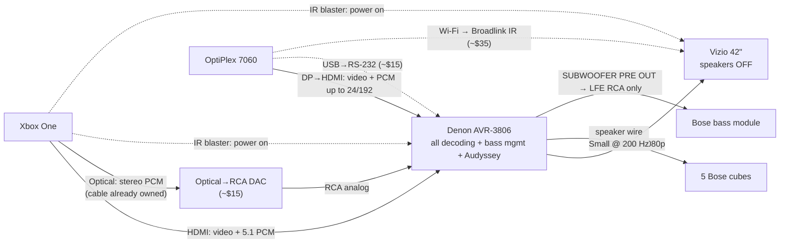

# Ultimate Setup: Current Gear

The best possible configuration for the parts you **already own**, plus a few inexpensive add-ons that finish the job. Every choice here serves three goals:

1. **The Denon does all the processing.** One brain handles decoding, bass management and room correction. Nothing processes the sound twice.
2. **The best signal from every source.** Discrete 5.1 when the content is 5.1, true stereo with real Pro Logic IIx when it's stereo, and bit-perfect Qobuz.
3. **As few button presses as possible.** Power, input and surround mode follow what you're doing.

Deep detail and sources are on the [reference pages](reference/entertainment/system-overview.md). Things to buy later are in [PARTS.MD](PARTS.MD).

> **Status legend:** ✅ confirmed (manual or your own testing) · 🧪 likely, needs a quick test at home

---

## 1. The finished system

### Port-by-port wiring

> **Only one optical cable is needed, and you already own it.** The Xbox optical output goes to the DAC; the DAC's red/white RCA output goes to the Denon. Nothing plugs into the Denon's optical inputs. The PC stays on its single DP→HDMI cable. You already own the optical and RCA cables, so the only purchase is the **DAC (~$10–15)**. Power it from a **separate USB phone charger** (see §3, *Noise*).

| From | To | Cable | Notes |
|---|---|---|---|
| Xbox HDMI OUT | Denon **HDMI IN 2** | HDMI (≤ 5 m) | Already wired this way ✅. On the **DBS** source, renamed "XBOX" ✅ |
| Xbox OPTICAL | DAC optical in | Toslink (**the one you already own**) | Xbox optical set to **Stereo uncompressed**. This is the **only** optical cable in the system |
| DAC RCA out | Denon **DBS analog L/R IN** | RCA stereo (red/white) | The "stereo path" for the Xbox source 🧪. Use the analog jacks of whichever source the Xbox is assigned to |
| OptiPlex DP port | Denon **HDMI IN 1** | One-piece DP→HDMI cable, **video and audio together** | Already wired this way ✅. On the **TV** source, renamed "PC" ✅. **Keep it as the one cable; don't split the audio** (§5) |
| OptiPlex USB | Denon **RS-232** (DB-9) | FTDI USB→RS-232, **straight-through** | Power, input, volume and mode control |
| Denon **HDMI MONITOR OUT** | Vizio HDMI 1 | HDMI | The TV only ever uses this one input |
| Denon FL/FR/C/SL/SR speaker terminals | The 5 cubes | Speaker wire | Already done ✅ |
| Denon **SUBWOOFER PRE OUT** | Bose module **LFE** RCA | RCA (mono) | **The only connection the module needs** (§4) |
| Xbox IR blaster (built into S/X; Kinect or an IR Out cable on the original) | Denon + Vizio IR windows | Line of sight | Powers both on with the Xbox |

---

## 2. Denon AVR-3806: full configuration

Do these in order. Menu: **SETUP** on the remote. It shows on the TV only when "Analog to HDMI Convert" is ON and nothing is playing over HDMI. Otherwise use the front-panel display.

### 2.1 Inputs

| Menu | Setting |
|---|---|
| Input Setup → **HDMI In Assign** | **TV (PC) = HDMI 1**, audio **AMP**. **DBS (Xbox) = HDMI 2**, audio **AMP**. On this unit only TV and DBS can take HDMI (TV → HDMI 1 only, DBS → HDMI 2 only) ✅ |
| Input Setup → Digital In Assign | Leave DBS and TV on **HDMI** (assigning HDMI sets this automatically) ✅ |
| Input Setup → Rename | DBS → **XBOX**, TV → **PC** |
| Remote **INPUT MODE**, per source | XBOX: **AUTO** (5.1 via HDMI), switched to **ANALOG** for stereo content (§3). PC: **AUTO** |
| Video Setup → Video Convert | **OFF** on XBOX and PC |
| Video Setup → HDMI Out Setup | Analog-to-HDMI Convert **ON** (if the Vizio blanks when the menu opens, set OFF and use the front panel). Color space **YCbCr**, RGB **Normal** |
| Video Setup → Audio Delay | XBOX **0 ms**, PC **0 ms**. Add 10–40 ms only if lips visibly lag |

### 2.2 Speakers and bass (for cubes wired directly to the Denon)

| Menu | Setting | Why |
|---|---|---|
| Speaker Config | Front, Center, Surround = **Small**. Surround Back = **None**. Subwoofer = **Yes** | "Small" makes the Denon strip bass from every cube and send it to the sub output |
| Subwoofer mode | **LFE** | With everything Small, LFE already carries all bass. LFE+Main would add nothing |
| Crossover | **200 Hz** for all cubes (Advanced mode). Use **250 Hz** if you listen loud | Bose cubes are 3 dB down at about 280 Hz. **Never below 150 Hz.** |
| Power Amp Assign | Not used (no back speakers) | |

### 2.3 Audyssey MultEQ XT (rerun now: the wiring changed)

1. Quiet room: turn off the HVAC, fans and **the OptiPlex** (its fan will pollute the measurement).
2. Bose module: **Bass/Room compensation knob at its center detent**, **LFE knob at midpoint**.
3. Mic on a **tripod at ear height, pointing at the ceiling**, never held and never on the couch.
4. SETUP → Auto Setup/Room EQ → preliminary measurement → **Position 1 = your main seat**, then **all 6 positions** within about 2 ft of it (or one per seat if others watch too).
5. Calculate → check → **Store** (don't power off while it stores).
6. Check the results: cubes **Small**, crossover **≥ 150 Hz**. Raise any crossover below 150 Hz to 200 Hz. If the sub distance comes out longer than its real distance, **leave it**: that's Audyssey compensating the module's internal filter delay.
7. Room EQ curve: **Audyssey** for movies and TV, **Flat** if music sounds dull. The ROOM EQ button switches between them.
8. **Setup Lock ON** when you're happy.

### 2.4 Surround modes (set once; the Denon remembers per input and per signal type ✅)

*Advanced Playback → Auto Surround Mode = ON.* Then **on each input, while that kind of signal is playing, pick the mode once**:

| Input | Signal arriving | Pick | Result |
|---|---|---|---|
| XBOX | Multichannel PCM (INPUT MODE AUTO) | **MULTI CH IN** | Discrete 5.1 for games and 5.1 streams |
| XBOX | Analog 2-ch (INPUT MODE ANALOG) | **DOLBY PLIIx Cinema** (Game for games) | True steered surround from stereo content |
| PC | PCM 2-ch | **STEREO** (pure 2.1), or **PLIIx Music** if you want the whole room filled | Qobuz |

Surround parameters: Cinema EQ **OFF**, D.Comp **OFF**, Night **OFF**. PLIIx Music: Panorama OFF, Dimension 3, Center Width 3.

> ⚠️ **Never use DIRECT or PURE DIRECT with directly wired cubes.** Those modes can bypass bass management. The cubes would then get full-range bass, which risks damage, and the module goes silent. For music use **STEREO**: it keeps the 200 Hz crossover and the sub.

---

## 3. Xbox One: the stereo/5.1 problem, solved as far as current gear allows

**What you found is correct ✅.** In 5.1 uncompressed, the Xbox sends stereo content as 6-channel PCM with silent center and surrounds. The Denon's manual only allows Pro Logic IIx on true 2-channel signals, so it's locked out. No Xbox app escapes this. The Xbox mixes everything into one output format.

**The trick:** the Xbox's HDMI and optical outputs run **at the same time with separate settings** (Microsoft Xbox team, confirmed 🧪). The Denon lets one source have **HDMI video with its audio switched to that source's analog jacks** using the INPUT MODE button, and the picture keeps playing (manual pp. 28–30 🧪). So the Xbox source gets two audio paths:

| Path | Xbox setting | Denon INPUT MODE | Denon plays | Use for |
|---|---|---|---|---|
| **Surround path** | HDMI audio = **5.1 uncompressed** | **AUTO** | MULTI CH IN, discrete lossless 5.1 | Games, 5.1 movies and series |
| **Stereo path** | Optical audio = **Stereo uncompressed** → DAC → DBS analog in | **ANALOG** | Real **PLIIx** steered surround | YouTube, music, stereo shows |

### Xbox settings (Settings → General → Volume & audio output / TV & display options)

| Setting | Value |
|---|---|
| HDMI audio | **5.1 uncompressed**. Never 7.1: the Denon's HDMI reports 6-channel PCM max ✅ |
| Optical audio | **Stereo uncompressed** |
| Bitstream passthrough / Blu-ray passthrough | **Off** |
| Resolution / refresh | **1080p / 60 Hz** |
| Color depth / color space | **24-bit / Standard** |
| Allow 24 Hz, 50 Hz, 4K, HDR | **Off** |
| Device control → TV / Receiver | Vizio / Denon. Power: **turn ON when Xbox turns on**, but **not off** (so it can't kill PC music) |
| Power mode | Sleep (instant-on) if you want the Xbox reachable by automation later; Shutdown otherwise |

### Three levels of convenience

| Level | Cost | How you switch | Sound |
|---|---|---|---|
| **1. Free, today** | $0 | Press the **7CH STEREO** button for stereo content (shows 5CH STEREO), **STANDARD** to go back | Stereo spread to all speakers, with the in-phase part in the center. Not steered like PLIIx ✅ |
| **2. Best sound** | ~$10–15 DAC. You already own the cables | Press **INPUT MODE** until **ANALOG** shows; press again until **AUTO** to go back | True PLIIx for stereo, lossless discrete 5.1 for surround. **This is the target setup.** 🧪 |
| **3. Zero-touch** | + an always-on automation host (later, see PARTS.MD) | Automatic: Home Assistant's Xbox integration sees the active app → sends `SDANALOG` (YouTube, Spotify…) or `SDAUTO` (games, Netflix…) over RS-232 | Same as level 2 with no button presses |

The INPUT MODE button cycles AUTO → PCM → DTS → ANALOG → EXT.IN. A universal remote macro (see PARTS.MD) or the RS-232 command makes it one press.

**Why not plug the optical straight into the Denon's optical port?** On the 3806, each source takes its digital audio from **either** HDMI **or** one optical input, set in the setup menu (manual p.67). So you'd have two choices:

- **Same source (XBOX):** assign the optical in *Digital In Assign*, and HDMI audio switches off. Getting 5.1 back means going into the setup menu every time, which is worse than switching in the Xbox menu.
- **A different source** (e.g. CD = optical): pressing CD changes the HDMI output to CD's HDMI assignment, which is none, so the picture most likely goes black. VIDEO SELECT can't hold HDMI video (manual p.28).

The analog jacks are the only second audio path that INPUT MODE can reach while the XBOX source keeps its HDMI picture. That's why the DAC is needed.

**Free test before buying the DAC (2 minutes):** the "picture goes black" part is inferred, not confirmed. Plug your optical cable from the Xbox into a Denon optical input and assign it to an unused source such as **CD** (*Digital In Assign*). Set the Xbox's optical output to **Stereo uncompressed**. While watching the Xbox, press **CD**. If the picture **stays** and sound plays with PLIIx available, you don't need the DAC: switch between XBOX (5.1) and CD (stereo) with the source buttons. If the picture drops, buy the DAC.

**Noise: static, hum and feedback.** Real audio plays; the Denon treats the DAC like any analog source ✅.
- **Feedback:** can't happen. Feedback needs a microphone or an output looped back to an input, and there's neither here. Only the path INPUT MODE selects plays, so HDMI and analog never mix or echo.
- **Static or crackle:** the optical link is light, so it carries no electrical noise from the Xbox. A crackle means a loose Toslink plug, or the Xbox optical output set to **Bitstream**. These cheap DACs only decode PCM, so bitstream gives silence or noise. Keep the Xbox optical output on **Stereo uncompressed**.
- **Hum (60 Hz buzz):** the one real risk, from a ground loop through the DAC's USB power. Power it from a **2-prong USB phone charger** plugged into the same power strip as the Denon. Don't use a PC USB port. If hum persists, a **~$10 RCA ground-loop isolator** between the DAC and the Denon removes it.
- **Faint hiss:** you'd only hear it with your ear at a cube, at high volume, with nothing playing. It's normal for a budget DAC and inaudible over content.
- **A pop** when the Xbox wakes or changes apps is normal for these converters.

**Test for level 2 (5 minutes):** play a YouTube video, switch INPUT MODE to ANALOG, and check (a) the picture keeps playing, (b) the front display shows the analog input, and (c) the center and surrounds are active in PLIIx. If the picture drops, fall back to level 1 and tell me what happened.

---

## 4. Bose Acoustimass: LFE only

**Answer to your question: connect only the LFE RCA.** Leave all the speaker-level leads disconnected. The LFE-only connection is the better-sounding one. Here's why:

- **Everything is already in the LFE feed.** With the cubes set to Small, the Denon strips everything below 200 Hz from all five channels and adds it to the LFE channel. That one RCA output carries *all* of the system's bass, and it's the signal Audyssey measured, corrected, time-aligned and level-matched.
- **The speaker-level inputs would put Bose back in charge.** The module would sum those channels through its own uncorrected filter and EQ, which Audyssey never saw. You'd get doubled bass and phase smear around the crossover: the exact double processing you removed.
- **It adds load on the Denon's amplifiers for nothing.** The Denon is already rated for 6–16 Ω and the Bose sits around 5 Ω.

### Tidying the bulky cable

| Option | Effort | Notes |
|---|---|---|
| **Now:** cap or tape every bare speaker lead **individually**, fold them, and zip-tie the bundle behind the module | 5 min | Nothing may touch another lead or metal |
| **Clean:** make a short DB15→RCA pigtail (DB15 solder plug + one RCA jack), then any thin RCA cable to the Denon | 30 min, ~$10 | The LFE is **pins 14 (+) / 15 (−)** on Series III per a teardown. **Ring the pins out with a multimeter first**: no Series IV/V pinout was found. **Never put speaker-level signal on the LFE pins.** |
| Keep the original input cable in a drawer | — | It helps resale |

### Module settings and placement

- **Bass/Room compensation: center detent. LFE: midpoint.** Let Audyssey and the Denon's sub level do the rest.
- **Place the module near the front, close to the center cube.** At a 200 Hz crossover, bass becomes directional.
- 🧪 If the bass takes a second to come back after silence (auto-standby), turn the module's LFE knob up one notch and lower the Denon's subwoofer level by the same amount.
- Bose warns against wiring the cubes directly to a receiver. The protection is the Small / 200 Hz setting, so **never set a cube to Large** and **never use Direct or Pure Direct** (§2.4).

---

## 5. OptiPlex 7060 (music and PC)

### Audio path: one HDMI cable, no split ✅

The PC's audio already travels with the video on the single DP→HDMI cable, and that is the best path it has:

- **Bit-perfect up to 24-bit/192 kHz stereo.** The Denon's HDMI reports it accepts that (read from its EDID on this PC). Optical would be a downgrade, capped lower on sample rate.
- **The OptiPlex has no optical output.** Splitting would mean buying a USB-to-optical adapter for a worse result.
- The Denon receives true 2-channel PCM from the PC, so **STEREO** and **PLIIx Music** both work. That is only true if Windows is set to **Stereo** (below), not 5.1.
- The one downside of HDMI audio: the PC's audio device disappears when the Denon is off or on another input. The power automation below keeps the Denon on the PC input while the PC is in use.

### Windows

| Setting | Value |
|---|---|
| Sound → Output | **DENON-AVAMP** |
| Configure speakers | **Stereo**. The PC is the music source, and Stereo lets the Denon receive true 2-ch and apply STEREO or PLIIx Music. (Choosing 5.1 would recreate the Xbox's silent-channel problem.) |
| Advanced → Default format | 24-bit / 48 kHz. Exclusive mode **on**, with priority **on** |
| Enhancements, Spatial sound | **Off** |
| Qobuz app | Quality **Hi-Res up to 24/192**. Output device **DENON-AVAMP**, **Exclusive mode ON**. App volume 100%; use the Denon's volume |

### Fedora

- **Make Qobuz bit-perfect** (it's currently resampled to 48 kHz ✅). Add the `allowed-rates` PipeWire config from [the OptiPlex page](reference/entertainment/dell-optiplex-7060.md#linux-fedora--qobuz), then restart PipeWire. Keep app and sink volume at 100%.
- Optional: the **QBZ** client (RPM build) with **ALSA Direct** output for guaranteed bit-perfect playback.
- 🧪 192 kHz over HDMI: the Denon's EDID says yes. If a 192 kHz track is silent, cap `allowed-rates` at 96000.

### Power automation (the ~$50 fix)

With the **FTDI USB→RS-232** cable and a **Broadlink RM4 mini**:

| Event | Actions |
|---|---|
| PC wakes or boots (Windows Task Scheduler Event ID 1 / Fedora systemd sleep hook) | `PWON` → wait 2 s → `SITV` → Vizio IR **ON** |
| PC sleeps or shuts down | Query `SI?`. **Only if** the reply is `SITV`: `PWSTANDBY` + Vizio IR **OFF**. If the Xbox is in use, nothing happens. |

Scripts for both OSes are in [the OptiPlex page §4](reference/entertainment/dell-optiplex-7060.md#4-fixing-doesnt-power-avrtv-onoff). Use input **TV** (`SITV`); that page's examples say `SIDVD`, so change them to match this setup. Leave the Denon's front **ON/STANDBY** switch on, because RS-232 can only wake it from standby.

### Free fixes for "slow" and "loud fan"

- Blow the dust out of the heatsink, fan and PSU. Repaste the CPU (the factory paste is about 8 years old).
- Cap the CPU at **45–50 W** (Fedora: RAPL power limit; Windows: max processor state 99% or ThrottleStop). You'll lose almost no performance and the fan gets much quieter.
- The real fix for "slow" (Fedora on an internal NVMe) is in PARTS.MD.

---

## 6. Vizio VS420LF1A

| Setting | Value |
|---|---|
| Audio → Speakers | **Off** (the bar can't be removed; this silences it) |
| Input | Only **HDMI 1** (from the Denon). Rename it "AVR" |
| Picture Mode | **Game** for the Xbox (lower lag). Both the Xbox and PC arrive on this one TV input, so the picture settings are shared. Game mode suits both |
| Backlight | 20–35 dark room / 50–70 bright |
| Sharpness | Low (0–10) |
| Color Temp | **Warm** |
| DNR, Black Level Extender, White Peak Limiter, CTI, Flesh Tone, Adaptive Luma, DCR | **All Off** |
| Aspect | **Wide** |

Run the Xbox's built-in display calibration once to set Brightness and Contrast.

---

## 7. Daily use: what it looks like when finished

| I want to… | Levels 1–2 (current gear + ~$20 DAC + ~$50 power automation) | Level 3 (with an automation host) |
|---|---|---|
| **Play a game or watch a 5.1 show** | Press the Xbox power button. The TV and Denon turn on by IR. Press **XBOX** on the Denon remote if it was on the PC | Press the Xbox power button |
| **Watch YouTube or stereo content on the Xbox** | INPUT MODE → **ANALOG** (level 2), or **7CH STEREO** (level 1) | Nothing: it switches by app |
| **Play Qobuz from the PC** | Wake the PC. The Denon and TV turn on and switch to PC automatically | Same |
| **Finish with the PC** | Sleep the PC. The Denon and TV turn off only if they're still on the PC | Same |
| **Finish with the Xbox** | Turn off the Xbox, then press the Denon and TV power buttons (the Xbox won't turn them off, so it can't cut PC music) | Automation turns everything off when both sources are idle |

---

## 8. What current gear still can't do

These are hardware limits. The fixes are in [PARTS.MD](PARTS.MD).

| Limit | Why | Fixed by |
|---|---|---|
| One button press for stereo on the Xbox (level 2) | The Xbox has a fixed output format | An always-on automation host (level 3), or a streaming box that outputs stereo as 2-ch (e.g. Nvidia Shield) |
| No 4K, HDR or Atmos | 2005 HDMI 1.1 receiver + 2008 1080p TV | A new TV **and** AVR together |
| Denon menus not visible over HDMI video | The 3806 has no HDMI on-screen overlay | A new AVR (the RS-232 scripts help meanwhile) |
| Bass/cube sound quality | 2.5" cubes need a 200 Hz crossover, and the module is a small band-pass box | A sealed sub first, then conventional speakers |
| Speaker bar visible | Part of the TV's one-piece cabinet | A new TV |
| PC slow, small SSD | Fedora on a USB drive, 256 GB Windows SSD | An internal NVMe (+ RAM) |

---

*Written 2026-09-24. 🧪 items are well-supported but untested on your exact units. Report back what works and I'll update the page.*
