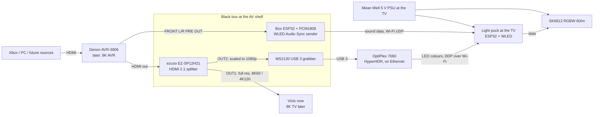

# Reactive Light Build (DIY WLED hybrid)

The build plan for the sound/movie reactive light. Background research and every option considered: [reactive-light.md](../reference/entertainment/reactive-light.md).

**Goal:** a light behind the TV that copies the picture's edge colours during video and pulses to the sound otherwise. It should be as small and cheap as possible with no loss of light quality, and **must pass 8K through untouched** so it never holds back a future TV/AVR upgrade.

---

## 1. Decisions so far

| # | Decision | Why |
|---|---|---|
| D1 | **DIY WLED hybrid** (HyperHDR video sync + WLED sound mode) | Most accurate for the money, any TV size, local only, Home Assistant native. |
| D2 | **Video input: HDMI, tapped after the AVR** with a splitter | One cable carries every source the AVR switches. |
| D3 | **Audio input: Denon FRONT L/R PRE OUT → line-in board** on the ESP32. INMP441 mic as fallback | The Denon's HDMI out can't be trusted for sound: inputs set to AMP likely send no audio to the TV, analog inputs never reach HDMI, Dolby Digital can't be read by a capture card, and HyperHDR doesn't react to sound anyway. The pre-out is a clean copy of everything you hear. WLED auto-gain removes the volume-knob effect. |
| D4 | **8K60 / 4K120 pass-through, HDCP 2.3, HDR/Dolby Vision, VRR/ALLM** on the TV path | Don't repeat the 1080p bottleneck. Only the splitter sits in the TV's path, so only the splitter has to be 8K-ready. |
| D5 | **The capture side stays 1080p forever** | HyperHDR shrinks the picture to a tiny grid before working out the LED colours, so capture resolution has no effect on light quality. A 1080p grabber is the right part even with an 8K TV. |
| D6 | **SK6812 RGBW cold-white, 60 LEDs/m, 5 V, one 5 m reel** | True white for D65 bias light, 60/m is the quality sweet spot. 5 m covers the 42" (2.9 m) now and a 65–75" TV later (4.5–5.2 m). |
| D7 | **WLED drives the strip; HyperHDR sends colours to it over Wi-Fi (DDP)** | Keeps WLED's sound mode on the same strip. When video stops, WLED falls back to the sound-reactive preset by itself. |
| D8 | **Host: the OptiPlex 7060 runs HyperHDR. No Pi** (decided 2026-10-05) | It's already at the AV shelf and costs nothing. The PC is on for all TV use; when it's off, the light still does sound mode on its own ([§6.1](#61-host-optiplex-7060)). |
| D9 | **Controller: ESP32 + WLED** (decided 2026-10-05) | Ready-made firmware covers every job; the Teensy would mean writing it all ([§6.3](#63-esp32-vs-the-spare-teensy-41)). |
| D10 | **Mount: strip lives in aluminium channels; channels attach with stretch-release strips; every side unplugs** | Nothing sticks to the TV permanently, and the strip, channels and controller move to the next TV ([§7](#7-mounting-removable)). |
| D11 | **Black box + light puck:** splitter, grabber and audio ESP32 in one 3D-printed box at the AV shelf; a second ESP32 "puck" + PSU at the TV, linked by Wi-Fi | One tidy box with HDMI in/out, RCA in, USB out and 5 V in, and no cable from the shelf to the TV ([§2.1](#21-what-lives-where-the-black-box-and-the-light-puck)). |

## 2. Signal chain

### 2.1 What lives where: the black box and the light puck

**Black box (AV shelf, 3D-printed case).** Holds the splitter, the grabber and an ESP32 with the line-in board. Low voltage only, no mains inside.

| Port on the case | Connects to | Carries |
|---|---|---|
| **HDMI IN** | Denon HDMI out | Every source's picture (and sound, passed through untouched) |
| **HDMI OUT** | TV | Same signal, up to 8K60 / 4K120 |
| **RCA L / R IN** | Denon FRONT L/R PRE OUT | Line-level sound for the music mode |
| **USB OUT** (USB-C or USB-B female) | OptiPlex USB 3 port | The 1080p picture copy for HyperHDR (see below) |
| **5 V IN** (USB-C) | 5 V 3 A wall supply | Powers the splitter and the box ESP32 |
| Mode button + status LED (optional) | | Cycle video / music / movie scene / off |

**Light puck (behind the TV).** A second, small printed box: ESP32 + 74AHCT125 + fuse, with the Mean Well PSU in its own printed cover next to it. Plugs into the wall outlet behind the TV and into the strip. Nothing else connects to it, so **the link between the shelf and the TV is wireless** (Wi-Fi).

**Why not Bluetooth:** Bluetooth LED strips only take a few colour zones, with 100 ms+ lag. Pixel-level sync needs about 42–72 KB/s at 60 fps with low lag, which is a Wi-Fi job. And the lights are never cordless: the strip draws several amps at 5 V, so it always needs a power supply at the TV.

**What goes over the USB cable to the OptiPlex:** only the picture, one way. The grabber shows up on the PC as a webcam-style video device (UVC) sending the 1080p picture (uncompressed, about 2 Gbit/s, which is why it needs USB 3). The USB also powers the grabber. The grabber also offers a USB audio device; it's unused. **Nothing comes back down the USB.** HyperHDR works out the edge colours on the PC and sends them over the network (Ethernet → router → Wi-Fi) straight to the puck.

**Audio path:** the box ESP32 reads the RCA input and broadcasts the sound analysis with WLED's built-in **Audio Sync** (UDP). The puck ESP32 receives it and runs the sound effects. The box needs no cable to the TV, and the extra delay is a few milliseconds.

**Case design rules:**
- **No HDMI extension jumpers inside the box.** 8K (48 Gbps) is fragile, and every extra connector risks dropouts. Mount the splitter so **its own HDMI ports sit flush in cut-outs** in the case wall. The internal splitter OUT2 → grabber link is 1080p, so a short 15 cm cable or a coupler is fine there.
- The **USB** port can be a 30 cm panel-mount USB 3 extension from the grabber to the case wall; 5 Gbps tolerates that.
- **Screw the splitter down** (heat-set inserts) so plugging and unplugging HDMI pushes on the case, not on the splitter's board. Leave the splitter in its own metal shell.
- Print in **PETG or ASA**, not PLA: the splitter runs warm. Add vent slots over the splitter.
- Measure every part once it arrives before designing the case; exact sizes aren't confirmed.
- Keep **mains out of the black box.** The Mean Well lives at the TV in its own cover with a fused IEC inlet and strain relief, with no exposed terminals.

## 3. Minimal parts list

Prices are rough US street prices, October 2026. **(unverified)** means not confirmed from a current listing.

| Block | Part | Pick | Approx. |
|---|---|---|---|
| Video tap | HDMI 2.1 splitter with scaler | **ezcoo EZ-SP12H21** (8K60/4K120, HDCP 2.3, DV, VRR/ALLM, OUT2 downscales 4K→1080p) | $80 |
| Video tap | Cables | 2 × short **Ultra High Speed (48 Gbps) certified** HDMI (AVR→splitter, splitter→TV; keep under 3 m) + 1 short HDMI to the grabber | $25 **(unverified)** |
| Capture | USB grabber | **MS2130** USB 3 (1080p60, neutral colours) | $15–25 |
| Host | HyperHDR computer | **OptiPlex 7060** (already owned), grabber in a USB 3 port ([§6.1](#61-host-optiplex-7060)). Add a USB 3 extension only if the splitter is out of reach | $0 (+ $10 extension if needed) |
| Controller | ESP32 boards | **2 ×** ESP32-WROOM-32 dev board (box: audio sender; puck: LED driver) | $12–20 |
| Controller | Line-in | PCM1808 I2S ADC board + RCA→pin cable | $8–12 |
| Controller | Level shifter + protection | 74AHCT125, 330 Ω, 1000 µF cap, 5 A blade fuse, perfboard (puck) | $8–12 |
| Black box | Panel parts | Panel-mount USB 3 extension (30 cm, USB-C or B female), panel RCA jack pair, USB-C 5 V panel jack, momentary button + LED | $15–25 |
| Black box | Power | 5 V 3 A USB-C wall supply | $8–12 |
| Cases | 3D printing | PETG/ASA (~200 g for the box, puck and PSU cover), M3 heat-set inserts and screws, fused IEC inlet for the PSU cover | $15–20 |
| Light | LED strip | **SK6812 RGBW cold white, 60/m, 5 m, IP30** (bare, not waterproof: thinner and cheaper) | $30–40 **(unverified)** |
| Light | Wiring | 18 AWG two-core, JST-SM 4-pin pigtails (one per side), solderless L corners | $10–15 |
| Light | Mount | 45° aluminium channel with diffuser (about 3 m, in 1 m lengths) + 3M Command stretch-release strips | $25–35 **(unverified)** |
| Power | PSU | **Mean Well LRS-75-5** (5 V 14 A) + mains cord | $20–25 |
| Audio | Fallback mic (optional) | INMP441 | $3–5 |
| | | **Total** | **≈ $280–350** |

### Where the money can and can't be cut

| Cut | Saves | Costs light quality? | Verdict |
|---|---|---|---|
| Use the **OptiPlex** as the HyperHDR host instead of a Pi | $0–145 | No. The PC must be on for video sync | **Done (D8)** |
| Skip the **aluminium channel/diffuser** | $25–35 | No, on the stand (>10 cm from wall). Yes if wall-mounted close to the wall | **Keep:** it's what makes the mount removable and reusable (§7) |
| **1080p splitter** (EZ-SP12H2) instead of HDMI 2.1 | ~$40 | No today, **but breaks D4** | **No** |
| **WS2812B RGB** instead of SK6812 RGBW | ~$10 | **Yes**: bluish/pinkish whites, poor bias light | **No** |
| **30/m** instead of 60/m | ~$10 | **Yes**: blotchy halo | **No** |
| **Mic** instead of pre-out line-in | ~$5 | Slightly: hears talking/room noise | Keep as fallback only |
| **Pre-built WLED controller** (QuinLED/Gledopto) instead of DIY board | costs +$15–25 | No | Optional if you'd rather not solder |

## 4. Size

- **Behind the TV:** the strip, plus the ESP32 box (about a deck of cards).
- **At the AV shelf:** the splitter (about 10 × 6 cm), the grabber (USB-stick size) and the PSU (99 × 82 × 30 mm). Put the PSU at the TV with the ESP32 so only mains and one RCA cable reach the TV.
- No extra computer: the OptiPlex is already there.

## 5. Known limits of the 8K path

- **Eventual true 8K input:** the splitter's scaler only does 4K→1080p. With a real 8K60 source, OUT1 still passes 8K to the TV, but OUT2 may not give the grabber a picture it can take **(unverified)**, so the light would fall back to sound mode. Real 8K content is almost nonexistent; if it ever matters, the splitter is the only part to swap.
- **Dolby Vision:** the scaler can't downscale DV. In DV the light may lose video sync, and users report the splitter can push the Xbox to HDR10 instead of DV ([HyperHDR #1505](https://github.com/awawa-dev/HyperHDR/discussions/1505)). Check the EDID switch settings when the DV-capable gear arrives.
- **eARC:** a splitter between the AVR and the TV won't carry eARC back to the AVR. That only matters for apps built into a future TV; sources plugged into the AVR are unaffected.
- **HDCP on OUT2:** streaming apps (Netflix etc.) use HDCP. Whether OUT2 hands the grabber a viewable picture decides whether streaming gets video sync or falls back to sound mode. See [reactive-light §5.2](../reference/entertainment/reactive-light.md#52-hyperionng--hyperhdr-on-a-raspberry-pi-with-usb-hdmi-capture).

## 6. Host and microcontroller

There are two different jobs here, and each needs a different kind of chip.

| Job | Needs | Right tool |
|---|---|---|
| **Host:** read the capture card and turn the picture into LED colours (HyperHDR) | A USB host that understands video capture devices (UVC), megabytes of RAM per frame (a 1080p frame is about 4 MB), Linux or Windows | A **computer**: here the **OptiPlex** (a Pi 4/5 would also work) |
| **LED controller:** drive the strip with exact timing, listen to the line-in, switch between video and sound modes | Hardware-timed LED output, I2S audio input, FFT, a link to the host | A **microcontroller**: ESP32 or Teensy 4.1 |

### 6.1 Host: OptiPlex 7060

- **The PC must be on for video sync**, including Xbox-only movies and games. That's accepted. When the PC is off, the ESP32 still runs sound mode and the movie scene by itself.
- **HyperHDR runs on Windows and Linux.** Install it on **Windows** (the everyday entertainment OS) and set it to start with Windows. If the Fedora side is booted for TV use too, install it there as well and copy the settings (HyperHDR can export/import its config).
- **Plug the grabber into a USB 3 port** (blue or marked SS). On USB 2 the MS2130 falls back to compressed MJPEG, with more lag and worse colours. If the PC sits more than ~2 m from the splitter, use a short USB 3 extension (over 3 m: an active one).
- **Load is light:** HyperHDR samples the capture at about 640×480. It shouldn't affect Qobuz or anything else on the PC.
- **Ethernet** on the PC is preferred; the ESP32 still joins over 2.4 GHz Wi-Fi.
- **Not affected by Qobuz exclusive mode:** the light's sound comes from the Denon pre-out, not from the PC.

### 6.2 What the LED controller has to do

| # | Task | Load | Notes |
|---|---|---|---|
| 1 | **Receive frames from the host** | 174 LEDs now / 300 later × 4 bytes (RGBW) × 60 fps ≈ **42–72 KB/s** | Tiny over Wi-Fi (DDP) or USB serial |
| 2 | **Clock data out to the strip** | SK6812: 800 kHz single-wire, 32 bits per LED. 300 LEDs ≈ 9.6 ms per frame (fits 60 fps on one pin; split into 2 pins to halve it) | Must be done by hardware (ESP32 RMT/I2S, Teensy DMA) so Wi-Fi and audio can't cause flicker |
| 3 | **Read the line-in** | I2S from the PCM1808 at 44.1/48 kHz. **The PCM1808 also needs a master clock (MCLK) from the controller** (on the ESP32 this can only be GPIO 0, 1 or 3) | |
| 4 | **Analyse the sound** | FFT on about 512 samples every ~20 ms, beat detection, auto-gain | Uses the second core on an ESP32 |
| 5 | **Switch modes** | Video frames arriving → show them. No frames for ~2 s → sound-reactive effect. Plus a static D65 "movie" scene and off | |
| 6 | **Limit current** | Estimate the draw and dim to stay under the PSU (about 12 A) | WLED's ABL does this |
| 7 | **Be controllable** | Brightness, modes, presets from a phone or Home Assistant | |
| 8 | **Electrical** | 3.3 V logic → **74AHCT125 level shifter** → 5 V strip data, common ground, fused 5 V feed | Same for ESP32 or Teensy (Teensy 4.1 is not 5 V tolerant either) |

Pins used: 1 LED data (2 later), 4 for the PCM1808 (BCK, LRCK, DATA, MCLK), power and ground.

### 6.3 ESP32 vs the spare Teensy 4.1

| | ESP32 + WLED | Teensy 4.1 |
|---|---|---|
| Cost | $6–10 | **$0 (already owned)** |
| Firmware | **Ready-made.** WLED covers all 8 tasks: DDP receiver, sound reactive with line-in/MCLK, mode fallback, ABL, phone app, Home Assistant | **Write it yourself:** an Adalight/serial receiver for HyperHDR, OctoWS2811/FastLED output, Teensy Audio Library FFT, mode switching, some kind of control |
| Link to host | Wi-Fi (2.4 GHz) | **USB serial** (fastest, no Wi-Fi), or Ethernet with the 4.1's MagJack kit |
| Audio | PCM1808 board | PCM1808, or the Teensy Audio Shield's line-in (SGTL5000) |
| Hardware | Enough | Much faster (600 MHz), more pins, DMA LED output |
| Where it lives | Behind the TV, needs only power | Within a USB cable's reach of the PC (≤ 5 m) |

**Recommendation:** use the **ESP32 + WLED** for the least work and phone/Home Assistant control out of the box. Pick the **Teensy** only if you want writing the firmware to be part of the project; it's the better hardware but has no ready firmware for this hybrid.

## 7. Mounting (removable)

Don't stick the strip's own adhesive to the TV. On a warm TV back it either lets go or, after a year or two, pulls off the finish when removed, and the strip is ruined either way.

**How it works:** the strip sticks permanently into aluminium channels. The channels are the only thing attached to the TV, using stretch-release strips that come off clean.

1. **Cut channel to the four sides** of the strip rectangle (about 0.93 m top and bottom, 0.52 m per side; measure first). Leave the bottom gap for the stand neck and cables.
2. **Stick the strip into the channels** with its own adhesive, plus a dab of VHB at each end. Snap on the diffusers.
3. **Wire each side as a removable section:** a JST-SM 4-pin plug at each end of every side (5 V, data, GND; the fourth pin spare), joined with short jumpers at the corners. Feed power at the start; add a fused injection lead to the far end.
4. **Clean the TV back** with isopropyl alcohol, and attach each channel with **3M Command strips** (2–3 per side), about 2–5 cm in from the edge.
5. **Fix the ESP32 box and loose wire** with Command strips or adhesive cable clips, also stretch-release, so no cable hangs off the strip.

**Removal for the next TV:** unplug the sides, pull each Command tab slowly straight down along the surface, and lift the channels off. The TV is left clean. On the new TV, cut longer top and bottom channels, add strip from the leftover 2 m of the reel (or a second reel), solder on JST plugs, and update the LED counts in HyperHDR and WLED.

*Alternative with no adhesive at all:* bolt a light aluminium frame to the TV's VESA holes and fix the channels to the frame. It's tidier but means a new frame for each TV.

## 8. Time estimate

Assumes every part is in hand and some soldering experience. Mains wiring to the PSU is the one step to do slowly and check twice.

| Stage | Task | Time |
|---|---|---|
| **Build (bench)** | Flash WLED to the ESP32, join Wi-Fi, basic settings | 0.5 h |
| | Controller board: ESP32, 74AHCT125, PCM1808, resistor, capacitor, fuse, connectors on perfboard, into the box | 2–3 h |
| | PSU: mains cord, output leads, fuse, check voltages | 0.5–1 h |
| | Bench test: 1 m of strip, WLED effects, line-in from a phone, auto-gain | 0.5–1 h |
| | OptiPlex: install HyperHDR on Windows, start with Windows, grabber shows a picture | 0.5–1 h |
| | Cut strip and channel, solder JST plugs per side, fit diffusers | 1.5–2 h |
| | **Build total** | **≈ 5.5–8 h (one long day or two evenings)** |
| **Install** | Clean the TV back, mount channels, plug sides together, power injection | 1–1.5 h |
| | Splitter into the HDMI chain, EDID/scaler switches, grabber into the OptiPlex | 0.5 h |
| | RCA from the Denon front pre-out to the ESP32 box | 0.25 h |
| | HyperHDR: LED layout (start corner, per-side counts), WLED as DDP target, black-border detection, colour and smoothing | 1–2 h |
| | WLED: sound-reactive preset as fallback, D65 movie scene, ABL limit, Home Assistant | 0.5–1 h |
| | **Install total** | **≈ 3.5–5 h**, plus a few evenings of fine-tuning while watching |

## 9. Where to buy

Store stock is a general guide, not checked against live inventory. Call or check the store's site first.

| Part | In person | Online only? | Best online source |
|---|---|---|---|
| 3M Command strips, isopropyl alcohol | **Any** (Walmart, Target, Home Depot, Lowe's, grocery) | | |
| 18 AWG two-core wire, mains cord for the PSU | **Home Depot / Lowe's / Ace** | | |
| Aluminium LED channel + diffuser | **Home Depot / Lowe's** (lighting aisle, 1 m lengths; usually flat or U profile, 45° is rarer) | 45° corner profile is easiest online | Amazon (Muzata, LightingWill) |
| Inline blade fuse holder + 5 A fuse | **Auto parts store** (AutoZone, O'Reilly) or Home Depot | | |
| Ultra High Speed (48 Gbps) HDMI cables | **Best Buy, Micro Center** (look for the certified Ultra High Speed label) | | Amazon, Monoprice |
| ESP32 dev board, perfboard, 330 Ω resistor, 1000 µF capacitor | **Micro Center** (nearest is Denver) | | Amazon |
| USB 3 extension (only if needed) | **Best Buy, Micro Center** | | Amazon |
| RCA cable for the pre-out | **Best Buy, Walmart** (plain stereo RCA); the PCM1808 end is soldered on | | |
| **ezcoo EZ-SP12H21 splitter** | | **Yes** | Amazon (ezcoo store) |
| **MS2130 USB 3 grabber** | | **Yes** (store capture cards are pricier models) | Amazon / AliExpress |
| **SK6812 RGBW 60/m 5 m strip** | | **Yes** | Amazon (BTF-Lighting) |
| **PCM1808 line-in board**, INMP441 mic | | **Yes** | Amazon / AliExpress |
| **74AHCT125 level shifter** | | **Yes** | Digi-Key / Mouser, or an Amazon multi-pack |
| **Mean Well LRS-75-5 PSU** | | **Yes** (store supplies are no-name; avoid) | Digi-Key / Mouser / Amazon (sold by Mean Well distributors) |
| JST-SM 4-pin pigtails, solderless L corners | Sometimes Micro Center | Mostly | Amazon (BTF-Lighting) |

**Ordering plan:**
- **One Amazon order:** splitter, grabber, strip, JST pigtails and L corners, PCM1808 (+ INMP441), 45° channel. Usually arrives in 1–3 days.
- **One Digi-Key or Mouser order:** Mean Well PSU and 74AHCT125 (+ spare passives). Skip it if Amazon has a genuine Mean Well and a 74AHCT125 pack.
- **One store run:** Micro Center for the ESP32, perfboard, passives, and HDMI cables. Home Depot and an auto parts store for wire, mains cord, fuse holder, channel and Command strips.
- AliExpress is cheaper for the grabber, PCM1808 and strip, but takes 1–3 weeks.

## 10. Checks before buying

- [ ] Denon **front L/R pre-out** has signal while the internal amps drive the speakers.
- [ ] Measure the back of the Vizio (strip rectangle, stand gap) to set per-side LED counts.
- [ ] Check the OptiPlex has a free USB 3 port and measure the distance to where the splitter will sit.

## Sources

- [ezcoo EZ-SP12H21 product page](https://www.easycoolav.com/products/8k60hz-4k120hz-hdmi-21-splitter-1x248gbps)
- [EZ-SP12H21 manual](https://manuals.plus/ezcoo/ez-sp12h21-1x2-hdmi-2-1-splitter-scaler-manual)
- [HyperHDR #1505, EZ-SP12H21 and Dolby Vision](https://github.com/awawa-dev/HyperHDR/discussions/1505)
- [HyperHDR #1525, UGREEN 25173 + SP12H21](https://github.com/awawa-dev/HyperHDR/discussions/1525)
- Strip, PSU, wiring and power figures: [reactive-light.md §6](../reference/entertainment/reactive-light.md#6-led-sizing-power-and-build-notes)
