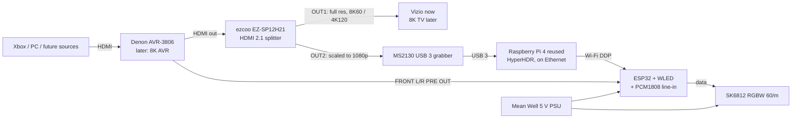

# Reactive Light Build (DIY WLED hybrid)

The build plan for the sound/movie reactive light. Background research and every option considered: [reactive-light.md](../reference/entertainment/reactive-light.md).

**Goal:** a light behind the TV that copies the picture's edge colours during video and pulses to the sound otherwise. It should be as small and cheap as possible with no loss of light quality, and **must pass 8K through untouched** so it never holds back a future TV/AVR upgrade.

---

## 1. Decisions so far

| # | Decision | Why |
|---|---|---|
| D1 | **DIY WLED hybrid** (HyperHDR video sync + WLED sound mode) | Most accurate for the money, any TV size, local only, Home Assistant native. |
| D2 | **Video input: HDMI, tapped after the AVR** with a splitter | One cable carries every source the AVR switches. |
| D3 | **Audio input: Denon FRONT L/R PRE OUT → line-in board** on the ESP32. INMP441 mic as fallback | The Denon's HDMI out can't be trusted for sound: inputs set to AMP likely send no audio to the TV, analog inputs never reach HDMI, Dolby Digital can't be read by a capture card, and HyperHDR doesn't react to sound anyway. The pre-out is a clean copy of everything you hear. WLED auto-gain removes the volume-knob effect. |
| D4 | **8K60 / 4K120 pass-through, HDCP 2.3, HDR/Dolby Vision, VRR/ALLM** on the TV path | Don't repeat the 1080p bottleneck. Only the splitter sits in the TV's path, so only the splitter has to be 8K-ready. |
| D5 | **The capture side stays 1080p forever** | HyperHDR shrinks the picture to a tiny grid before working out the LED colours, so capture resolution has no effect on light quality. A 1080p grabber is the right part even with an 8K TV. |
| D6 | **SK6812 RGBW cold-white, 60 LEDs/m, 5 V, one 5 m reel** | True white for D65 bias light, 60/m is the quality sweet spot. 5 m covers the 42" (2.9 m) now and a 65–75" TV later (4.5–5.2 m). |
| D7 | **WLED drives the strip; HyperHDR sends colours to it over Wi-Fi (DDP)** | Keeps WLED's sound mode on the same strip. When video stops, WLED falls back to the sound-reactive preset by itself. |
| D8 | **Host: a reused Raspberry Pi 4, on Ethernet**, not the OptiPlex | Video sync shouldn't need the PC to be on. A Pi 4 is enough ([§6.1](#61-host-raspberry-pi-4-reuse)). |
| D9 | **Controller: ESP32 + WLED** (decided 2026-10-05) | Ready-made firmware covers every job; the Teensy would mean writing it all ([§6.3](#63-esp32-vs-the-spare-teensy-41)). |
| D10 | **Mount: strip lives in aluminium channels; channels attach with stretch-release strips; every side unplugs** | Nothing sticks to the TV permanently, and the strip, channels and controller move to the next TV ([§7](#7-mounting-removable)). |

## 2. Signal chain

## 3. Minimal parts list

Prices are rough US street prices, October 2026. **(unverified)** means not confirmed from a current listing.

| Block | Part | Pick | Approx. |
|---|---|---|---|
| Video tap | HDMI 2.1 splitter with scaler | **ezcoo EZ-SP12H21** (8K60/4K120, HDCP 2.3, DV, VRR/ALLM, OUT2 downscales 4K→1080p) | $80 |
| Video tap | Cables | 2 × short **Ultra High Speed (48 Gbps) certified** HDMI (AVR→splitter, splitter→TV; keep under 3 m) + 1 short HDMI to the grabber | $25 **(unverified)** |
| Capture | USB grabber | **MS2130** USB 3 (1080p60, neutral colours) | $15–25 |
| Host | HyperHDR computer | **Reused Raspberry Pi 4** + official 5.1 V 3 A PSU, microSD, heatsink/fan case, Ethernet ([§6.1](#61-host-raspberry-pi-4-reuse)). New Pi 5 2 GB kit if no Pi is free | $0–25 reused / $110–145 new **(unverified)** |
| Controller | ESP32 board | ESP32-WROOM-32 dev board | $6–10 |
| Controller | Line-in | PCM1808 I2S ADC board + RCA→pin cable | $8–12 |
| Controller | Level shifter + protection | 74AHCT125, 330 Ω, 1000 µF cap, 5 A blade fuse, perfboard, small project box | $10–15 |
| Light | LED strip | **SK6812 RGBW cold white, 60/m, 5 m, IP30** (bare, not waterproof: thinner and cheaper) | $30–40 **(unverified)** |
| Light | Wiring | 18 AWG two-core, JST-SM 4-pin pigtails (one per side), solderless L corners | $10–15 |
| Light | Mount | 45° aluminium channel with diffuser (about 3 m, in 1 m lengths) + 3M Command stretch-release strips | $25–35 **(unverified)** |
| Power | PSU | **Mean Well LRS-75-5** (5 V 14 A) + mains cord | $20–25 |
| Audio | Fallback mic (optional) | INMP441 | $3–5 |
| | | **Total with a reused Pi 4** | **≈ $230–310** |
| | | **Total with a new Pi 5** | **≈ $340–430** |

### Where the money can and can't be cut

| Cut | Saves | Costs light quality? | Verdict |
|---|---|---|---|
| Use the **OptiPlex** as the HyperHDR host instead of a Pi | ~$110–145 | No. But the PC must be on for video sync, and the grabber must be within USB reach | Fine to **start** this way. Add the Pi later if the PC being on is annoying |
| Skip the **aluminium channel/diffuser** | $25–35 | No, on the stand (>10 cm from wall). Yes if wall-mounted close to the wall | **Keep:** it's what makes the mount removable and reusable (§7) |
| **1080p splitter** (EZ-SP12H2) instead of HDMI 2.1 | ~$40 | No today, **but breaks D4** | **No** |
| **WS2812B RGB** instead of SK6812 RGBW | ~$10 | **Yes**: bluish/pinkish whites, poor bias light | **No** |
| **30/m** instead of 60/m | ~$10 | **Yes**: blotchy halo | **No** |
| **Mic** instead of pre-out line-in | ~$5 | Slightly: hears talking/room noise | Keep as fallback only |
| **Pre-built WLED controller** (QuinLED/Gledopto) instead of DIY board | costs +$15–25 | No | Optional if you'd rather not solder |

## 4. Size

- **Behind the TV:** the strip, plus the ESP32 box (about a deck of cards).
- **At the AV shelf:** the splitter (about 10 × 6 cm), the grabber (USB-stick size), the Pi in a case (about 9 × 6 × 3 cm) and the PSU (99 × 82 × 30 mm). Put the PSU at the TV with the ESP32 so only mains and one RCA cable reach the TV.
- Using the OptiPlex as host removes the Pi entirely.

## 5. Known limits of the 8K path

- **Eventual true 8K input:** the splitter's scaler only does 4K→1080p. With a real 8K60 source, OUT1 still passes 8K to the TV, but OUT2 may not give the grabber a picture it can take **(unverified)**, so the light would fall back to sound mode. Real 8K content is almost nonexistent; if it ever matters, the splitter is the only part to swap.
- **Dolby Vision:** the scaler can't downscale DV. In DV the light may lose video sync, and users report the splitter can push the Xbox to HDR10 instead of DV ([HyperHDR #1505](https://github.com/awawa-dev/HyperHDR/discussions/1505)). Check the EDID switch settings when the DV-capable gear arrives.
- **eARC:** a splitter between the AVR and the TV won't carry eARC back to the AVR. That only matters for apps built into a future TV; sources plugged into the AVR are unaffected.
- **HDCP on OUT2:** streaming apps (Netflix etc.) use HDCP. Whether OUT2 hands the grabber a viewable picture decides whether streaming gets video sync or falls back to sound mode. See [reactive-light §5.2](../reference/entertainment/reactive-light.md#52-hyperionng--hyperhdr-on-a-raspberry-pi-with-usb-hdmi-capture).

## 6. Host and microcontroller

There are two different jobs here, and each needs a different kind of chip.

| Job | Needs | Right tool |
|---|---|---|
| **Host:** read the capture card and turn the picture into LED colours (HyperHDR) | A USB host that understands video capture devices (UVC), megabytes of RAM per frame (a 1080p frame is about 4 MB), Linux or Windows | A **computer**: Pi 4, Pi 5 or the OptiPlex |
| **LED controller:** drive the strip with exact timing, listen to the line-in, switch between video and sound modes | Hardware-timed LED output, I2S audio input, FFT, a link to the host | A **microcontroller**: ESP32 or Teensy 4.1 |

### 6.1 Host: Raspberry Pi 4 (reuse)

- **The OptiPlex works but must be on** whenever you want video sync, including for Xbox-only movies and games. A Pi runs on its own.
- **A Pi 4 is enough.** HyperHDR supports Pi 4 and Pi 5 (any RAM size from 1 GB; 2 GB+ is comfortable). It samples the 1080p capture at about 640×480, which is light work.
- **Plug the grabber into a blue USB 3 port.** On USB 2 the MS2130 falls back to compressed MJPEG, with more lag and worse colours.
- **Put the Pi on Ethernet.** Pi 4 USB 3 traffic is a known source of 2.4 GHz interference, and the light controller's link is 2.4 GHz Wi-Fi.
- Use the official 5.1 V 3 A USB-C power supply, add a heatsink or fan case, and use a good microSD card.
- **No GPIO pins are used.** The Pi only uses USB and the network, so headers or wires from an old project don't matter. Remove anything that is still wired to a powered circuit; nothing needs desoldering or new pins.

### 6.2 What the LED controller has to do

| # | Task | Load | Notes |
|---|---|---|---|
| 1 | **Receive frames from the host** | 174 LEDs now / 300 later × 4 bytes (RGBW) × 60 fps ≈ **42–72 KB/s** | Tiny over Wi-Fi (DDP) or USB serial |
| 2 | **Clock data out to the strip** | SK6812: 800 kHz single-wire, 32 bits per LED. 300 LEDs ≈ 9.6 ms per frame (fits 60 fps on one pin; split into 2 pins to halve it) | Must be done by hardware (ESP32 RMT/I2S, Teensy DMA) so Wi-Fi and audio can't cause flicker |
| 3 | **Read the line-in** | I2S from the PCM1808 at 44.1/48 kHz. **The PCM1808 also needs a master clock (MCLK) from the controller** (on the ESP32 this can only be GPIO 0, 1 or 3) | |
| 4 | **Analyse the sound** | FFT on about 512 samples every ~20 ms, beat detection, auto-gain | Uses the second core on an ESP32 |
| 5 | **Switch modes** | Video frames arriving → show them. No frames for ~2 s → sound-reactive effect. Plus a static D65 "movie" scene and off | |
| 6 | **Limit current** | Estimate the draw and dim to stay under the PSU (about 12 A) | WLED's ABL does this |
| 7 | **Be controllable** | Brightness, modes, presets from a phone or Home Assistant | |
| 8 | **Electrical** | 3.3 V logic → **74AHCT125 level shifter** → 5 V strip data, common ground, fused 5 V feed | Same for ESP32 or Teensy (Teensy 4.1 is not 5 V tolerant either) |

Pins used: 1 LED data (2 later), 4 for the PCM1808 (BCK, LRCK, DATA, MCLK), power and ground.

### 6.3 ESP32 vs the spare Teensy 4.1

| | ESP32 + WLED | Teensy 4.1 |
|---|---|---|
| Cost | $6–10 | **$0 (already owned)** |
| Firmware | **Ready-made.** WLED covers all 8 tasks: DDP receiver, sound reactive with line-in/MCLK, mode fallback, ABL, phone app, Home Assistant | **Write it yourself:** an Adalight/serial receiver for HyperHDR, OctoWS2811/FastLED output, Teensy Audio Library FFT, mode switching, some kind of control |
| Link to host | Wi-Fi (2.4 GHz) | **USB serial** (fastest, no Wi-Fi), or Ethernet with the 4.1's MagJack kit |
| Audio | PCM1808 board | PCM1808, or the Teensy Audio Shield's line-in (SGTL5000) |
| Hardware | Enough | Much faster (600 MHz), more pins, DMA LED output |
| Where it lives | Behind the TV, needs only power | Within a USB cable's reach of the Pi (≤ 5 m) |

**Recommendation:** use the **ESP32 + WLED** for the least work and phone/Home Assistant control out of the box. Pick the **Teensy** only if you want writing the firmware to be part of the project; it's the better hardware but has no ready firmware for this hybrid.

## 7. Mounting (removable)

Don't stick the strip's own adhesive to the TV. On a warm TV back it either lets go or, after a year or two, pulls off the finish when removed, and the strip is ruined either way.

**How it works:** the strip sticks permanently into aluminium channels. The channels are the only thing attached to the TV, using stretch-release strips that come off clean.

1. **Cut channel to the four sides** of the strip rectangle (about 0.93 m top and bottom, 0.52 m per side; measure first). Leave the bottom gap for the stand neck and cables.
2. **Stick the strip into the channels** with its own adhesive, plus a dab of VHB at each end. Snap on the diffusers.
3. **Wire each side as a removable section:** a JST-SM 4-pin plug at each end of every side (5 V, data, GND; the fourth pin spare), joined with short jumpers at the corners. Feed power at the start; add a fused injection lead to the far end.
4. **Clean the TV back** with isopropyl alcohol, and attach each channel with **3M Command strips** (2–3 per side), about 2–5 cm in from the edge.
5. **Fix the ESP32 box and loose wire** with Command strips or adhesive cable clips, also stretch-release, so no cable hangs off the strip.

**Removal for the next TV:** unplug the sides, pull each Command tab slowly straight down along the surface, and lift the channels off. The TV is left clean. On the new TV, cut longer top and bottom channels, add strip from the leftover 2 m of the reel (or a second reel), solder on JST plugs, and update the LED counts in HyperHDR and WLED.

*Alternative with no adhesive at all:* bolt a light aluminium frame to the TV's VESA holes and fix the channels to the frame. It's tidier but means a new frame for each TV.

## 8. Time estimate

Assumes every part is in hand and some soldering experience. Mains wiring to the PSU is the one step to do slowly and check twice.

| Stage | Task | Time |
|---|---|---|
| **Build (bench)** | Flash WLED to the ESP32, join Wi-Fi, basic settings | 0.5 h |
| | Controller board: ESP32, 74AHCT125, PCM1808, resistor, capacitor, fuse, connectors on perfboard, into the box | 2–3 h |
| | PSU: mains cord, output leads, fuse, check voltages | 0.5–1 h |
| | Bench test: 1 m of strip, WLED effects, line-in from a phone, auto-gain | 0.5–1 h |
| | Pi: flash Raspberry Pi OS Lite, install HyperHDR, grabber shows a picture | 1 h |
| | Cut strip and channel, solder JST plugs per side, fit diffusers | 1.5–2 h |
| | **Build total** | **≈ 6–8 h (one long day or two evenings)** |
| **Install** | Clean the TV back, mount channels, plug sides together, power injection | 1–1.5 h |
| | Splitter into the HDMI chain, EDID/scaler switches, grabber and Pi on Ethernet | 0.5 h |
| | RCA from the Denon front pre-out to the ESP32 box | 0.25 h |
| | HyperHDR: LED layout (start corner, per-side counts), WLED as DDP target, black-border detection, colour and smoothing | 1–2 h |
| | WLED: sound-reactive preset as fallback, D65 movie scene, ABL limit, Home Assistant | 0.5–1 h |
| | **Install total** | **≈ 3.5–5 h**, plus a few evenings of fine-tuning while watching |

## 9. Checks before buying

- [ ] Denon **front L/R pre-out** has signal while the internal amps drive the speakers.
- [ ] Measure the back of the Vizio (strip rectangle, stand gap) to set per-side LED counts.
- [ ] Confirm a Pi 4 is free to reuse (any RAM size; check it boots).

## Sources

- [ezcoo EZ-SP12H21 product page](https://www.easycoolav.com/products/8k60hz-4k120hz-hdmi-21-splitter-1x248gbps)
- [EZ-SP12H21 manual](https://manuals.plus/ezcoo/ez-sp12h21-1x2-hdmi-2-1-splitter-scaler-manual)
- [HyperHDR #1505, EZ-SP12H21 and Dolby Vision](https://github.com/awawa-dev/HyperHDR/discussions/1505)
- [HyperHDR #1525, UGREEN 25173 + SP12H21](https://github.com/awawa-dev/HyperHDR/discussions/1525)
- [Raspberry Pi 5 2 GB 2026 pricing (Geeknetic)](https://www.geeknetic.es/Noticia/32468/La-Raspberry-Pi-5-mas-barata-ya-esta-disponible-desde-56-euros-por-la-version-de-2-GB-de-RAM.html)
- Strip, PSU, wiring and power figures: [reactive-light.md §6](../reference/entertainment/reactive-light.md#6-led-sizing-power-and-build-notes)
