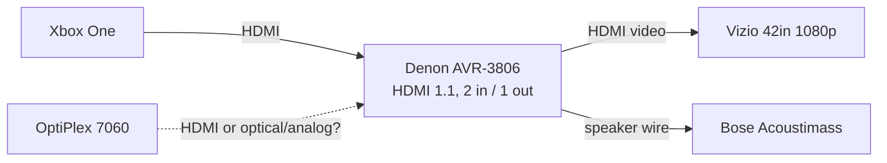
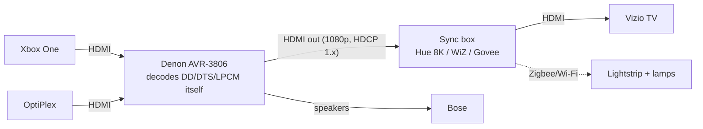
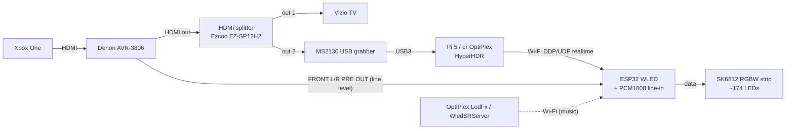

# Sound/Movie Reactive Light

Reference and buying guide for adding lights that react to **movies and games** (Xbox) and to **music** (Qobuz on the OptiPlex) in this system.

> Researched September 2026. Prices are US street prices seen in 2025–2026 and change often. Items marked **(unverified)** could not be confirmed from a manufacturer page or a hands-on review.

**Short answer:** For the current 42" Vizio, the best value is a **camera kit sized for the TV** (Govee TV Backlight 3 Lite for 40–50", about $60–80). It works with every source, including Netflix, and its built-in mic handles music. For a setup that carries over to a future 4K TV and receiver, go with **Philips Hue** (Sync Box 8K + Bridge + gradient lightstrip + Hue Sync desktop app on the PC), at about $550–700. The **DIY path** (WLED on an ESP32 + HyperHDR) costs the least per LED and makes the best hybrid (video sync plus a line-in feed from the Denon pre-outs), but it takes weekend-project effort and has an HDCP caveat.

---

## Contents

1. [How the two approaches work](#1-how-the-two-approaches-work)
2. [Constraints of this system](#2-constraints-of-this-system)
3. [Commercial options](#3-commercial-options)
4. [Comparison table](#4-comparison-table)
5. [DIY options](#5-diy-options)
6. [LED sizing, power and build notes](#6-led-sizing-power-and-build-notes)
7. [Signal-chain diagrams](#7-signal-chain-diagrams)
8. [Getting audio to a sound-reactive controller](#8-getting-audio-to-a-sound-reactive-controller)
9. [Room and placement](#9-room-and-placement)
10. [Recommendation tiers](#10-recommendation-tiers)
11. [How it fits this system](#11-how-it-fits-this-system)
12. [Sources](#12-sources)

---

## 1. How the two approaches work

### A. Screen/video-synced ("Ambilight" style)

The lights copy the colours near each edge of the picture onto the wall behind the TV. A device has to "see" the picture, and there are four ways to do that:

| Method | How it sees the picture | Pros | Cons |
|---|---|---|---|
| **Camera** (Govee Envisual/TV Backlight, Nanoleaf 4D, Hue Play Screen Sync) | A small camera clipped to the TV bezel watches the screen | Works with **any** source (Xbox, PC, TV apps, even the TV's own tuner). HDCP doesn't matter. Cheap | Colour accuracy depends on room light, viewing angle and TV brightness. Camera is visible. Slightly more lag. Can be fooled by glare |
| **HDMI sync box** (Hue Sync Box 8K, Govee AI Sync Box 2, WiZ, Lytmi) | Sits in the HDMI chain and reads the actual pixels | Most accurate, lowest lag. Licensed HDCP device, so Netflix and similar work | Must be in the HDMI path, so it can add EDID/HDCP handshake trouble with old gear. Most expensive. Content from TV-internal apps is not seen |
| **PC software** (Hue Sync desktop, Govee Desktop, SignalRGB, Prismatik, HyperHDR/Hyperion on Windows/Linux) | Screen capture on the PC | Free or cheap. Very accurate for PC content | Only sees what the PC shows. **Useless for the Xbox** |
| **DIY capture** (HyperHDR/Hyperion.ng + USB HDMI grabber + splitter) | HDMI splitter feeds a cheap USB capture card | Cheapest accurate option, fully tweakable, local and open-source | HDCP-protected content (Netflix etc.) only works if the splitter strips HDCP (see §5.2). DIY effort |
| **Built-in** (Philips Ambilight TV) | TV processes its own picture | Seamless, zero setup, works with every input | Only if you replace the TV |

### B. Sound-reactive (music mode)

The lights pulse and change with the audio, based on its level, beat and spectrum (FFT).

| Audio source | Examples | Notes |
|---|---|---|
| **Built-in microphone** | Govee strips, floor lamps and TV kits, WiZ Sync Box, Nanoleaf 4D rhythm mode, WLED + INMP441 | Hears anything in the room, whatever the source. Zero wiring. Picks up talking and room noise, and needs decent volume |
| **Line-in** | WLED with a line-in ADC (PCM1808/ES7243/CS5343). Some Govee/Lytmi controllers have a 3.5 mm input **(unverified per model)** | Clean, precise, immune to room noise. Needs an audio tap (Denon pre-out, PC output) |
| **HDMI audio** | Hue Sync Box music mode | Only works when the audio passes *through the box's HDMI input* (see §3.1) |
| **Network audio sync** | Hue Sync desktop app, LedFx, WLED "Audio Sync" UDP (WledSRServer / Feed_My_WLED), SignalRGB | The PC analyses what it's playing and sends effects over Wi-Fi. Great for Qobuz on the PC, but not for the Xbox |

### C. Hybrids

- **Sync box + music mode:** one box switches between video and music. Hue does music only from HDMI audio. WiZ and Govee boxes have mics.
- **Camera kit + mic:** all Govee TV kits have a Video mode and a Music mode (control-box mic). You pick one at a time.
- **DIY WLED:** HyperHDR/Hyperion pushes realtime video colours to WLED. When no video stream is arriving, WLED falls back to its own audio-reactive effect from the mic or line-in. One strip does both jobs automatically.
- **Ecosystem grouping:** add extra lamps (Hue Play bars, Govee floor lamp) to the same "entertainment area" or DreamView group so room lights follow the screen or the music too.

---

## 2. Constraints of this system

| Component | Relevant facts | Consequence |
|---|---|---|
| **Vizio VS420LF1A** (42" 1080p LCD) | 3× HDMI, optical + RCA line out. Active area 930 × 523 mm, cabinet 1028 mm wide (service manual). No CEC mentioned. No ARC. No smart apps worth using | Only 1080p needed. Everything worth syncing arrives over HDMI from the Denon. Many kits are sized for 55"+ only |
| **Denon AVR-3806** (2005) | **2 HDMI in / 1 HDMI out, HDMI 1.1**, HDCP 1.x repeater. Accepts DD/DTS and multichannel PCM over HDMI. **7.1 analog PRE OUT**, 3 analog REC OUT, 2 optical out, RS-232. **Zone 2 cannot play HDMI audio** (no D/A of HDMI audio to zones) | The single HDMI output is a natural place for one sync box (Denon out → box → TV). Pre-outs are the best line-level audio tap. Zone 2/REC OUT won't carry Xbox audio |
| **Xbox One** | Outputs 1080p here. Uses **HDCP only for media apps** (Netflix, Blu-ray, etc.), not for games (per capture-card vendor docs). No user toggle | Games can be captured by a DIY grabber. Streaming apps need an HDCP-licensed sync box, a camera, or an HDCP-stripping splitter |
| **OptiPlex 7060** | Windows (Qobuz) + Fedora | PC music can drive lights by software (Hue Sync app, LedFx, WLED audio sync) with no extra hardware. **Qobuz exclusive (WASAPI exclusive) mode can block loopback capture (unverified for current Qobuz app)**, so turn it off or use a mic/line-in |
| **Bose Acoustimass** | Bass module fed at speaker level (the README says "sub wants to receive all inputs") | The Denon's **SUBWOOFER pre-out is probably silent** if speaker setup is "Subwoofer: No". Use the **FRONT L/R pre-out** as the audio tap instead |

---

## 3. Commercial options

### 3.1 Philips Hue Play HDMI Sync Box 8K + Play gradient lightstrip

- **Sync method:** HDMI box, 4 in / 1 out, **HDMI 2.1 certified**. 8K60, 4K120, 4K60, 1080p120. HDR10+ and Dolby Vision passthrough. Dolby Atmos passthrough. ARC/**eARC** (eARC on HDMI input 4 port). CEC. Works with Netflix and other HDCP content, because it's a licensed HDCP repeater (HDCP version not published; 2.3 per third parties, **unverified**).
- **Lights:** up to 10 Hue lights per entertainment area. A Hue **Bridge** is required for more than one light. The 2026 box can drive one strip without a bridge.
- **Lightstrips:** in Sept 2026 Hue replaced the 2020 Play gradient lightstrip with two new versions:
  - **Play gradient lightstrip** (Flux, RGBWWIC): cuttable every 16.6 cm, about $149.99 for 65"
  - **Play gradient lightstrip Pro** (OmniGlow): cuttable every 12.5 cm, from about $179.99, with a 20 W PSU

  Hue suggests about 2 m of strip for 55". **For the 42" Vizio, cut to about 1.5–1.7 m (unverified guidance; follows the 16:9 perimeter maths in §6)**. The older 55/65/75" non-cuttable gradient strips are still sold. The 55" one is too long for a 42" TV.
- **Music mode:** yes, but **only from audio passing through the box's HDMI input**. If the box sits after the Denon, music mode depends on the Denon also sending audio to its HDMI out (Hue itself warns about this receiver case).
- **Latency:** reviewers describe it as effectively instant and more reliable than the 4K box. No published figure.
- **Ecosystem:** Hue app, Alexa/Google/Apple Home. **Hue Sync desktop app (free, Windows/macOS)** adds screen and music sync for the PC. Home Assistant has a Hue integration plus a sync-box integration (mvdwetering/huesyncbox). SignalRGB has a Hue plugin. Razer Chroma via Hue integration **(unverified)**.
- **Price (2026):** Hue list **$384.99** (Sept 2026, up from $349.99 at launch). Frequently discounted to about $209–245. Bridge Pro is now **$139** (raised from $99 in Aug/Sept 2026 due to memory costs). The standard Bridge v2 is cheaper if still stocked **(unverified price)**.
- **Related:** the **Hue Play Screen Sync** camera ($119.99) is a camera alternative. Customer reviews say its mount only fits TVs about 1.2" or thinner, so it **probably won't fit the thick Vizio**. The Hue Sync TV app is $129.99 one-time or $2.99/mo, **Samsung/LG TVs only**.

### 3.2 WiZ HDMI Sync Box with TV Backlight (Signify, 2025)

- **Sync method:** HDMI box, **1 input**, HDMI 2.0, 4K60, HDR10+ and Dolby Vision. No 4K120/VRR. **Built-in microphone** for music. Wi-Fi/Bluetooth, WiZ app, **no bridge**.
- **Lights:** 3-sided strip (left/top/right). Works with any WiZ lights, and Signify says there's no add-on limit.
- **Sizes:** 55–65" ($89.99) and 75–85" ($109.99). **Strip is not cuttable.** One reviewer folded the excess on a 43" screen.
- **Weaknesses:** some lag in fast cuts. No eARC advertised **(unverified)**. Home Assistant/Matter not advertised.
- **Fit here:** a single input is fine because the Denon has a single output. It's the cheapest HDMI-box option, but the strip is oversized for a 42" TV.

### 3.3 Govee AI Sync Box Kit 2 (H6604)

- **Sync method:** HDMI box, **4 in / 1 out, HDMI 2.1**, 8K60 / 4K144, VRR/ALLM, HDR10+ passthrough. eARC reported by reviewers. **Dolby Vision/Atmos passthrough unverified.** An NPU does "AI" game and scene recognition.
- **Lights:** RGBWIC strip with 75 LEDs/m (450 lm/m). DreamView lets you add other Govee lights. Matter support.
- **Music mode:** Govee lights have music modes. **A mic on the Kit 2 box is unverified.** The TV strips' control boxes have mics.
- **Sizes/price:** TV 55–65" and 75–85" at $239.99–$259.99. Monitor 27–34" kit (H6603) at $279.99. Often discounted.
- **Weaknesses:** the box runs hot. Some users report connection drops that need a power-cycle. Cable clutter. Needs 2.4 GHz Wi-Fi.
- **Integrations:** Govee Home app, Alexa/Google, Matter. Home Assistant via Govee local LAN API **(per-model support unverified)**. Govee Desktop and SignalRGB plugin for PC sync.

### 3.4 Govee camera kits (Envisual / TV Backlight 3 Lite / T2)

| Model | Sizes | Tech | Price seen 2026 |
|---|---|---|---|
| **TV Backlight 3 Lite (H6097)** | **40–50"** (2.4 m / 7.8 ft), also 55–65" | Fish-eye camera, RGBICW 4-in-1 beads, DreamView | about **$60–80** |
| Envisual T1 (older) | 55–65", 75–85" | Single camera, RGBIC | cheap/clearance |
| **Envisual T2 (H605C)** | 55–65", 75–85", 98–100" | **Dual cameras**, 60 LEDs/m double beads | $119.99–159.99 list, often **$70–75** |

- Every kit also has a **Music mode using the control-box microphone**.
- A camera doesn't care about HDMI, HDCP or the Denon, so it works with every source. It needs a sensible TV picture mode and a dim room for good accuracy.
- **Fit here:** the **3 Lite 40–50"** is the only mainstream kit sized for the 42" Vizio.

### 3.5 Govee music-reactive lights (no screen sync)

- **Govee RGBIC Floor Lamp (Basic)**: 1000 lm, Matter, music sync, about $59–69 on sale ($99 list). Govee's copy says music sync uses the **phone's** mic for this model. Other Govee floor lamps (Floor Lamp 2, RGBICWW Floor Lamp Pro) have **built-in mics (unverified per model)**.
- **Govee RGBIC strips** (for example the M1/Neon/standard strips): control-box mic, music modes, DreamView grouping with TV kits.
- These are good as a **second, music-only zone**, for example a corner lamp that dances to Qobuz while the TV strip does bias lighting.

### 3.6 Nanoleaf 4D Screen Mirror + Lightstrip

- **Sync method:** camera. Four modes (1D–4D), about 10 colour zones/m.
- **Music:** "Rhythm" mode reacts to TV sound (mic).
- **Price:** 65" kit $99.99, 85" kit $119.99, camera-only $79.99 (seen at $39.99 on sale).
- **Integrations:** Nanoleaf app. Syncs with other Nanoleaf panels, bulbs and strips. Nanoleaf Desktop app for PC screen mirror and Razer Chroma **(unverified)**. Home Assistant has a Nanoleaf integration. SignalRGB plugin.
- **Weaknesses:** reviewers found colour skew (reds in blacks, excess green) and corner adhesive that loosens. The 65" kit is the smallest, so it's too long for 42" **(check whether it can be cut)**.

### 3.7 Lytmi (Neo 3 / Fantasy 3)

- **Sync method:** HDMI box. **Neo 3 / Fantasy 3: 4 × HDMI 2.1 in**, 8K60 / 4K120. 72 LEDs/m strips.
- **At time of Lytmi's spec page: no VRR, ALLM or CEC.** Dolby Vision fails with some LG TVs. **2.4 GHz Wi-Fi only.**
- Music mode through the app **(mic/line-in unverified)**. Priced similar to Govee (about $200–300, **unverified 2026**). Few 2025–2026 reviews exist, and support and firmware are less proven than Hue or Govee.

### 3.8 Philips Ambilight TV (if replacing the TV)

- Ambilight is built into the TV's back and uses the displayed picture, so it works with every HDMI input and every app, with **zero lag or setup**. **New to the US since late 2025 on Roku TV models:**
  - 7875 Series (DLED, Sam's Club)
  - **7985 Series QLED** (May 2026, Amazon/BJ's). 65" seen at about **$470**.
  - 9875 QLED models announced for 2026
- Europe has OLED Ambilight models, and some support "Ambilight + Hue" to extend to Hue lamps. **Ambilight+Hue and music modes on the US Roku models are unverified.**
- This is the **simplest future-proof option** if the TV gets replaced anyway.

### 3.9 Others worth knowing

- **Hisense / Samsung / LG:** no built-in rear bias lights. Samsung (2022+ QR60 or better) and recent LG TVs can run the **Hue Sync TV app**, which syncs Hue lights from the TV's own processing, including its apps. That's useful after a TV upgrade.
- **SignalRGB (Windows):** one app that drives Hue, Govee, Nanoleaf and WLED from PC screen or audio ("Screen Ambience"). PC only.
- **MediaLight / Waveform Lighting / Scenic Labs LX1:** accurate **D65 static white** bias strips (CRI 95–98). They don't react, but they're the reference for picture quality (see §9).

---

## 4. Comparison table

| Option | Sync method | HDMI / HDCP | 1080p / 4K / HDR | Latency | Audio passthrough and old-Denon implications | Music mode | Fits 42"? | Ecosystem / integrations | Price 2026 (USD) |
|---|---|---|---|---|---|---|---|---|---|
| **Hue Sync Box 8K** + gradient strip + Bridge | HDMI box, 4 in | HDMI 2.1, HDCP-licensed (Netflix OK) | 1080p120 / 8K60 / 4K120, HDR10+, DV | Very low (reviews) | Passes Atmos/eARC. Placed **after** the Denon it only carries video to the TV, so audio isn't affected. Placed before it, it must hand DD/LPCM to an HDMI 1.1 AVR (should work, **unverified**) | HDMI audio only | Cut new 2026 strip to about 1.6 m | Hue app, Hue Sync PC app, HA, SignalRGB, Alexa/Google/Apple | Box $209–385 + strip $150–180 + Bridge Pro $139 = **about $500–700** |
| **WiZ HDMI Sync Box** kit | HDMI box, 1 in | HDMI 2.0, HDCP (Netflix via external source OK) | 4K60, HDR10+, DV | Some lag on fast cuts | Single in/out. Put it after the Denon, video only | **Built-in mic** | No (55"+ strip, not cuttable) | WiZ app, Alexa/Google | **$90–110** |
| **Govee AI Sync Box Kit 2** | HDMI box, 4 in | HDMI 2.1, HDCP | 4K144 / 8K60, HDR10+ (DV **unverified**) | Low | eARC per reviewers. Same placement logic as Hue | Govee music modes (box mic **unverified**) | No (55"+ strip) | Govee app, Matter, DreamView, SignalRGB, HA (LAN API) | **$240–260** |
| **Govee TV Backlight 3 Lite** (40–50") | Camera | n/a, HDCP irrelevant | Any | Moderate (camera) | Not in HDMI chain. **Zero risk** | Control-box mic | **Yes** | Govee app, DreamView, Alexa/Google | **$60–80** |
| **Govee Envisual T2** | Dual camera | n/a | Any | Moderate | Not in chain | Mic | No (55"+) | Govee | $70–160 |
| **Nanoleaf 4D** | Camera | n/a | Any | Low for camera | Not in chain | Mic (Rhythm) | Smallest kit 65" | Nanoleaf, HA, SignalRGB | $80–120 |
| **Lytmi Neo 3 / Fantasy 3** | HDMI box, 4 in | HDMI 2.1, HDCP | 8K60/4K120, DV issues on some TVs | Low | No CEC/VRR/ALLM (at spec time) | App (**unverified**) | Sized kits | Lytmi app, Alexa/Google | about $200–300 (**unverified**) |
| **Philips Ambilight TV** | Built-in | n/a | 4K HDR (DV on 7985) | Instant | TV → ARC/optical to AVR as normal | Model-dependent (**unverified**) | Replaces TV | Roku, (Hue on EU models) | 65" 7985 about $470 |
| **DIY WLED + HyperHDR** | Capture card + splitter | Splitter-dependent. HDCP content needs stripping | 1080p easy. 4K HDR with better grabber | 10–50 ms tunable | Splitter after Denon, video only | **Mic or clean line-in** | **Any length** | WLED app, HA (native), LedFx, SignalRGB, Hue-free | **$120–200** |
| **DIY WLED audio-only** | Mic / line-in / network | n/a | n/a | Near-instant | n/a | Yes, excellent | Any | WLED, HA, LedFx | **$40–70** |
| **PC software** (Hue Sync / Prismatik / SignalRGB) | Screen capture | n/a | n/a | Very low | n/a | Yes (loopback) | n/a | Depends on lights | Free |

---

## 5. DIY options

### 5.1 WLED on ESP32: sound-reactive (and target for video sync)

WLED is open-source firmware for ESP32/ESP8266 LED controllers. **Audio-reactive has been included in all official WLED builds since v0.15.0.** The old separate "WLED-SR" fork isn't needed. The MoonModules fork (WLED-MM) adds more audio features.

**Audio inputs supported (per WLED docs):**

| Input | Chip support | Quality | Use here |
|---|---|---|---|
| **INMP441** / ICS-43434 I2S MEMS mic | ESP32, S2, S3, C3 (C3 since v16) | Best mic option | Place near the Bose cubes. Hears Xbox, PC, anything |
| **Line-in via I2S ADC** (PCM1808, CS5343, ES7243, ES8388 boards) | ESP32 / S3 | Best overall, immune to room noise | Feed from the Denon **FRONT L/R PRE OUT** or PC analog out |
| Analog mic / direct line-in on ADC1 (GPIO 36, 32–39) | Classic ESP32 only | Poor; needs conditioning | Avoid |
| PDM mic | ESP32 / S3 | OK | Alternative |
| **Network "Audio Sync"** (UDP multicast 239.0.0.1:11988) | All, including ESP8266 receive | Depends on sender | One ESP32 with a mic sends and others receive. Or **WledSRServer / Feed_My_WLED on the PC** sends Qobuz audio analysis |

**INMP441 wiring (typical classic ESP32; set the same pins in WLED → Usermods → AudioReactive):**

| INMP441 | ESP32 |
|---|---|
| VDD | 3V3 |
| GND | GND |
| L/R | **GND** (left channel) |
| WS | GPIO 15 (example) |
| SCK | GPIO 14 (example) |
| SD | GPIO 32 (example) |

Keep these wires short. Press the ESP32's **RST** after changing audio settings, because WLED can't re-init I2S on the fly.

**Parts list: WLED sound-reactive strip (about $40–70)**

| Part | Example | Approx. price |
|---|---|---|
| ESP32 dev board (classic ESP32-WROOM-32 or ESP32-S3) | or a pre-built WLED controller with level shifter, fuse and terminals (QuinLED Dig-Uno, Gledopto/Athom ESP32 WLED boxes; some include a mic, **verify per listing**) | $6–35 |
| INMP441 I2S mic module | | $3–5 |
| *or* PCM1808 I2S line-in ADC module + 3.5 mm/RCA jack | | $5–10 |
| 74AHCT125 (or 74HCT245) level shifter | not needed on QuinLED/Gledopto boards | $1 |
| LED strip (see §6) | WS2812B 60/m 5 m | $15–25 |
| 5 V PSU (see §6) | Mean Well LRS-50-5 (10 A) | $15–20 |
| 1000 µF cap across strip input, 330 Ω series resistor on data, 18 AWG wire, JST-SM pigtails, inline fuse | | $5–10 |
| Aluminium channel + diffuser (optional) | 45° corner profile | $15–30 |

**Sending PC music to WLED:**
- **LedFx** (Windows/Linux/macOS) captures system audio (WASAPI loopback, Stereo Mix, or VoiceMeeter on Windows; the PipeWire/PulseAudio monitor on Fedora) and sends effects to WLED over **DDP/E1.31/UDP**. It gives the richest music visuals.
- **WledSRServer** / Feed_My_WLED are lighter: they send FFT data so WLED's own audio effects run.

### 5.2 Hyperion.ng / HyperHDR on a Raspberry Pi with USB HDMI capture

Both are open-source ambient-light servers. **HyperHDR** is a fork focused on HDR tone-mapping, low latency and USB grabbers. **Hyperion.ng** is the original project. Both also run on **Windows and Linux**, so the OptiPlex could host one if it's near the TV.

**Chain:** Denon HDMI out → **HDMI splitter** → (1) TV, (2) **USB capture card** → Pi (HyperHDR) → LED controller.

**Components (per HyperHDR wiki/guide):**

| Part | Recommendation | Approx. price |
|---|---|---|
| Host | Raspberry Pi 4/5 (≥1 GB), or any x64 PC / Intel N100. Pi 3 and Zero 2 W not officially supported. **Use the official Pi PSU** | Pi 5 2–4 GB about $60–85 (2026 prices up, **unverified**) |
| Capture card | **MS2130** USB 3.0 (neutral colours, 1080p60 YUV). MS2109 works but needs colour tweaks. UGREEN 25173 for 4K HDR | $15–25 (MS2130). About $60+ (UGREEN) |
| HDMI splitter | HyperHDR recommends **Ezcoo EZ-SP12H2** (4K60) / EZ-SP12H21 (4K120). FeinTech VSP01201 also cited | $30–60 |
| LED controller | **HyperSerialESP32** / **HyperSerialPico** (USB serial, lowest latency). RP2040 boards with built-in level shifter (Adafruit Feather RP2040 Scorpio) are the "easiest, best stability" pick. Or **WLED over UDP/DDP** (keeps WLED's audio mode for the hybrid) | $5–25 |
| LEDs | HyperHDR prefers **SK6812 RGBW cold-white 5 V** | see §6 |
| PSU | **Mean Well**, "avoid no-name" | $15–30 |

Tuning tips from the docs: capture at a low resolution/high frame rate (for example 640×480@50–60), and parallel LED segments halve LED update latency (300 RGBW LEDs: about 12 ms single vs about 6 ms dual).

**HDCP: the factual situation**
- USB capture cards **cannot capture HDCP-encrypted video**. Cards with a passthrough port will pass HDCP 2.2 video to the TV but show black to the capture side.
- Xbox **games** are not HDCP-encrypted, so DIY capture works for gaming. **Netflix, Disney+, Blu-ray and similar apps on the Xbox enable HDCP**, so the capture side goes black *unless* the splitter outputs an unencrypted copy.
- Many inexpensive splitters (and the Ezcoo units the HyperHDR community recommends) behave this way. Vendors call it "HDCP compliant/downscaling", and the community calls it "HDCP stripping".
- **Legal note (neutral):** in the US, removing HDCP can fall under the DMCA §1201 anti-circumvention provisions. How that applies to a personal ambilight has not been tested in court, and splitters with this behaviour are widely sold. Other countries have their own rules. Licensed sync boxes (Hue/Govee/WiZ/Lytmi) and camera kits avoid the question entirely.

### 5.3 PC-only: Prismatik, AmbiBox, Hue Sync, SignalRGB

- **Prismatik** (psieg fork of Lightpack, GPL-3.0, last release Feb 2025): uses the DXGI Desktop Duplication grabber and supports Adalight serial. A plugin (Prismatik-WLED-WiFi) drives WLED.
- **AmbiBox:** old and effectively unmaintained **(unverified)**, Windows only. Prefer Prismatik or HyperHDR for Windows.
- **Hue Sync desktop** (free): screen + music sync for Hue lights.
- **SignalRGB** (Windows): screen ambience + audio across Hue/Govee/Nanoleaf/WLED.
- These are only useful for PC content. Here that means Qobuz (music modes) and any PC video, not the Xbox.

---

## 6. LED sizing, power and build notes

### 6.1 LED types

| Type | Voltage | Colours | Density options | Pros | Cons |
|---|---|---|---|---|---|
| **WS2812B** | 5 V | RGB | 30/60/144 per m | Cheapest, universal support | Whites are bluish/pinkish (RGB mix). Voltage drop over about 2–3 m, so inject power. One dead pixel breaks the chain after it |
| **SK6812 RGBW** | 5 V | RGB + dedicated white (cold, neutral or warm) | 30/60/144 | **True white**, ideal for bias lighting (cold white ≈ 6000–6500 K). HyperHDR's preferred type | Slightly pricier. RGBW needs support (WLED and HyperHDR both handle it) |
| **WS2815** | 12 V | RGB | 30/60/144 | Less voltage drop, so fewer injection points. **Backup data line** keeps the strip working past one dead pixel | 12 V PSU. Pixels are grouped/wired differently. Some ESP boards need 12 V→5 V/3.3 V buck |
| APA102 / SK9822 | 5 V | RGB | 60/144 | Clocked (fast, high PWM) | Extra clock wire. Pricier |

**Pick for this TV:** **SK6812 RGBW (cold white) 60/m, 5 V.** It gives accurate white bias light when idle and colours for sync/music. For future long runs (75"+), WS2815 12 V is also a good choice if RGB-only is acceptable.

**Density:** 60 LEDs/m is the sweet spot for ambilight. 30/m looks blotchy up close, and 144/m draws 2.4× the power for little visible gain, because the wall diffuses it anyway.

### 6.2 LED count for this TV (computed)

A 16:9 panel with diagonal *d* has width = 0.8716·d and height = 0.4903·d.

Vizio VS420LF1A (service manual): active area **930 × 523 mm**, cabinet width **1028 mm** (cabinet height without stand is not listed; about 640 mm estimated, **unverified**). **Measure the back of the set before ordering.** Mount the strip about 2–5 cm in from the rear edge, so a rectangle roughly the size of the active area is typical.

| Layout (42" Vizio) | Run length | @30/m | **@60/m** | @144/m |
|---|---|---|---|---|
| 4-sided, active-area rectangle (0.93 + 0.52) × 2 | **2.91 m** | 87 | **≈174** (52 top, 52 bottom, 35 per side) | 419 |
| 4-sided, bottom split for stand gap (−0.2 m) | 2.71 m | 81 | ≈162 | 390 |
| 3-sided (top + sides) | 1.97 m | 59 | ≈118 | 283 |

**For a future TV** (4-sided, strip at about the panel edge):

| TV | W × H (m) | Perimeter | LEDs @60/m | LEDs @30/m |
|---|---|---|---|---|
| 55" | 1.218 × 0.685 | 3.81 m | ≈228 | ≈114 |
| 65" | 1.439 × 0.809 | 4.50 m | ≈270 | ≈135 |
| 75" | 1.660 × 0.934 | 5.19 m | ≈312 | ≈156 |
| 85" | 1.882 × 1.058 | 5.88 m | ≈353 | ≈176 |

Buy a **5 m reel**. It covers the 42" with spare pixels and most of a 65–75" later.

### 6.3 Power-supply sizing

Worst case is full white at full brightness. Real ambilight averages 20–40% of that. Size the PSU at about 60–80% of worst case and let **WLED's Automatic Brightness Limiter (ABL)** or HyperHDR's max-current setting cap the draw.

| Strip | Worst-case per LED | 174 LEDs (42") | 270 LEDs (65") | Suggested PSU |
|---|---|---|---|---|
| WS2812B 5 V | about 60 mA (0.3 W) | 10.4 A / 52 W | 16.2 A / 81 W | 42": **5 V 10 A** (Mean Well LRS-50-5), ABL 8 A. 65": 5 V 15–20 A |
| SK6812 RGBW 5 V | about 80 mA with all 4 channels (0.4 W). About 20 mA white-only | 13.9 A / 70 W | 21.6 A / 108 W | 42": **5 V 12–15 A** (LRS-75-5), ABL 10–12 A. 65": LRS-100-5 (18 A) or ABL-limited |
| WS2815 12 V | about 0.2–0.24 W (about 20 mA @12 V) **(approx., unverified)** | about 3.5 A / 42 W | about 5.4 A / 65 W | 42": **12 V 5 A** (LRS-75-12). 65": 12 V 8 A |

### 6.4 Wiring, level shifting and power injection

```
                 +5V ──────────────┬──────────────────────┬─────────────┐
 Mean Well PSU                     │ (inject at start)    │ (inject at  │
 (5V, fused)     GND ──────────┬───┼──────────────────────┼─── far end) │
                               │   │                      │             │
   ESP32 ──GPIO16──[74AHCT125]──330Ω──► DIN  LED STRIP ───────────────► (end)
     │  3V3 logic    5V-powered        │   1000µF cap across +5V/GND at strip input
     └── GND tied to PSU GND (common ground is mandatory)
     └── powered from the 5V rail (VIN) or USB (not both at once)
```

- **Level shifting:** ESP32 data is 3.3 V and WS2812B/SK6812 expect about 0.7×VDD (3.5 V at 5 V). A **74AHCT125** (or 74HCT245) powered from 5 V fixes the flicker and "random colour" bugs. Short runs sometimes work without one, but it's unreliable. QuinLED/Gledopto boards have one built in.
- **Power injection:** on 5 V strips, feed power at both ends (and every about 2–3 m at 60/m) with 18 AWG. On a 42" TV, inject at the start and the far end of the loop. Put fuses on each injection leg.
- **Common ground** between PSU, ESP32 and strip.
- **Start point:** usually bottom-centre or bottom-left corner. Tell WLED/HyperHDR the start corner, direction and per-side LED counts.
- **Corners:** use solderless L-connectors or bridge with short wires. Leave a gap at the stand/cable exit at the bottom.

### 6.5 Diffusion and mounting

- **Aluminium channel** (45° angled "corner" profile) aims light at the wall at about 45°. It spreads the glow outward, adds heat-sinking and gives a clean mount. An opal/milky diffuser cover hides individual dots if they're ever visible.
- Or stick the strip directly on the TV back. Adhesive on warm TV backs often fails, so use extra 3M VHB or clips.
- **Distance to wall:** 10–25 cm gives a smooth halo. Wall-mounted TVs about 5–10 cm from the wall show hot-spots at 144/m, so 60/m with diffusion is better there.
- **Wall colour:** neutral white/grey walls give correct colours. Coloured walls tint everything.

---

## 7. Signal-chain diagrams

### 7.1 Current chain (assumed)



### 7.2 Recommended placement for an HDMI sync box: after the Denon



- **Why here:** the Denon still receives the Xbox audio directly, so there's **no change to DD/LPCM handling**. The box sees *every* source the Denon switches. The box's HDMI 2.1 and eARC features are irrelevant. It only needs to repeat 1080p video.
- **Risk:** EDID/HDCP handshake between a 2005 HDMI 1.1 repeater and a 2020s HDMI 2.1 box. It should work, since HDCP 1.x is backward compatible, but it is **unverified**. Buy from a retailer with easy returns and lock the Xbox to 1080p output.
- **Music mode trade-off:** Hue's music mode needs audio in the HDMI stream the box receives. The Denon's HDMI out may carry only 2-ch PCM for the TV, or nothing, depending on setup ("HDMI audio output capacity is dependent on the monitor"). WiZ and Govee boxes use a mic, so they aren't affected.

### 7.3 Alternative: sync box before the Denon

```
Xbox ──HDMI──► [Sync box] ──HDMI──► Denon AVR-3806 ──HDMI──► Vizio
                    │                     └── speakers ──► Bose
                    └── lights
```

- The box forwards the Denon's EDID to the Xbox. The Xbox then bitstreams DD 5.1 or sends LPCM 5.1/7.1, which the 3806 accepts over HDMI. **Should work, unverified.**
- **Pro:** Hue music mode gets the full HDMI audio from the Xbox.
- **Con:** only sources plugged into the box are synced, and there's one more handshake in the audio path. This also doesn't fix the existing README issue of manually switching DD/stereo on the Xbox.

### 7.4 Camera kit (no HDMI changes)

```
Xbox ──► Denon ──► Vizio  ◄── (camera on top bezel watches the screen)
                              │
                         Govee control box (+ mic) ──► strip on TV back
```

### 7.5 DIY HyperHDR + WLED hybrid



- While HyperHDR streams (Xbox/PC video on screen), WLED shows the video colours.
- When HyperHDR stops (it can auto-stop on no signal), WLED returns to its **preset: an audio-reactive effect** fed by the Denon pre-out line-in, which covers every source, or by LedFx from the PC.

---

## 8. Getting audio to a sound-reactive controller

| Tap point | Carries | Level | Verdict |
|---|---|---|---|
| **Denon FRONT L/R PRE OUT** | Everything the main zone plays (Xbox HDMI audio decoded, PC, tuner) after volume | Line level, **tracks master volume** | **Best wired tap.** Use a stereo RCA→3.5 mm or RCA→PCM1808 cable. On many Denons of this era the pre-outs are live while the internal amps also drive the speakers, so check on the 3806 **(unverified)**. Set WLED AGC (auto-gain) on so volume changes don't matter |
| Denon SUBWOOFER pre-out | LFE + redirected bass only (1.2 V rated) | Line | Great for beat detection, **but silent if speaker config is "Subwoofer: No"**, which is likely with the Bose bass module on speaker wire |
| Denon **Zone 2** pre-out | Analog-input sources only | Line (variable) | **Cannot carry HDMI (Xbox) or digital audio.** Only works if the PC is connected by analog |
| Denon **REC OUT** (VCR/CDR) | Analog inputs only (digital-to-analog not output to REC OUT, **unverified**) | 200 mV fixed | Same limitation as Zone 2 |
| Denon **optical out ×2** | Digital-input sources (optical/coax), probably not HDMI audio **(unverified)** | S/PDIF | Would need a DAC + ADC. Not worth it |
| Vizio optical / RCA line out | TV's audio, which is only 2-ch PCM from whatever the Denon passes to it (often nothing) | Line | Unreliable in this chain |
| **PC analog out / USB DAC split** | PC audio only | Line | Fine for Qobuz, but a second path |
| **PC network (LedFx, Hue Sync, WledSRServer)** | PC audio only | none | **Easiest for Qobuz**, no wiring. Needs loopback, so Qobuz exclusive mode may block it |
| **Microphone** (INMP441, Govee/WiZ box mic) | Everything in the room | Acoustic | **Easiest universal option.** Place it near a Bose cube, away from people talking |

---

## 9. Room and placement

- **Bias lighting colour: D65 (6500 K).** SMPTE RP 166 (critical viewing) calls for surround lighting as close to CIE D65 as possible, a neutral grey/white wall, and a backlight level **under 10% of the display's peak white**. MediaLight suggests about 5% in most rooms.
  - It reduces eye strain and makes blacks look deeper by comparison. On an old LCD with mediocre contrast, like the Vizio, this is a real visible improvement.
  - RGB strips can only approximate 6500 K. RGBW (cold white) or RGBICW/RGBWW products (Hue, new Govee) get closer. Colour-critical users pick a CRI 95+ D65 strip such as MediaLight.
- **Set a "Movie – bias" scene** (static D65, low brightness) as the default for serious viewing. Save dynamic sync for games, action movies and parties. Constant colour changes can be distracting, and even the reviewers of these products say so.
- **Brightness for sync:** start around 20–40% and keep it lower in a dark room. The glow should never be brighter than the picture's highlights.
- **Behind-TV vs. room lights:**
  - The **strip behind the TV** does the work: bias light plus a colour halo.
  - **Floor lamps and light bars beside the TV** (Hue Play bars, Govee floor lamp) add immersion and work well for **music**.
  - Keep them **behind or beside the viewer's line of sight**, never reflecting in the screen. Avoid overhead or ceiling colour lights during movies.
- **TV mounting:** the Vizio on a stand gives a wall-bounce distance of more than 10 cm, which is fine. With a wall mount, use a 45° channel.
- **Camera kits:** mount the camera centred on the top bezel. Run Govee's calibration with the TV in its normal picture mode. Avoid glare from windows or lamps on the screen.

---

## 10. Recommendation tiers

| Tier | Pick | What you get | Approx. 2026 cost |
|---|---|---|---|
| **Budget** | **Govee TV Backlight 3 Lite (40–50")** + optional Govee RGBIC floor lamp | Camera sync for Xbox, PC and Netflix, with no HDMI changes. Mic music mode for Qobuz and movies. DreamView groups the lamp | **$60–80** (+ $60–70 lamp) |
| **Best overall (for this TV now)** | **Philips Hue: Sync Box 8K placed after the Denon + Bridge (Pro) + new 2026 Play gradient lightstrip cut to about 1.6 m + Hue Sync desktop app on the PC** (+ Hue Play bars or floor lamp later) | Most accurate, lowest-lag video sync, HDCP-safe. PC music via the Hue Sync app. Mature app, Home Assistant support. **Every piece moves to a future 4K TV/AVR** (only the strip may need replacing for a much bigger TV) | **About $500–700** (box $209–385 depending on sale, Bridge Pro $139, strip $150–180) |
| **DIY enthusiast** | **ESP32 WLED (+ PCM1808 line-in from the Denon front pre-out, or an INMP441) + SK6812 RGBW 60/m (about 174 LEDs) + HyperHDR on a Pi 5 (or the OptiPlex) + MS2130 + Ezcoo splitter after the Denon** | True hybrid: video sync plus clean line-level music reaction for *all* sources plus LedFx for Qobuz. Local-only, Home Assistant-native, any TV size | **$120–200** (about $50 for the audio-only WLED part) |
| **Value HDMI alternative** | WiZ HDMI Sync Box (after the Denon) | HDMI accuracy + mic music for $90, but the strip is sized for 55"+ and isn't cuttable (fold the excess) | $90 |
| **Future-proof** (TV/AVR upgrade) | **(a)** A **Philips Ambilight 4K TV** (e.g., 65" 7985 QLED Roku, about $470), zero-setup sync on every input. **Or (b)** keep the **Hue Sync Box 8K** (HDMI 2.1, 4K120, VRR, Atmos, eARC) with a modern eARC AVR. **Or (c)** the DIY WLED system, extended to about 270–310 LEDs, with a 4K HDR grabber (UGREEN 25173) + EZ-SP12H21 splitter | (a) is the simplest if a new TV is coming anyway. (b) is best if you buy Hue now. (c) is cheapest to scale | (a) $470+ TV. (b) $0 extra + longer strip. (c) about $100–150 upgrade |

**Future chain with a modern TV + eARC AVR:** Xbox Series/PC → **Sync Box 8K** → TV, with TV **eARC** → AVR. Or put the box's eARC port (HDMI 4) on the AVR per Hue's guide. Hue music mode then gets the HDMI audio directly.

---

## 11. How it fits this system

1. **Everything funnels through one HDMI cable (Denon → Vizio).** That single cable is the ideal tap point: put a sync box or a splitter/grabber *after* the Denon and every source is covered. The Denon keeps decoding the Xbox's Dolby Digital/LPCM exactly as it does today. The old HDMI 1.1 receiver never has to negotiate audio with new hardware.
2. **The old 42" TV is the awkward part.** Most kits start at 55". Only the **Govee 3 Lite (40–50")**, a **cuttable Hue 2026 strip**, or **DIY** fit properly.
3. **No CEC on the Vizio** only matters for auto power and input switching. Sync boxes still work. You'll turn sync on through the app or an automation, for example Home Assistant triggered by the Xbox or Denon power state. The Denon's RS-232 is also usable from Home Assistant.
4. **Netflix on the Xbox (HDCP):** it works with licensed sync boxes and cameras. A DIY capture shows black unless the splitter outputs an unencrypted copy (§5.2). Xbox **games** are fine either way.
5. **Music (Qobuz on the PC):** the simplest routes are the Hue Sync desktop app (Hue lights) or LedFx/WledSRServer (WLED) on Windows. Turn off exclusive mode if the lights don't react. For room-wide reaction to *any* source, use a mic, or the **Denon front pre-out → line-in** on a WLED controller.
6. **Zone 2 and REC OUT won't help:** they can't output HDMI audio on the AVR-3806.
7. **Upgrade path:** if a 4K TV + modern AVR is likely within about a year, either buy the budget Govee kit now and a Philips Ambilight TV later, or buy Hue now (the Sync Box 8K is already HDMI 2.1/eARC). Avoid spending mid-range money on an HDMI 2.0 box (WiZ) or a TV-size-specific kit you'll outgrow.

**Suggested first step (lowest risk):** buy the Govee TV Backlight 3 Lite 40–50" (about $70) and set up a D65 "Movie" scene plus Music mode. If you want more accuracy or a better music reaction later, add a WLED ESP32 with a line-in from the Denon pre-outs (about $50) as a second, music-focused zone, such as a shelf or corner strip.

---

## 12. Sources

**Philips Hue / WiZ / Ambilight**
- Hue Play HDMI Sync Box 8K product page: https://www.philips-hue.com/en-us/p/hue-philips-hue-play-hdmi-sync-box-8k/046677579753
- Trusted Reviews, Sync Box 8K: https://www.trustedreviews.com/reviews/philips-hue-play-hdmi-sync-box-8k
- The Ambient, Sync Box 8K review: https://www.the-ambient.com/reviews/philips-hue-play-hdmi-sync-box-8k-review/
- TechRadar, Sync Box 8K review: https://www.techradar.com/home/small-appliances/philips-hue-play-hdmi-sync-box-8k-review
- TechRadar, Sync Box 8K deal ($244.99): https://www.techradar.com/home/smart-lights/philips-hue-play-hdmi-sync-box-8k-crashes-to-record-low-price-heres-how-to-get-the-maximum-discount
- 9to5Google, Sync Box 8K launch: https://9to5google.com/2024/09/05/philips-hue-sync-box-8k-launch/
- Hue, Sync box + ARC setup: https://www.philips-hue.com/en-us/support/article/hue-sync-box-and-arc-setup/000006
- AVForums Sync Box 8K owners' thread: https://www.avforums.com/threads/philips-hue-play-hdmi-sync-box-8k.2508459/
- Hueblog, new 2026 TV lightstrips: https://hueblog.com/2026/09/07/everything-you-need-to-know-about-the-new-philips-hue-tv-lightstrips/
- Hue Play gradient lightstrip 55": https://www.philips-hue.com/en-us/p/hue-white-and-color-ambiance-play-gradient-lightstrip-55-inch/046677560409
- 9to5Google, Bridge Pro price hike to $139: https://9to5google.com/2026/09/16/philips-hue-bridge-pro-price-hikes/
- Hueblog, Bridge Pro price: https://hueblog.com/2026/09/16/philips-hue-massively-raises-the-price-of-the-hue-bridge-pro/
- Hue Play Screen Sync camera: https://www.philips-hue.com/en-us/p/hue-philips-hue-play-screen-sync/046677612436
- Hue Sync app (PC): https://www.philips-hue.com/en-us/explore-hue/blog/sync-with-pc
- Hue sync with music: https://www.philips-hue.com/en-us/explore-hue/blog/sync-with-music
- TechHive, Sync box music mode requires HDMI audio: https://www.techhive.com/article/584116/philips-hue-play-hdmi-sync-box-review.html
- TechHive, Hue Sync TV app subscription (Samsung): https://www.techhive.com/article/2277181/philips-hue-sync-app-for-samsung-tvs-adds-subscription-option.html
- huesyncbox Home Assistant integration: https://github.com/mvdwetering/huesyncbox
- FlatpanelsHD, WiZ HDMI Sync Box: https://www.flatpanelshd.com/news.php?subaction=showfull&id=1746012925
- Hueblog, WiZ Sync Box: https://hueblog.com/2025/04/29/wiz-hdmi-sync-box-affordable-addition-for-the-second-tv/
- New Edge Times, WiZ review: https://www.newedgetimes.com/wiz-hdmi-sync-box-and-tv-backlight-review/
- Trusted Reviews, WiZ review: https://www.trustedreviews.com/reviews/wiz-hdmi-sync-box-and-tv-backlight
- WiZ Sync Box 55–65" product page: https://www.wizconnected.com/en-us/p/light-strip-hdmi-sync-box-with-tv-backlight-for-55-65-tvs%E2%80%8B/046677640064
- FlatpanelsHD, Ambilight comes to the US: https://www.flatpanelshd.com/news.php?subaction=showfull&id=1759401577
- Philips 65PUL7985/F7: https://www.usa.philips.com/c-p/65PUL7985_F7/7985-series-ambilight-tv-65-inch-ambilight-tv-qled-uhd-roku
- ecoustics, Philips 2026 Ambilight QLED: https://www.ecoustics.com/products/philips-9875-ambilight-qled-tvs-2026/

**Govee / Nanoleaf / Lytmi / SignalRGB**
- Govee AI Sync Box Kit 2: https://us.govee.com/products/govee-ai-sync-box-kit-2
- How-To Geek, AI Sync Box Kit 2 review: https://www.howtogeek.com/govee-ai-sync-box-kit-2-review/
- PC Gamer, AI Sync Box Kit 2 review: https://www.pcgamer.com/hardware/lighting/govee-ai-sync-box-kit-2-review/
- GameRant, AI Sync Box 2 review: https://gamerant.com/govee-ai-sync-box-2-review/
- Govee community, H6604B review: https://community.govee.com/posts/govee-ai-sync-box-2-h-6604-b-unboxing-and-review-p/214723
- Govee Envisual T2: https://us.govee.com/products/govee-envisual-tv-backlight-t2
- TechEBlog, T2 deal: https://www.techeblog.com/govee-envisual-tv-led-backlight-t2-review-specs-deal/
- Govee TV Backlight 3 Lite (40–50") Best Buy: https://www.bestbuy.com/product/govee-tv-backlight-3-lite-for-40-50-inch-tvs-7-8ft-wi-fi-led-strip-lights-with-camera-rgbicw/J3R85KWFK5
- Govee TV Backlight 3 Lite: https://us.govee.com/products/govee-tv-backlight-3-lite
- Reviewed, Govee TV Backlight 3 (mic music mode): https://www.reviewed.com/televisions/content/govee-tv-backlight-3-review
- Govee floor lamps: https://us.govee.com/collections/floor-lamps
- Gizmodo, Govee floor lamp pricing: https://gizmodo.com/this-govee-rgbic-floor-lamp-with-16-million-colors-now-costs-less-than-a-dumb-lamp-2000775797
- MacRumors, Nanoleaf 4D review: https://www.macrumors.com/review/nanoleaf-4d-camera-and-light-strip/
- Nanoleaf 4D product page: https://nanoleaf.me/en-US/products/nanoleaf-4d/screen-mirror-kit-camera/
- TechRadar, Nanoleaf 4D review: https://www.techradar.com/home/smart-lights/nanoleaf-4d-screen-mirror-and-lightstrip-kit-review
- Lytmi Neo sync box specs: https://www.lytmi.co/pages/lytmi-neo-sync-box-specifications
- Lytmi Fantasy 3: https://www.lytmi.co/products/lytmi-fantasy-3-tv-backlight-kit
- TFTCentral, Lytmi: https://tftcentral.co.uk/articles/improve-your-display-immersion-with-synced-rgb-lighting-including-a-look-at-lytmis-smart-tv-backlight-range
- SRGBmods / SignalRGB network plugins: https://srgbmods.net/wifiled/

**DIY**
- WLED Audio Reactive docs: https://kno.wled.ge/advanced/audio-reactive/
- WLED audioreactive usermod: https://github.com/wled/WLED/tree/main/usermods/audioreactive
- WLED MoonModules audio docs: https://mm.kno.wled.ge/advanced/audio-reactive/
- WLED-MM, digital mic hookup: https://mm.kno.wled.ge/WLEDSR/Digital-Microphone-Hookup/
- WLED-MM, using PC for sound: https://mm.kno.wled.ge/WLEDSR/Using-my-PC-for-the-Sound/
- LedFx docs: https://docs.ledfx.app/en/latest/
- WledSRServer (Windows): https://github.com/Victoare/SR-WLED-audio-server-win
- HyperHDR wiki, needed components: https://wiki.hyperhdr.eu/Getting-started.-Needed-components
- HyperHDR ultimate LED build guide: https://www.hyperhdr.eu/2023/02/ultimate-guide-on-how-to-build-led.html
- HyperHDR MS2130 discussion: https://github.com/awawa-dev/HyperHDR/discussions/499
- HyperHDR 4K capture setup discussion: https://github.com/awawa-dev/HyperHDR/discussions/612
- Prismatik (psieg fork): https://github.com/psieg/Lightpack
- Prismatik WLED plugin: https://github.com/Lord-FEAR/Prismatik-WLED-WiFi
- Tweaking4All, HDCP and HDMI splitters: https://www.tweaking4all.com/home-theatre/remove-hdcp-hdmi-signal/
- Elgato, HDCP and capture (Xbox games not HDCP): https://help.elgato.com/hc/en-us/articles/360040482032-HDCP-and-Elgato-Game-Capture-devices

**System components / picture quality**
- Denon AVR-3806 spec sheet: https://assets.denon.com/documentmaster/us/avr3806.pdf
- Denon AVR-3806 owner's manual: https://www.denon.com/on/demandware.static/-/Library-Sites-denon_northamerica_shared/default/dwf5ed74ff/downloads/archived/avr-3806-owners-manual-en.pdf
- Denon support, HDMI / Zone 2: https://denon.custhelp.com/app/answers/detail/a_id/339/~/hdmi-/-zone-2
- Vizio VS420LF1A service manual: https://archive.org/details/Vizio_VS420LF1A
- MediaLight, bias lighting fundamentals: https://www.biaslighting.com/pages/bias-lighting-fundamentals
- Waveform Lighting, D65 bias lighting: https://www.waveformlighting.com/d65-bias-lighting
- AVS Forum, SMPTE D65 bias lighting thread: https://www.avsforum.com/threads/video-bias-lighting-smpte-recommended-practice-cie-d65-6500k-white-light-only.451527/page-10
