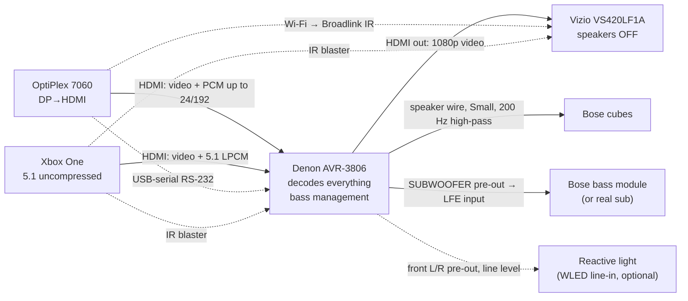

# Home Entertainment System: How It All Fits Together

This page connects the six component pages. It shows how signals and power move between the parts, how each complaint in [README.md](README.md) traces back to its cause, and what order to fix things in. For details, follow the links to each part's own page.

| Part | Page | Role |
|---|---|---|
| Dell OptiPlex 7060 | [dell-optiplex-7060.md](dell-optiplex-7060.md) | Qobuz music, Windows entertainment, Fedora dev |
| Xbox One | [xbox-one.md](xbox-one.md) | All streaming and gaming |
| Denon AVR-3806 | [denon-avr-3806.md](denon-avr-3806.md) | Audio decoding, amplification, HDMI switching |
| Bose Acoustimass | [bose-acoustimass.md](bose-acoustimass.md) | Speakers |
| Vizio VS420LF1A | [vizio-vs420lf1a.md](vizio-vs420lf1a.md) | Display |
| Sound/movie reactive light | [reactive-light.md](reactive-light.md) | Planned |

---

## 1. Things still to confirm (these change which fix applies)

| Unknown | How to check | What it decides |
|---|---|---|
| **Bose model and whether the bass module is powered** | Back of the bass module: a power cord and a capped RCA marked **LFE** mean powered (AM6 III/V, AM10 III–V, AM15 II, AM16). No power cord means passive (AM5, AM6 I/II, AM10 I/II). | Bose Fix A/B (use the module as a sub) vs Fix C (add a real sub). [Bose §1](bose-acoustimass.md#1-identify-the-exact-model) |
| **Xbox variant** | Original = large black box with a separate power brick. One S = white, smaller, internal power supply. One X = black, compact, "XBOX ONE X" on the front. [Xbox §1](xbox-one.md#1-which-xbox-one-do-you-have) | Whether there's a built-in IR blaster (S/X) or you need a Kinect/IR cable (original) for power control |
| **How the Xbox is cabled today** | HDMI into the Denon, or HDMI into the TV with optical to the Denon? | Whether Xbox fix A works as-is or needs a cable change |
| **Xbox One through the 3806's HDMI 1.1** | Plug it in and try 1080p. No one has reported this pairing online. | If it fails (black screen or no handshake), use the dual-path fix instead |
| **OptiPlex form factor** | Measure the case width: about 9 cm = SFF (most likely), about 15 cm = tower | Which drive bays and PCIe cards fit |
| **Do the Vizio's separate IR on/off codes work?** | Test with a learning IR blaster | Whether the TV can be switched *on* reliably rather than toggled |

Already confirmed from the running PC: **the OptiPlex is on HDMI into the Denon**. It connects through a DisplayPort-to-HDMI adapter and reads the Denon's EDID (`DENON-AVAMP`). It has an i7-8700 and 16 GB RAM, Windows is on a 256 GB SATA SSD, and **Fedora runs from an external USB SSD at 5 Gb/s**.

---

## 2. Signal chain

### Recommended chain with the current gear

Rules that follow from the Denon:
- **The Denon must be on for any picture to reach the TV.** The 3806 can't pass HDMI through while in standby. This is why power automation matters.
- **The Denon's menus don't show over HDMI video.** They only reach the TV at 480i through the analog path. Use the front-panel display, or RS-232 commands from the PC ([Denon §10](denon-avr-3806.md#10-control-rs-232-ir-12-v-trigger-automation)).
- **1080p is the ceiling** for everything that goes through the Denon.
- **Zone 2/3 and REC OUT carry analog sources only.** A sound-reactive light should tap the **front pre-outs** instead. The sub pre-out carries only bass (below 200 Hz) after the Bose fix.

---

## 3. Complaint → root cause → fix

> **Update 2026-09-24 (owner tested):** with the Xbox on 5.1 uncompressed, stereo content arrives as 6-channel PCM with silent channels, and PLIIx is locked out, exactly as with DD. The current recommended fix (Xbox optical → DAC → the Xbox source's analog input, toggled with INPUT MODE) is in [SETUP.md](../../SETUP.md#3-xbox-one-the-stereo51-problem-solved-as-far-as-current-gear-allows).

| Complaint (from README) | Real cause | Fix now (free or cheap) | Fixed properly by |
|---|---|---|---|
| **Xbox: manual DD / stereo switching** | The Xbox mixes everything into one fixed format. In DD mode stereo becomes a DD 5.1 stream with only L/R filled, and the 3806 only upmixes true 2-channel sources. | Xbox → Denon by **HDMI**, Xbox set to **5.1 uncompressed** permanently, and press **7CH STEREO** (shows "5CH STEREO" with 5.1 speakers) for stereo content. Save it on a USER button. [Xbox §5](xbox-one.md#5-solutions-ranked) | A streamer that sends stereo as real 2-channel (Nvidia Shield, about $149). A new receiver helps only partly: stereo inside a 5.1 container is Xbox behavior on any receiver. |
| **Bose: bass module wants all inputs** | Bose design. The module sums bass from every channel, applies its own EQ, and crosses over at about 200 Hz. | **Powered module:** cubes wired direct to the Denon (or left through the module), Denon speakers **Small, 200 Hz**, Sub **Yes**, mode **LFE**, sub pre-out → module's **LFE** RCA, then run Audyssey. [Bose §5](bose-acoustimass.md#5-solutions-to-the-sub-wants-all-inputs) | New speakers + a conventional powered sub (from about $400) |
| **PC doesn't power AVR/TV on/off** | No CEC anywhere in the chain: the Denon has none (manual confirms), the Vizio has none. | **USB-to-RS-232 cable** to the Denon (`PWON`/`PWSTANDBY`, about $15) + **Broadlink RM4 mini** IR for the Vizio (about $35), triggered by sleep/wake hooks. [OptiPlex §4](dell-optiplex-7060.md#4-fixing-doesnt-power-avrtv-onoff) | A new TV + AVR with CEC/eARC, plus network control |
| **PC slow** | Fedora runs from a USB SSD at 5 Gb/s; 16 GB RAM | Internal 1–2 TB NVMe for Fedora; 32 GB RAM | Same |
| **PC small SSD** | 256 GB Windows drive | Same NVMe plan; the USB SSD becomes the backup drive | Same |
| **PC loud fan** | Dust and old paste; the BIOS has no quiet mode | Clean, repaste, cap CPU power at 45–50 W | Silent mini PC (N150, about $200) for music/TV only |
| **Denon: no 4K/8K, no Atmos** | HDMI 1.1, 2005 decoders | Nothing, since the TV is 1080p anyway | New AVR **and** new TV together (see §6) |
| **Denon: clunky interface** | No on-screen menu over HDMI | RS-232 scripts from the PC; the remote's USER memory buttons | Modern receiver GUI + app |
| **Vizio: no 4K** | 2008 1080p panel | — | New TV |
| **Vizio: ugly speaker bar** | Part of the one-piece cabinet; can't be removed | Turn it off: **Menu → Audio → Speakers → Off** | New TV |
| **Want a reactive light** | — | **Govee TV Backlight 3 Lite (40–50")**, $60–80: camera-based, no HDMI changes, works with Netflix, mic music mode | Hue Sync Box 8K after the Denon (about $500–700). It carries over to a future TV/AVR. |

---

## 4. Settings cheat sheet (everything in one place)

**Xbox One** ([details](xbox-one.md#3-audio-output-settings-deep-dive))
- HDMI audio: **5.1 uncompressed**. Stay at 5.1 even though the Denon supports 7.1: you have 5.1 speakers, and some early 3806 units need firmware for 7.1 PCM.
- Optical: Off. Bitstream passthrough: Off. Blu-ray passthrough: Off.
- Video: **1080p**, 60 Hz, color depth 24-bit, color space **Standard (recommended)**.
- Device control: TV = Vizio, Receiver = Denon, power **On when Xbox turns on**. For turning off, see the power-conflict note in §5.

**Denon AVR-3806** ([details](denon-avr-3806.md#9-recommended-setup-for-this-system))
- HDMI In Assign: Xbox and PC each on their own HDMI input, **HDMI audio = AMP**.
- Speakers: Front, Center, Surround = **Small**. Surround back = **None**. Subwoofer = **Yes**.
- Crossover: **200 Hz** (Advanced per-speaker is fine; never below 150 Hz with the cubes).
- Sub mode: **LFE**.
- Run **Audyssey MultEQ XT** after rewiring. If it reports the sub farther away than it really is, that's expected filter delay; leave it.
- Surround mode per input: Xbox = MULTI CH IN (7CH STEREO for stereo apps). PC = PLIIx Music or Stereo, your preference. The 3806 remembers the mode per input and signal type.
- Don't use **Pure Direct** with the cubes; it bypasses bass management.

**Bose** ([details](bose-acoustimass.md#6-recommended-denon-avr-3806-settings))
- Module LFE/Bass knobs at the center position, then let Audyssey set the level.
- The Denon is rated for 6–16 Ω speakers and the Bose dips to about 5 Ω. Avoid long sessions at very high volume.

**Vizio** ([details](vizio-vs420lf1a.md#3-picture-settings))
- Speakers **Off**. Picture starting settings for movies, gaming and PC are on its page.

**OptiPlex** ([details](dell-optiplex-7060.md#3-audio-to-the-denon-avr-3806))
- Windows: output to the Denon HDMI device, exclusive mode on, and Qobuz set to its maximum resolution with exclusive mode.
- Fedora: let PipeWire switch sample rates (`allowed-rates`) so Qobuz playback is bit-perfect. Today it's locked at 48 kHz and resamples everything.
- Keep 96 kHz as the safe maximum until 192 kHz over HDMI is confirmed on the 3806. The EDID claims 192 kHz.

---

## 5. How the parts interact (watch-outs)

- **Two things control power, and they can conflict.** If the Xbox is set to turn the Denon **off** when the Xbox turns off, it will cut PC music. The PC scripts already check the Denon's input (`SI?`) before sending standby. Do the same on the Xbox side: set it to **turn devices on only**, or accept the conflict. The long-term fix is one controller: Home Assistant on the PC (its Denon RS-232 integration arrived in 2026.5) plus the Broadlink. It can see both sources and decide.
- **The Xbox IR blaster needs line of sight** to both the Denon and the Vizio, or an IR emitter cable if the console is in a cabinet.
- **HDMI hot-plug on the PC:** when the Denon is off or switched to the Xbox, the PC loses its display and audio device. Windows may move windows around, and PipeWire may switch audio to another output. Power automation reduces this.
- **The Xbox dual-path fix and the light:** Xbox fix B sends Xbox HDMI straight to the TV. An HDMI sync box placed "after the Denon" would then miss the Xbox. The camera-based Govee kit works with any wiring, which is one more reason it's the right first pick.
- **The Vizio's optical out** is documented as active for all inputs including HDMI. That's what makes Xbox fix B possible for stereo PCM. Whether it passes DD 5.1 from HDMI is unverified, but fix B doesn't need it.
- **Bose bass fix and the light:** after the bass fix, the sub pre-out carries only bass below 200 Hz. The light should take its audio from the front L/R pre-outs.
- **The bass module is part of the bass handling.** With the cubes crossed over at 200 Hz, bass starts to be localizable. Keep the module near the front of the room.

---

## 6. Upgrade roadmap (order matters)

The parts depend on each other, so the order you buy in matters:

1. **Free, this week:** Xbox HDMI + 5.1 PCM + 7CH STEREO, the Bose bass rewire and Audyssey rerun, Vizio speakers off, the PipeWire bit-perfect fix, and dusting/repasting the OptiPlex.
2. **About $50:** USB-RS-232 cable + Broadlink RM4 mini → one-command power on/off from the PC.
3. **About $60–80:** Govee TV Backlight 3 Lite. It works now and needs no HDMI changes.
4. **About $100–300:** 1–2 TB NVMe for Fedora (+ RAM when prices fall).
5. **Optional, about $149:** Nvidia Shield for streaming, which ends DD/stereo switching entirely. The Xbox stays for games.
6. **Big step: TV + AVR together.** A new 4K TV behind the old Denon still gets no 4K from sources through the Denon and no ARC. A new AVR on the old Vizio gets no picture improvement. Buy both together, or the TV first with 4K sources plugged straight into it and audio to the Denon over optical.
   - TV: TCL QM6K 55–65" (about $500–800) is the value pick; LG C-series OLED if budget allows ([Vizio §9](vizio-vs420lf1a.md#9-upgrade-path-2026)).
   - AVR: Denon X1800H/S770H (about $800) as the entry point, or an X3800H refurb (about $900–1,100) for XT32 + Dirac ([Denon §13](denon-avr-3806.md#13-limitations-vs-goals-and-the-upgrade-path)).
   - With both on HDMI 2.1 + CEC/eARC, the power-control problem goes away without scripts, and Atmos becomes possible (it also needs height speakers).
7. **Speakers:** replace the Bose with a conventional 5.1 set + powered sub once the AVR is settled. Options run from about $400 (Micca + Dayton) to about $1,000–1,400 (SVS Prime) ([Bose §9](bose-acoustimass.md#9-honest-sound-quality-assessment-and-upgrade-path)).
8. **Light, if it moves to the new system:** a Hue Sync Box 8K + gradient strip carries over to the new TV/AVR. A Philips Ambilight TV has the lights built in.

---

*Research compiled 2026-09-24. Prices are approximate US street prices as of September 2026. Items marked "unverified" on the component pages have not been confirmed by a primary source.*
