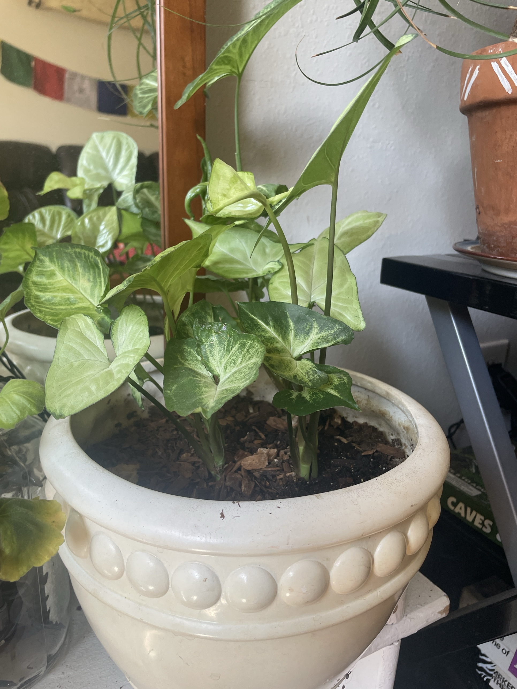

# Arrowhead Plant (*Syngonium podophyllum*)

Central/South American rainforest vine. Young leaves are heart- or arrow-shaped. As the plant matures, it starts climbing, grows longer stems, and makes more deeply lobed leaves. Fast, forgiving, and easy to propagate. **Toxic to pets and people if chewed** (calcium oxalate, like pothos).

## Current setup

- **Pot:** cream ceramic pot with a beaded band (confirm it has a drainage hole, or that there's a nursery pot inside)
- **Soil:** potting mix with bark chips on top
- **Location:** low stand next to the ponytail palm, in front of a mirror

## Condition log

### 2026-09-27
- Healthy and full. Lots of leaves and no visible damage or rot at the stems
- Mix of leaf colors: pale cream-green leaves (like the 'White Butterfly' cultivar) plus darker green leaves with speckled cream veins. Could be two cultivars planted together, or a variegation difference between newer and older leaves
- A few stems are getting tall and upright with longer, arrow-shaped leaves. It's starting to climb or reach for light

## To do

- [ ] Check that the pot drains. If it's a cachepot with no hole, empty any water sitting in the bottom after watering
- [ ] Decide on shape: **bushy** = pinch/cut the tall stems back just above a node. **Climbing** = add a moss pole or stake and tie the tall stems to it
- [ ] Root any stems you cut in water. Each piece needs a node. Plant them back in the same pot to make it fuller
- [ ] Rotate the pot a quarter turn every week or two so it grows evenly and doesn't lean toward the light
- [ ] Wipe dust off the leaves every month or so
- [ ] Keep it where pets can't chew it

## Care guide

| | |
|---|---|
| **Light** | Bright indirect. Tolerates medium light. Pale/variegated types keep their color best in brighter light, but direct afternoon sun scorches them |
| **Water** | Water when the top 1" of soil is dry. Keep it lightly moist, never soggy. Water less in winter |
| **Humidity** | Average is fine. 50%+ gives bigger leaves. Crispy edges = air too dry |
| **Temp** | 60–85°F (15–29°C). No cold drafts |
| **Feeding** | Spring–summer: half-strength balanced liquid fertilizer every 2–4 weeks. None in winter |
| **Soil** | Chunky, well-draining aroid mix. Potting soil plus bark and perlite (current mix looks right) |
| **Growth** | Fast. Pinch back for a bushy plant, or give it a pole to climb |

## Troubleshooting

| Symptom | Likely cause |
|---|---|
| Yellow lower leaves | Overwatering (most common) or normal aging |
| Drooping/wilting | Too dry. It perks up within hours of watering |
| Brown crispy edges | Low humidity or underwatering |
| Leaves turning all green | Not enough light. Variegation fades in low light |
| Long bare stems, small leaves | Not enough light, or it wants to climb. Prune or give it a pole |
| Brown scorched patches | Direct sun |
| Fine webbing, speckled leaves | Spider mites. Rinse the leaves and treat with insecticidal soap |
