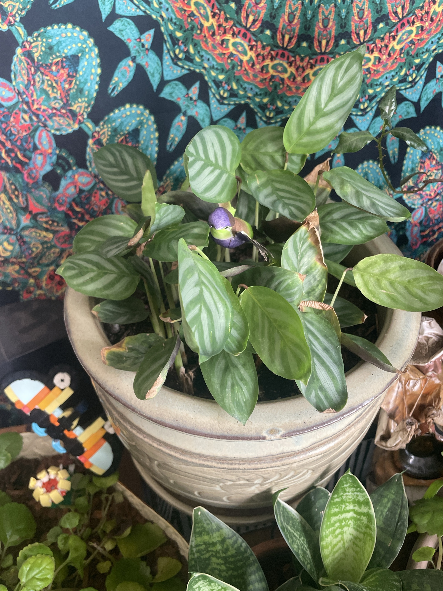

# Calathea (*Goeppertia* sp., ID tentative)

Prayer-plant family (Marantaceae), same family as the [Ctenanthe](ctenanthe-grey-star.md). Oval green leaves with a lighter feather/herringbone pattern along the veins. Possibly *Goeppertia concinna* 'Freddie' or a similar cultivar. The leaves fold up at night. **Very sensitive** to tap water, dry air, and letting the soil dry out. **Non-toxic to pets.** Care is the same as the Ctenanthe page.

## Current setup

- **Pot:** large celadon/sage glazed stoneware pot with a carved design, on a saucer. Purple bird decoration
- **Location:** low wooden surface in front of the green paisley tapestry, with Swedish Ivy #2 and the snake plant in front of it

## Condition log

### 2026-09-27
- Full clump with lots of leaves and good patterning on the healthy ones
- **Many leaves have brown, crispy edges and tips**, and several are curling
- Several dead, dried-up brown leaves around the base and in the middle of the clump
- New leaves are still coming up, so the roots are alive

## To do

- [ ] Cut off the fully dead/brown leaves at the base of their stalks
- [ ] Trim crispy edges following the leaf shape (optional, cosmetic)
- [ ] **Use filtered, distilled, or rainwater only.** Calatheas are the most tap-water-sensitive plants in the house. Minerals/fluoride cause exactly this kind of browning
- [ ] Keep the soil evenly moist. Check it every few days and water when the top ~1" is dry. Don't let it dry out
- [ ] Raise the humidity: a humidifier nearby is the biggest help, especially once the heat is on
- [ ] Keep it away from heaters, vents, drafts, and direct sun

## Care guide

See [ctenanthe-grey-star.md](ctenanthe-grey-star.md). Same family, same needs: medium indirect light, evenly moist soil with filtered water, 50%+ humidity, 65–80°F, light feeding.
