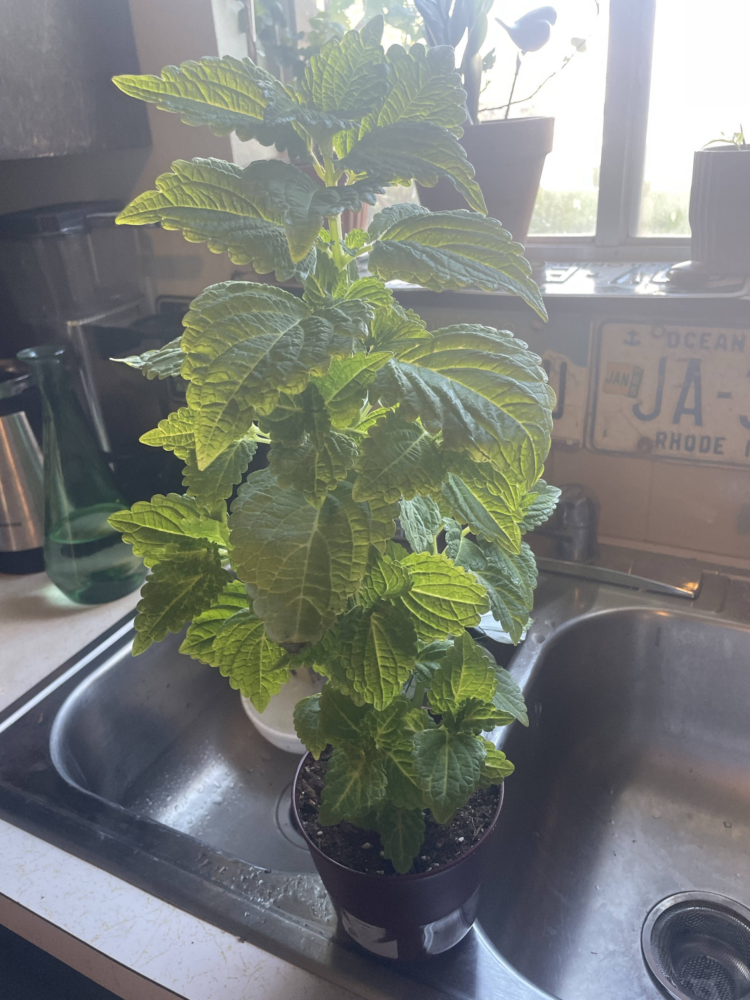

# Coleus (*Coleus scutellarioides*, ID tentative)

Tropical plant grown for its foliage, in the mint family (square stems, opposite leaves). This one is lime-green with darker green edges and deeply quilted, scalloped leaves. It looks like a lime cultivar such as 'Wasabi'. Fast-growing, thirsty, and easy to root from cuttings. **ID check:** lemon balm (*Melissa officinalis*) looks similar. Crush a leaf: a strong lemon smell means lemon balm, which is an herb (edible, and can be grown the same way).

## Current setup

- **Pot:** small dark-red plastic nursery pot, likely the one it came in
- **Soil:** nursery potting mix with perlite
- **Location:** photographed on the kitchen sink divider (probably being watered). Kitchen window nearby

## Condition log

### 2026-09-27
- Healthy, vigorous, and dense with leaves. Good color and no spots, holes, or wilting
- Tall and top-heavy for its small pot, which looks outgrown. The plant is maybe 3× the pot's height
- No flower spikes visible yet

## To do

- [ ] Repot into a pot 2" wider with drainage (spring is ideal, but it grows fast enough that now is fine). Nursery pots this full dry out fast and tip over
- [ ] Pinch out the growing tips (the top pair of tiny leaves on each stem) to make it bushier instead of taller
- [ ] Pinch off any flower spikes as soon as they appear. Flowering makes coleus leggy and slows leaf growth
- [ ] Root the pinched tips in water. They root in about a week, and are a good backup since coleus can decline in winter
- [ ] Do the smell test to confirm coleus vs lemon balm
- [ ] Rotate weekly so it grows evenly

## Care guide

| | |
|---|---|
| **Light** | Bright indirect, or some morning sun. Lime/yellow types handle more sun than dark types, but hot afternoon sun can scorch them. Too little light = leggy and dull color |
| **Water** | Keep evenly moist. Water when the top ½–1" is dry. It wilts dramatically when thirsty but bounces back quickly. Don't let it sit in water |
| **Humidity** | Average is OK. It likes 40%+ |
| **Temp** | 60–85°F (15–29°C). Sensitive to cold: keep it above 50°F and away from cold windows in winter |
| **Feeding** | Spring–summer: half-strength balanced liquid fertilizer every 2–4 weeks. Light or none in winter |
| **Soil** | Regular well-draining potting mix |
| **Pruning** | Pinch the tips often. Remove flower spikes. Cut back hard if it gets leggy, since it regrows fast |

## Troubleshooting

| Symptom | Likely cause |
|---|---|
| Sudden dramatic wilting | Dry soil. Water it and it recovers within hours |
| Wilting while the soil is wet | Root rot from overwatering |
| Leggy with leaves spread apart | Not enough light, or needs pinching |
| Faded colors | Too much or too little light |
| Brown crispy patches | Sunburn |
| Leaves dropping in winter | Cold drafts or low light. Keep cuttings as backup |
| White fuzzy spots under leaves/stems | Mealybugs. Dab with rubbing alcohol |
