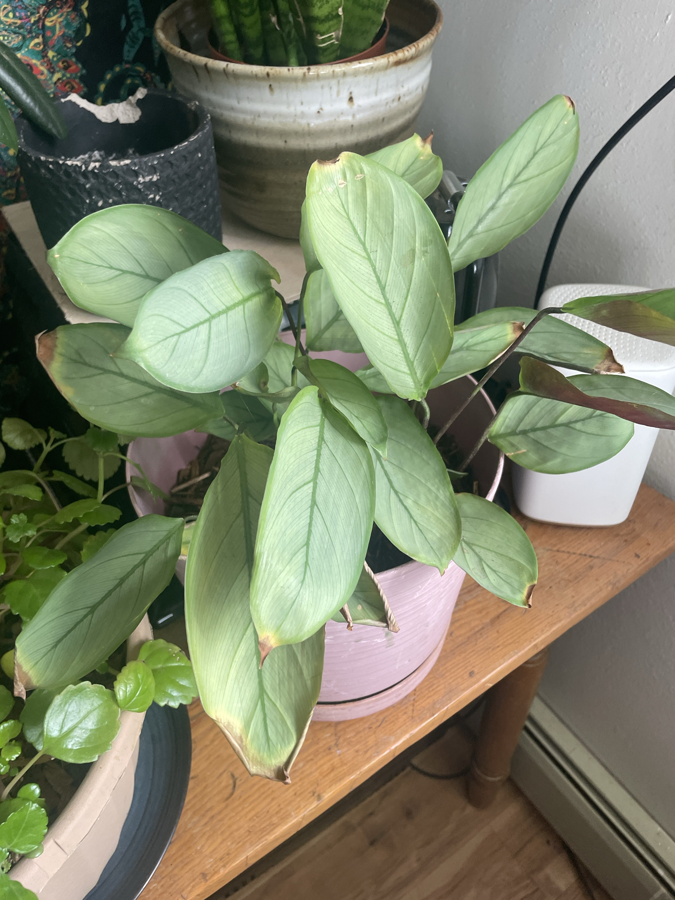

# Ctenanthe 'Grey Star' #2 (*Ctenanthe setosa*, ID tentative)

Second silver prayer plant, same type as [Ctenanthe #1](ctenanthe-grey-star.md). **See that page for the full care guide and troubleshooting.** **Non-toxic to pets.**

## Current setup

- **Pot:** pink ribbed pot on a matching saucer, soil topped with bark
- **Location:** wooden bench near the window corner. **Right next to a baseboard heater** (lower right) and near a white humidifier/air purifier

## Condition log

### 2026-09-27
- Good number of silvery leaves with dark veins. A couple of newer leaves at the top
- **Brown, crispy tips on most leaves**, with yellow halos between the brown and green on some
- A few leaves have small tears/holes, and a couple of leaves hang low, curling
- One or two dry dead leaves near the base

## To do

- [ ] **Move it away from the baseboard heater before the heat comes on.** Dry, hot air blowing up from a heater will quickly crisp this plant. Even a few feet helps
- [ ] If that white device is a humidifier, point it toward this plant and the Calathea
- [ ] Switch to filtered, distilled, or rainwater
- [ ] Keep the soil evenly moist. Don't let it dry out
- [ ] Cut off dead leaves at the base. Trim brown tips following the leaf shape (optional)
