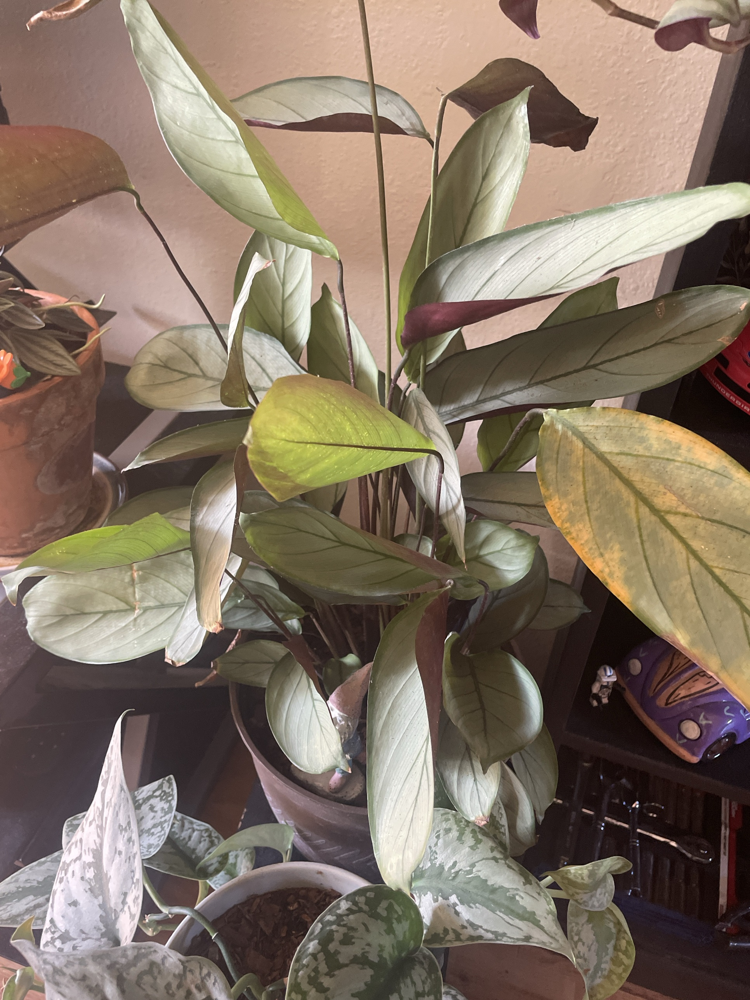

# Ctenanthe 'Grey Star' #1 (*Ctenanthe setosa*, ID tentative)

Brazilian prayer-plant family member (Marantaceae, with calathea and maranta). Long, silvery gray-green leaves with dark green veins and **deep purple undersides**, on long thin stalks. The leaves fold up at night. Fussy about water quality and humidity. **Non-toxic to pets.** ID is tentative: it could also be a similar silver *Stromanthe*/*Calathea*. Care is the same.

This page has the full care guide for [Ctenanthe #2](ctenanthe-grey-star-2.md) and the [Calathea](calathea.md) too (same family).

## Current setup

- **Pot:** brown ceramic pot with a gnome and a bird decoration in the soil
- **Location:** black shelf next to the inch plant and Peperomia 'Rosso', with the satin pothos in front of it

## Condition log

### 2026-09-27
- Big, full plant with lots of leaves and a tall flower stalk
- **One large leaf (right) yellowing with orange/brown blotches.** It's on its way out
- Several leaves have brown tips, brown curled edges, or crisp tears
- Some leaves are curled/rolled lengthwise. In prayer plants that usually means thirst or dry air
- Good purple undersides and silver color on most leaves

## To do

- [ ] Cut off the yellow blotchy leaf at the base of its stalk, plus any other mostly-brown leaves
- [ ] Trim brown tips/edges following the leaf shape (optional, cosmetic)
- [ ] **Switch to filtered, distilled, or rainwater.** The prayer-plant family is very sensitive to fluoride/chlorine/salts, which cause brown tips and edges
- [ ] Don't let it dry out completely. Water when the top ~1" is dry. Curled leaves = thirsty
- [ ] Raise the humidity: group it with other plants (it already is), use a pebble tray or a humidifier, especially once the heat is on this winter
- [ ] Keep it out of direct sun, which bleaches the silver and scorches the leaves
- [ ] After the flower stalk finishes, cut it off at the base

## Care guide

| | |
|---|---|
| **Light** | Medium to bright indirect. No direct sun |
| **Water** | Keep lightly and evenly moist. Water when the top 1" is dry. Never bone dry, never soggy. Filtered/distilled/rainwater at room temp |
| **Humidity** | 50%+. Dry air = crispy edges and curling |
| **Temp** | 65–80°F (18–27°C). Hates cold drafts and sudden changes |
| **Feeding** | Spring–summer: quarter- to half-strength fertilizer monthly. Salt buildup burns the leaf edges, so go light |
| **Soil** | Peat/coco-based mix with perlite, moisture-holding but airy |
| **Repotting** | Divide the clumps in spring if it gets crowded |

## Troubleshooting

| Symptom | Likely cause |
|---|---|
| Brown crispy tips/edges | Tap water minerals, dry air, or uneven watering |
| Leaves curling/rolling | Thirsty or air too dry |
| Yellow leaves with blotches | Overwatering, aging, or water stress. Check that the soil isn't soggy |
| Faded silver, scorched patches | Direct sun |
| Drooping stems | Underwatered or root rot. Check the soil |
| Fine webbing, speckled leaves | Spider mites (common in dry air). Rinse and treat |
