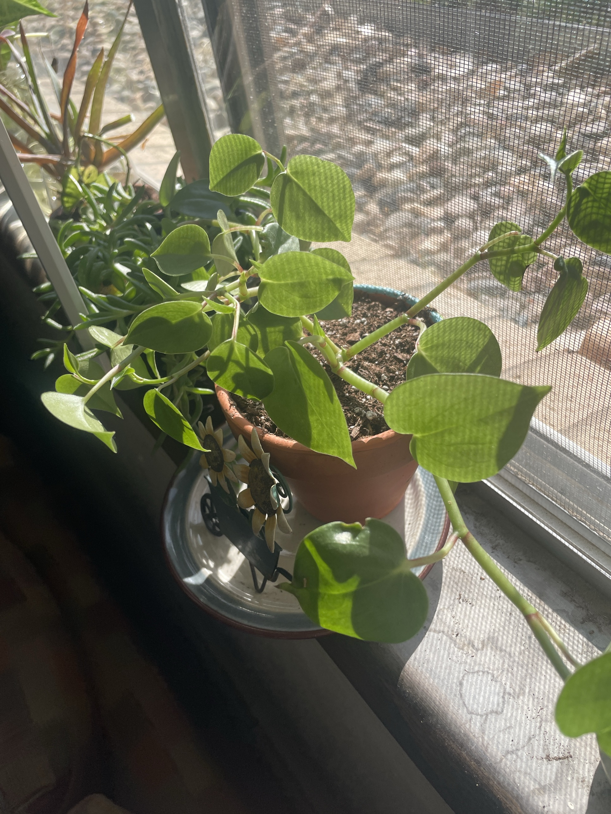

# Cupid Peperomia (*Peperomia scandens*, ID tentative)

Trailing peperomia with heart-shaped, slightly fleshy, light green leaves on thick jointed stems tinged pink at the nodes. Semi-succulent like your other peperomias ([ripple](ripple-peperomia.md), [baby rubber plant](variegated-baby-rubber-plant.md), ['Rosso'](peperomia-rosso.md)), so let it dry out partway. **ID is tentative:** it could be a heartleaf philodendron. Peperomia leaves are thicker and the stems juicier. **Non-toxic to pets** if it's the peperomia. The philodendron would be toxic.

## Current setup

- **Pot:** terracotta with a scalloped rim, on a saucer with a small metal wheelbarrow decoration
- **Location:** screened windowsill, next to the trailing succulent and the Dieffenbachia

## Condition log

### 2026-09-27
- Healthy, with lots of heart-shaped leaves and stems trailing across the sill and toward the screen
- Good light. The leaves are a bright light green
- Some stems long with spaced-out leaves
- No yellowing or rot visible

## To do

- [ ] Confirm the ID: squeeze a leaf. Thick and slightly succulent = peperomia. Thin and papery with aerial root nubs on the stem = philodendron
- [ ] Water when the top half of the soil is dry
- [ ] Trim the longest stems and root the cuttings back into the pot to make it bushier
- [ ] Watch for scorching if the sill gets hot afternoon sun
