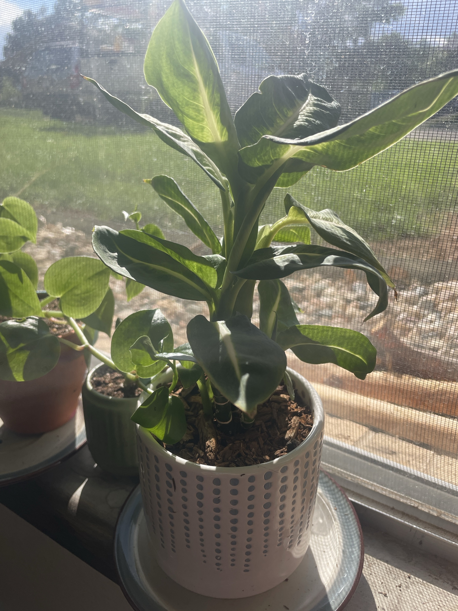

# Dieffenbachia (*Dieffenbachia* sp.)

Central/South American "dumb cane." Large oval leaves with pale cream-green centers along the midrib, on a thick upright stem. Fast grower. **Toxic to pets and people:** the sap contains calcium oxalate crystals that cause painful mouth/throat swelling if chewed. Wear gloves when cutting and wash your hands afterward.

## Current setup

- **Pot:** white ceramic pot with vertical gray dot rows, on a saucer. Soil topped with bark
- **Location:** windowsill with a screen (strong light). Next to the [cupid peperomia](cupid-peperomia.md) in terracotta and the [succulent cutting](succulent-cutting.md) in the small green ribbed pot

## Condition log

### 2026-09-27
- Healthy and upright, with several stems and good variegation. New leaves unfurling at the top
- A few leaves are **curling/rolling and twisting** at the edges
- One or two brown leaf tips
- Getting strong light through the window

## To do

- [ ] If the window gets hot afternoon sun, pull it back a foot or two or add a sheer curtain. Curling leaves can mean too much sun/heat or thirst
- [ ] Check the soil. Water when the top 1–2" is dry, and don't let it dry out completely
- [ ] Rotate weekly. Dieffenbachias lean hard toward light
- [ ] Wipe the dust off the big leaves monthly
- [ ] Keep it away from pets and kids

## Care guide

| | |
|---|---|
| **Light** | Bright indirect. Tolerates medium light. Direct sun scorches the leaves |
| **Water** | Water when the top 1–2" is dry. Evenly moist in summer, a bit drier in winter. No soggy soil |
| **Humidity** | Average is fine. 50%+ is better |
| **Temp** | 65–80°F (18–27°C). Hates cold drafts and cold windows in winter |
| **Feeding** | Spring–summer: half-strength balanced fertilizer monthly |
| **Soil** | Well-draining peat/coco potting mix with perlite and bark |
| **Pruning** | When it gets tall and bare at the bottom, cut the cane. The top and cane sections root, and the stump resprouts |

## Troubleshooting

| Symptom | Likely cause |
|---|---|
| Leaves curling | Too much sun/heat, thirst, or low humidity |
| Yellow lower leaves | Overwatering, or normal aging as it grows taller |
| Brown tips/edges | Dry air, uneven watering, or tap water salts |
| Scorched pale patches | Direct sun |
| Leaning, stretched | Needs rotating or more light |
| Mushy stem at the base | Rot from overwatering |
