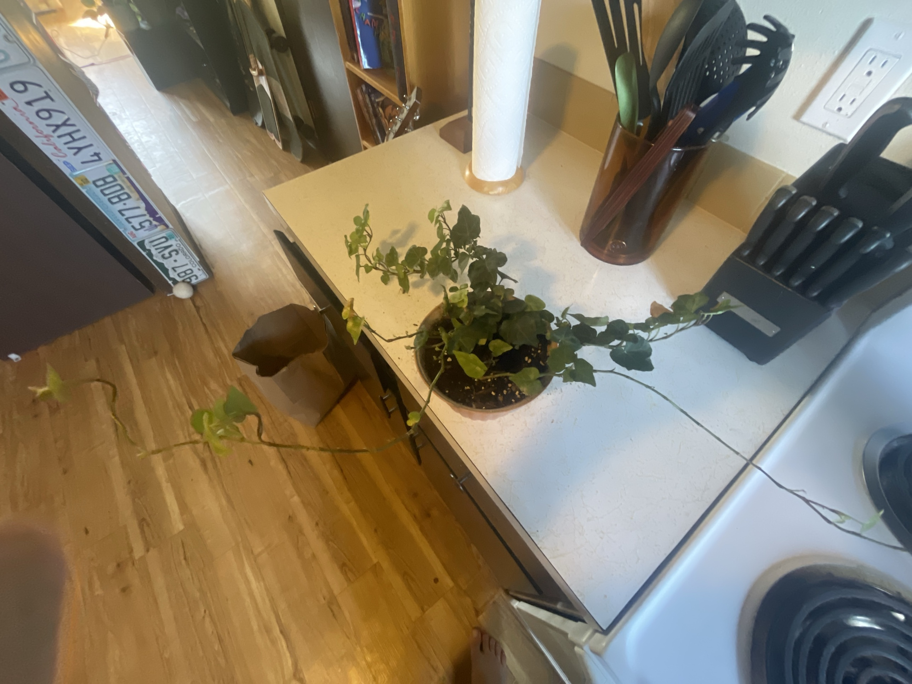

# English Ivy (*Hedera helix*)

European evergreen vine with lobed leaves. Trails or climbs with aerial rootlets. Prefers cooler temps and bright indirect light. Prone to spider mites in warm, dry indoor air. **Toxic to pets and people if eaten**, and the sap can irritate skin.

## Current setup

- **Pot:** terracotta
- **Soil:** potting mix with perlite
- **Location:** kitchen counter next to the stove

## Condition log

### 2026-09-27
- Center is full and dense with healthy dark green leaves
- Several very long runners: one trails onto the floor, and **one runs across the stovetop onto a burner**
- Runners are leggy: long bare stretches of stem with few leaves, and some pale/yellowish leaves near the tips
- No obvious pests visible in the photo

## To do

- [ ] **Get the vine off the stove now.** It's a fire hazard, and heat will cook it. Cut it back or move the pot away from the burners
- [ ] Trim the long leggy runners back to where the leaves are dense. Cut just above a leaf
- [ ] Root the cuttings: 4–6" pieces with a few leaves, lower leaves removed, set in water or moist soil. Roots in about 2–3 weeks. Plant them back in the pot to make the center even fuller
- [ ] Remove yellow leaves
- [ ] Check the leaf undersides for spider mites (tiny dots, fine webbing, speckled leaves), especially in winter when the heat is on
- [ ] Choose a spot away from the stove: bright indirect light, like a shelf or hanging near a window where it can trail safely
- [ ] Rinse the whole plant in the sink/shower every month or two. Helps prevent mites and dust

## Care guide

| | |
|---|---|
| **Light** | Bright indirect. Tolerates medium light but gets leggy. Variegated types need more light. No hot direct sun |
| **Water** | Water when the top ½–1" is dry. Evenly moist, never soggy. Water less in winter |
| **Humidity** | 40%+. Dry air invites spider mites |
| **Temp** | Prefers cool: 50–70°F (10–21°C). Struggles in hot rooms and near heat sources (stove, radiators, heaters) |
| **Feeding** | Spring–summer: half-strength balanced fertilizer monthly. None in winter |
| **Soil** | Regular well-draining potting mix |
| **Pruning** | Trim runners anytime to keep it full. It regrows fast |

## Troubleshooting

| Symptom | Likely cause |
|---|---|
| Long bare stems with few leaves | Not enough light or needs pruning |
| Speckled/stippled leaves, fine webbing | Spider mites. Rinse and treat with insecticidal soap |
| Brown crispy leaf edges | Hot, dry air, or underwatering |
| Yellow leaves | Overwatering, or normal aging of old leaves |
| Variegation fading | Not enough light |
| Sticky residue, small bumps on stems | Scale or aphids. Wipe off and treat with insecticidal soap |
