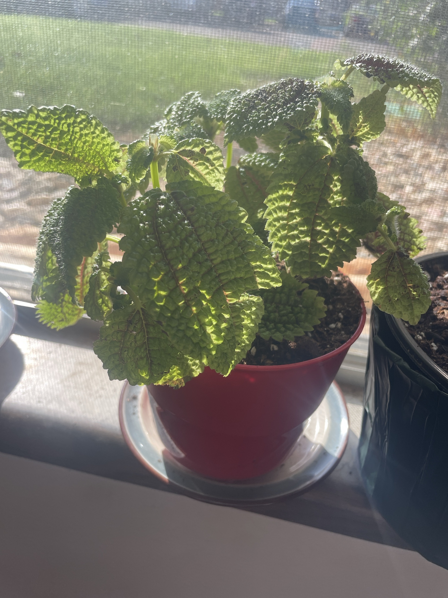

# Friendship Plant (*Pilea involucrata* 'Moon Valley')

Central/South American creeping plant. Deeply quilted, bumpy, fuzzy leaves: bright green with dark bronze in the "valleys" and reddish veins. Stays small and bushy. Loves humidity and warmth, and roots easily from stem tips. **Non-toxic to pets.**

## Current setup

- **Pot:** red plastic pot on a white saucer
- **Location:** windowsill with a screen (the same one as Jade #1 and the begonia base's black pot). Gets strong sun through the screen

## Condition log

### 2026-09-27
- Bushy and healthy. Lots of upright stems with full, textured leaves
- Some leaves have **small brown spots/specks**, and a few leaf edges are browning
- Leaves look slightly pale/yellow-green in the sun
- No wilting or pests visible

## To do

- [ ] **Move it out of direct sun**, or back it off the window a bit. The brown spots and paleness are likely from sun, since Pileas like bright *indirect* light
- [ ] Keep the soil lightly moist. Water when the top ½–1" is dry. It wilts quickly when dry
- [ ] Raise the humidity: group it with other plants or set it on a pebble tray
- [ ] Pinch the stem tips to keep it compact. Root the tips in water or moist soil
- [ ] Remove leaves that are mostly spotted/brown

## Care guide

| | |
|---|---|
| **Light** | Bright to medium indirect. No direct afternoon sun |
| **Water** | Evenly moist, never soggy. Water when the top ½–1" is dry. Water less in winter |
| **Humidity** | 50%+. Dry air = crispy edges |
| **Temp** | 65–80°F (18–27°C). No cold drafts or cold glass |
| **Feeding** | Spring–summer: half-strength balanced fertilizer monthly |
| **Soil** | Peat/coco-based potting mix with perlite |
| **Pruning** | Pinch often. Restart from cuttings when it gets leggy (every year or two) |

## Troubleshooting

| Symptom | Likely cause |
|---|---|
| Brown spots/scorched patches | Direct sun |
| Crispy brown edges | Dry air or drying out |
| Wilting, drooping | Thirsty. Water it |
| Yellow lower leaves, mushy stems | Overwatering |
| Leggy, spread out | Low light or needs pinching |
| Webbing, speckles | Spider mites. Rinse and treat |
