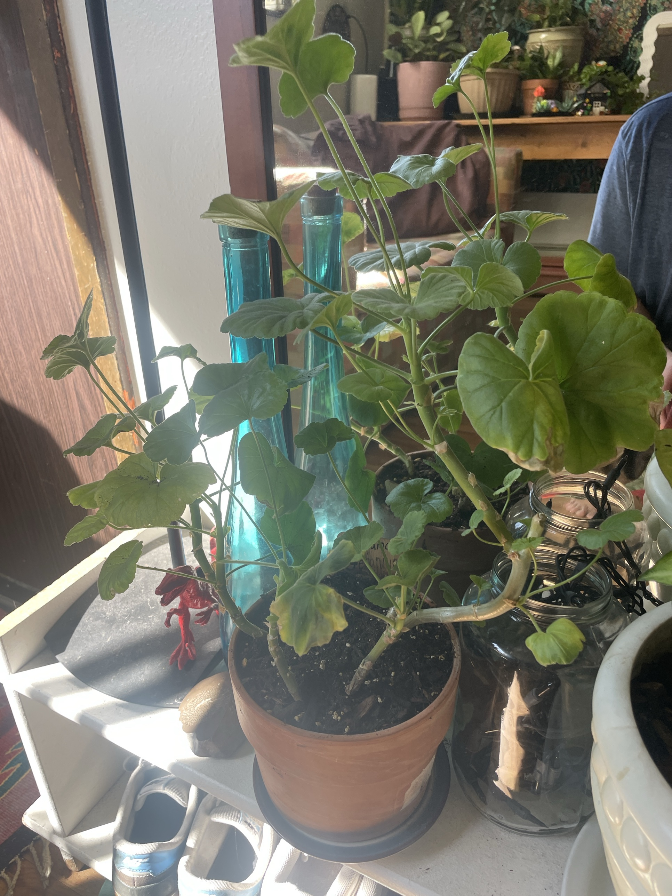

# Geranium (*Pelargonium* × *hortorum*)

South African perennial, most likely a zonal geranium (round, scalloped, slightly fuzzy leaves). Not a true *Geranium*. Loves sun and hates wet feet. Treat it more like a succulent than a tropical plant. Blooms best when slightly pot-bound and given lots of light. Easy to root from stem cuttings.

## Current setup

- **Pot:** terracotta with a saucer
- **Soil:** potting mix with some bark
- **Location:** white shelf in a sunny spot near the window/mirror

## Condition log

### 2026-09-27
- Leggy: long bare stems with the leaves spread out, stretching and leaning toward the light. The main stems are thick and woody near the base
- A few lower/older leaves are yellowing with brown, crispy edges (e.g. the big leaf on the right and one near the soil)
- No flowers right now
- Otherwise healthy. Lots of new leaves at the stem tips and no sign of rot at the base

## To do

- [ ] Remove yellow and brown leaves. Snap or cut them off where the leaf stalk meets the stem
- [ ] Cut back leggy stems by about ⅓–½, just above a leaf node. This makes it bushier and fuller. It can be done now, or harder in late winter (Feb–Mar) before spring growth
- [ ] Root the cuttings: 3–5" tip pieces, remove the lower leaves, let them dry for a few hours, then stick them in dry-ish potting mix (or water). Roots form in about 2–4 weeks. Plant them back in the pot to fill it out, or start new plants
- [ ] Give it the sunniest spot available, ideally a south- or west-facing window. Rotate it weekly so it doesn't lean
- [ ] Let the soil dry out between waterings. Water less through winter

## Care guide

| | |
|---|---|
| **Light** | Full sun. 6+ hours of direct light. Indoors, the sunniest window you have (or a grow light in winter). Low light = leggy stems and no flowers |
| **Water** | Water thoroughly when the top 1–2" of soil is dry, then let it drain. Err on the dry side. Much less in winter |
| **Humidity** | Dry household air is fine. Don't mist |
| **Temp** | 60–75°F (15–24°C) during the day. Likes cooler nights (50–60°F) in winter, which helps it bloom in spring. Keep above 45°F |
| **Feeding** | Spring–summer: balanced or bloom fertilizer every 2–4 weeks at half strength. Little or none in winter |
| **Soil** | Well-draining potting mix with perlite. Terracotta pot is ideal |
| **Pruning** | Pinch the tips often to keep it bushy. Deadhead spent flowers. Cut back hard in late winter if leggy |

## Troubleshooting

| Symptom | Likely cause |
|---|---|
| Long bare stems, leaves far apart | Not enough light. Prune and move it to brighter light |
| Yellow lower leaves | Overwatering (most common), or normal aging of old leaves |
| Yellow leaves with brown crispy edges | Uneven watering, or old leaves dying off. Also common after moving indoors |
| Red-tinged leaves | Cold, or low phosphorus. Usually harmless |
| Black/mushy stem base | Stem rot from wet soil. Take cuttings from the healthy top right away |
| No flowers | Not enough sun, too much nitrogen, or pot too big |
| Gray fuzzy mold on leaves | Botrytis. Remove affected leaves, improve airflow, keep leaves dry |
