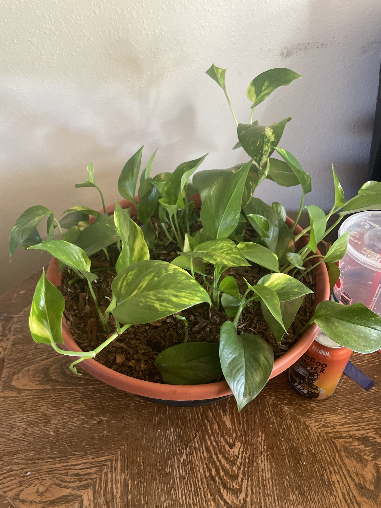

# Golden Pothos #2 (*Epipremnum aureum*)

Second golden pothos, a bowl planted with many rooted cuttings. **Full care guide and troubleshooting: [golden-pothos.md](golden-pothos.md).** **Toxic to pets and people if chewed.**

## Current setup

- **Pot:** wide, shallow terracotta bowl on a dark saucer. Soil topped with bark
- **Location:** wood table against a wall

## Condition log

### 2026-09-27
- Many separate cuttings/stems rooted in, filling the bowl. Looks like it was started from cuttings (possibly from Pothos #1)
- Healthy: glossy leaves with good yellow variegation and lots of new leaves unfurling
- A couple of vines starting to trail over the rim
- No yellow leaves, rot, or pests visible

## To do

- [ ] Wide, shallow bowls dry out unevenly. Check moisture in the middle, not just the edge. Water when the top 1–2" is dry
- [ ] Empty the saucer after watering
- [ ] Let vines trail over the edge, or pin them back onto the soil (pinned nodes root and make it fuller)
- [ ] Rotate so all sides get light evenly
- [ ] Keep away from pets
