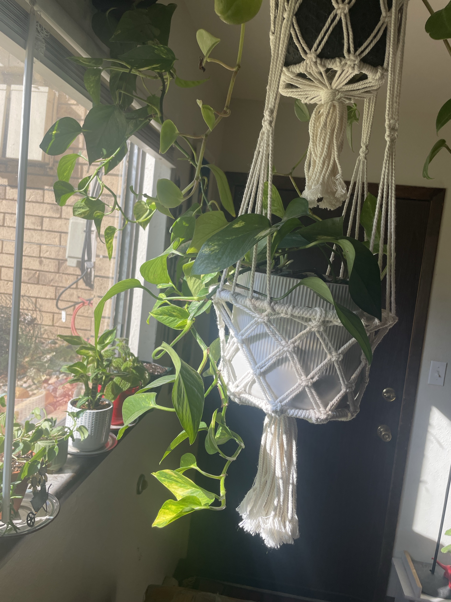

# Golden Pothos #3, hanging (*Epipremnum aureum*)

Hanging golden pothos in a macramé hanger. **Full care guide and troubleshooting: [golden-pothos.md](golden-pothos.md).** **Toxic to pets.**

## Current setup

- **Pot:** white ribbed pot in a cream macramé hanger
- **Location:** hanging near the big window by the front door, above the windowsill with the Dieffenbachia and friendship plant

## Condition log

### 2026-09-27
- Healthy and full, with long vines trailing a few feet down and good yellow variegation
- Bright light from the window. The lower vine leaves are brighter lime-yellow in the sun
- One or two yellowing leaves near the vine ends
- No pests visible

## To do

- [ ] Hanging pots dry out faster (warm air rises). Check the soil weekly. Take it down and water it in the sink so it drains fully before rehanging
- [ ] Remove yellow leaves
- [ ] Trim long vines if they get in the way, and root the cuttings to fill the top of the pot
