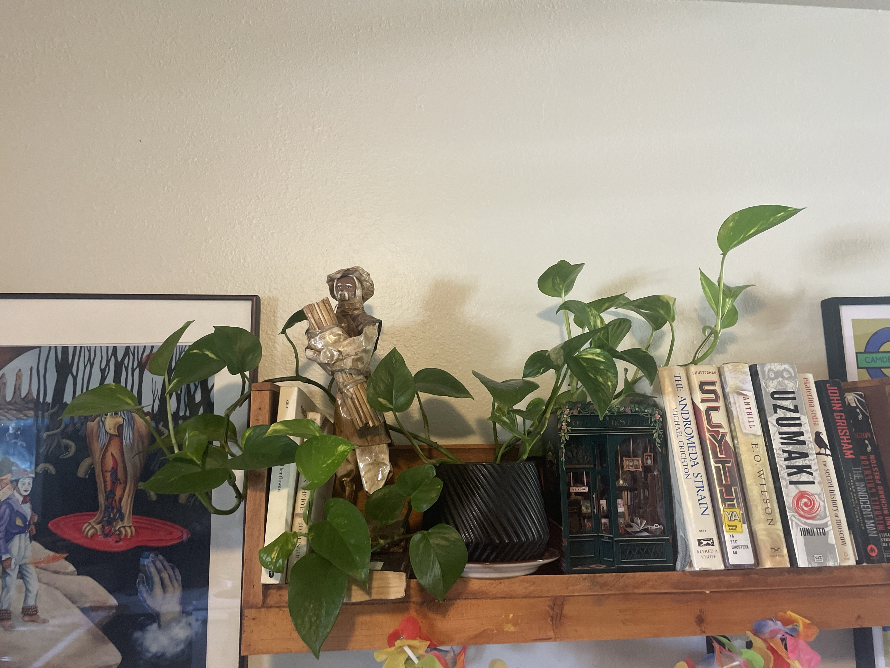

# Golden Pothos #1 (*Epipremnum aureum*)

Solomon Islands vine. Heart-shaped green leaves streaked with yellow. One of the toughest houseplants: tolerates low light and missed waterings, trails or climbs, and roots from cuttings in water in a couple of weeks. **Toxic to pets and people if chewed** (calcium oxalate).

There is a second one: [Golden Pothos #2](golden-pothos-2.md).

## Current setup

- **Pot:** black ribbed ceramic pot on a white saucer
- **Location:** high wall shelf above the books, between a framed painting and the book row. Vines drape over the shelf edge and a figurine

## Condition log

### 2026-09-27
- Healthy and lush. Glossy, deep green leaves with yellow streaks. Several long vines trailing left and down, plus some upright shoots on the right
- No yellow or brown leaves, spots, or pests visible
- Leaves are larger near the pot and smaller toward some vine tips, which is normal

## To do

- [ ] High shelves are easy to forget, so check the soil every week or so (a step stool or a finger test on the saucer runoff)
- [ ] Empty the saucer after watering
- [ ] Optional: trim long vines to keep them tidy, and root the cuttings in water (each piece needs a node). Plant them back in the pot for a fuller top
- [ ] Keep vines off anything a pet could reach
- [ ] If the yellow streaks fade over time, it needs more light. Move it closer to a window

## Care guide

| | |
|---|---|
| **Light** | Bright indirect for best variegation and growth. Tolerates low light but gets greener and leggier. No hot direct sun |
| **Water** | Let the top 1–2" dry out, then water thoroughly. About every 1–2 weeks, less in winter. Drooping leaves = thirsty, and it perks up quickly |
| **Humidity** | Average is fine |
| **Temp** | 60–85°F (15–29°C). Keep above 50°F |
| **Feeding** | Spring–summer: half-strength balanced fertilizer monthly. None in winter |
| **Soil** | Regular well-draining potting mix, perlite optional |
| **Pruning** | Trim anytime. Cut just above a node and the vine branches from there |

## Troubleshooting

| Symptom | Likely cause |
|---|---|
| Yellow leaves | Overwatering (most common), or normal aging of old leaves |
| Drooping/limp leaves | Thirsty. Water it |
| Brown crispy edges | Underwatering or very dry air |
| Brown/black soft spots | Overwatering or rot |
| Losing yellow variegation | Not enough light |
| Long bare vines, small leaves | Low light. Prune and move it brighter |
| Fine webbing, stippled leaves | Spider mites. Rinse and treat with insecticidal soap |
