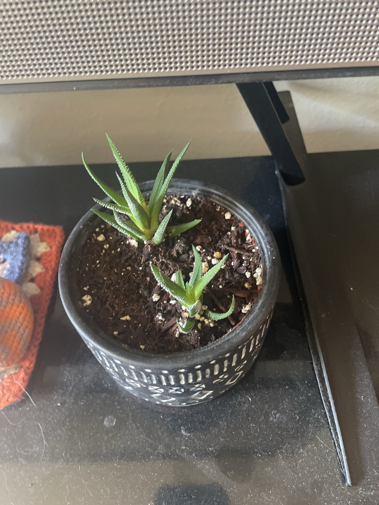

# Haworthia (*Haworthiopsis* sp., ID tentative)

Small South African succulent. Narrow, pointed, dark green leaves in a rosette, covered in raised white bumps. Likely a zebra haworthia (*H. attenuata*) or a close relative. Grows slowly and makes pups (offsets) at the base. Handles lower light better than most succulents, but still wants bright light. **Non-toxic to pets.**

## Current setup

- **Pot:** small black ceramic pot with a white carved pattern
- **Soil:** regular potting mix with some perlite. Holds more water than it likes
- **Location:** black shelf **directly under the TV/soundbar**, next to a crocheted decoration

## Condition log

### 2026-09-27
- Two separate rosettes planted in the pot. Looks like a mother plant plus a pup that was separated and replanted, or two pups
- Larger rosette: healthy, firm, and upright with good color
- Smaller rosette: healthy leaves but sitting a bit high, with a short bare stem/base visible. May still be rooting in
- Soil looks moist/dark

## To do

- [ ] **Move it somewhere brighter.** Under the TV/soundbar is probably too dark. A windowsill with bright indirect light or gentle morning sun is ideal. In low light it stretches and turns pale
- [ ] Let the soil dry out **completely** between waterings. Don't water again while it's still dark and damp
- [ ] Gently check that the small rosette is anchored. If it's loose, push it down so the base touches the soil and hold off watering for a week so it roots
- [ ] Next repot (spring): switch to cactus/succulent mix, or potting mix with lots of pumice/perlite/grit
- [ ] Check that the black pot has a drainage hole

## Care guide

| | |
|---|---|
| **Light** | Bright indirect, with gentle morning sun OK. Strong afternoon sun turns it red/brown (stress). Too little = stretched and pale |
| **Water** | Soak, then let it dry out completely. About every 2–3 weeks in spring–summer, every 4–6 weeks in winter. Water the soil, not into the rosette |
| **Humidity** | Dry household air is ideal |
| **Temp** | 60–80°F (15–27°C). Keep above 50°F |
| **Feeding** | Spring–summer: succulent fertilizer at quarter-strength once or twice a season |
| **Soil** | Gritty, fast-draining cactus/succulent mix |
| **Propagation** | Separate the pups with some roots attached in spring. Let them dry for a day, then plant in dry mix |

## Troubleshooting

| Symptom | Likely cause |
|---|---|
| Mushy, translucent leaves | Overwatering/rot |
| Stretched, pale, leaning | Not enough light |
| Leaves turning red/brown | Too much direct sun or stress. Usually reversible |
| Wrinkled, thin leaves | Thirsty. Soak it |
| Dry, crispy lower leaves | Normal aging. Pull them off gently |
| White cottony spots in the rosette | Mealybugs. Dab with rubbing alcohol |
