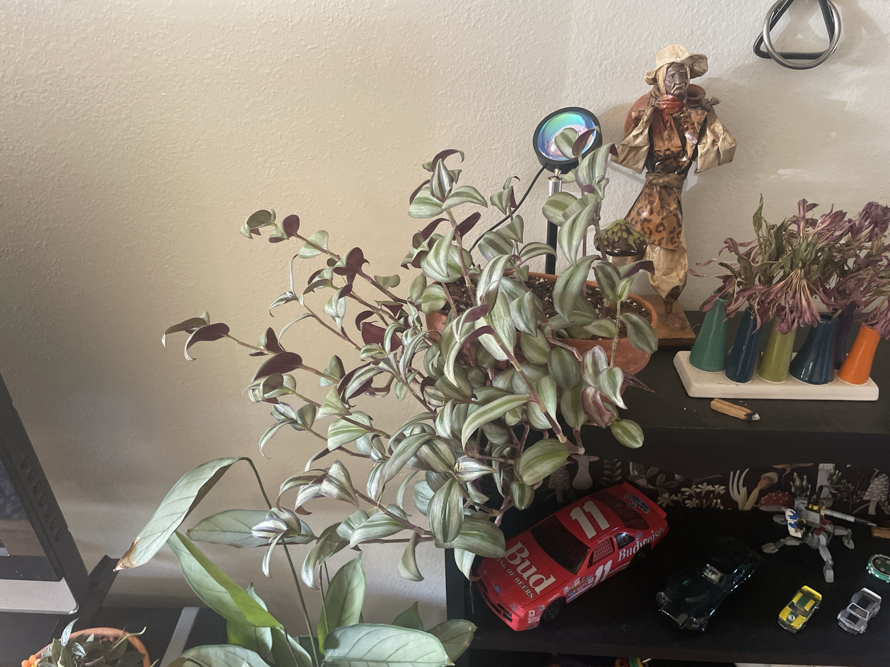

# Inch Plant (*Tradescantia zebrina*)

Mexican/Central American trailing plant. Pointed leaves with silver and green stripes on top and deep purple undersides, on jointed, juicy stems. Grows very fast and roots from any stem piece, in water or soil. Also sold as "wandering dude" or "wandering Jew." **Mildly toxic:** the sap can irritate skin and upset the stomach of pets that chew it.

## Current setup

- **Pot:** shallow terracotta bowl
- **Location:** top of a black shelf (with the figurine, sunset lamp, and dried flowers in bud vases), spilling over the front edge

## Condition log

### 2026-09-27
- Big, full, and healthy. Lots of stems spilling over the shelf edge
- Good silver striping with purple undersides visible on the curled leaves
- Some stems are long, with leaves spaced out along them (leggy), especially the long ones reaching left
- No crispy brown leaves or pests visible
- In front of it: the [Ctenanthe 'Grey Star'](ctenanthe-grey-star.md) (not an *Aglaonema* as first guessed) and the [Peperomia 'Rosso'](peperomia-rosso.md) in the small terracotta pot

## To do

- [ ] Trim the leggiest stems back by about a third, cutting just above a leaf node
- [ ] Stick the cuttings straight back into the pot's soil (or root them in water for about a week first). This is the best way to keep a tradescantia full at the top
- [ ] Pull off any dried/crispy leaves near the base (older stems lose their lower leaves)
- [ ] Give it bright light. The purple and silver colors fade toward plain green in low light
- [ ] Keep it where pets can't chew it

## Care guide

| | |
|---|---|
| **Light** | Bright indirect, and some gentle direct sun is fine. More light = stronger purple/silver color |
| **Water** | Water when the top 1" is dry. Evenly moist, never soggy. Water less in winter. Water the soil, not the leaves (leaves rot if water sits in the crowns) |
| **Humidity** | Average is fine. Very dry air causes crispy brown leaf tips |
| **Temp** | 60–80°F (15–27°C). Keep above 50°F |
| **Feeding** | Spring–summer: half-strength balanced fertilizer monthly. Too much makes it leggy and green |
| **Soil** | Regular well-draining potting mix |
| **Pruning** | Pinch and trim often. Replant the cuttings. Plants get straggly with age, so restarting from cuttings every year or two keeps it lush |

## Troubleshooting

| Symptom | Likely cause |
|---|---|
| Long bare stems, spaced-out leaves | Not enough light, or needs trimming. Normal with age |
| Colors fading to green | Low light |
| Brown crispy leaves | Underwatering or dry air |
| Mushy stems at soil level | Overwatering/rot. Take cuttings from the healthy tips |
| Leaves dropping at the base | Normal aging. Replant cuttings to refill |
| Fine webbing, speckled leaves | Spider mites. Rinse and treat with insecticidal soap |
