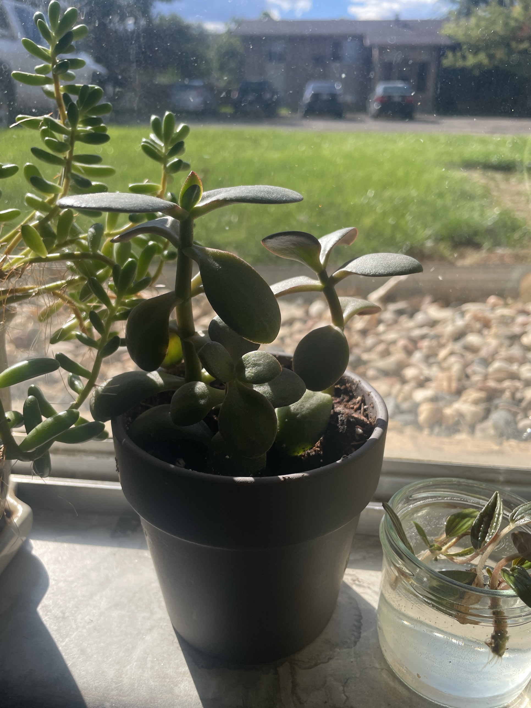

# Jade Plant #2 (*Crassula ovata*)

Classic jade: thick, oval, paddle-shaped leaves with red-tinged edges on branching stems. **Full care guide and troubleshooting: [jade-plant.md](jade-plant.md).** **Mildly toxic to pets.**

## Current setup

- **Pot:** small matte black/charcoal pot
- **Location:** sunny windowsill (no screen, looking out on the lawn and parking lot). Neighbors: the [trailing succulent](trailing-succulent.md) (left) and a jar of Peperomia 'Rosso' cuttings rooting in water (right)

## Condition log

### 2026-09-27
- Healthy and branching: a main stem plus a side branch, with several leaf pairs at the base
- Red leaf edges and new leaves at the tips, a sign it's getting good sun
- Leaves look firm and plump, not wrinkled (unlike Jade #1)

## To do

- [ ] Keep it in this sunny spot. It's doing well here
- [ ] Soak, then let the soil dry out completely before watering again
- [ ] Rotate weekly so it grows evenly
- [ ] Check that the black pot has a drainage hole. In spring, consider moving it to terracotta with cactus mix
