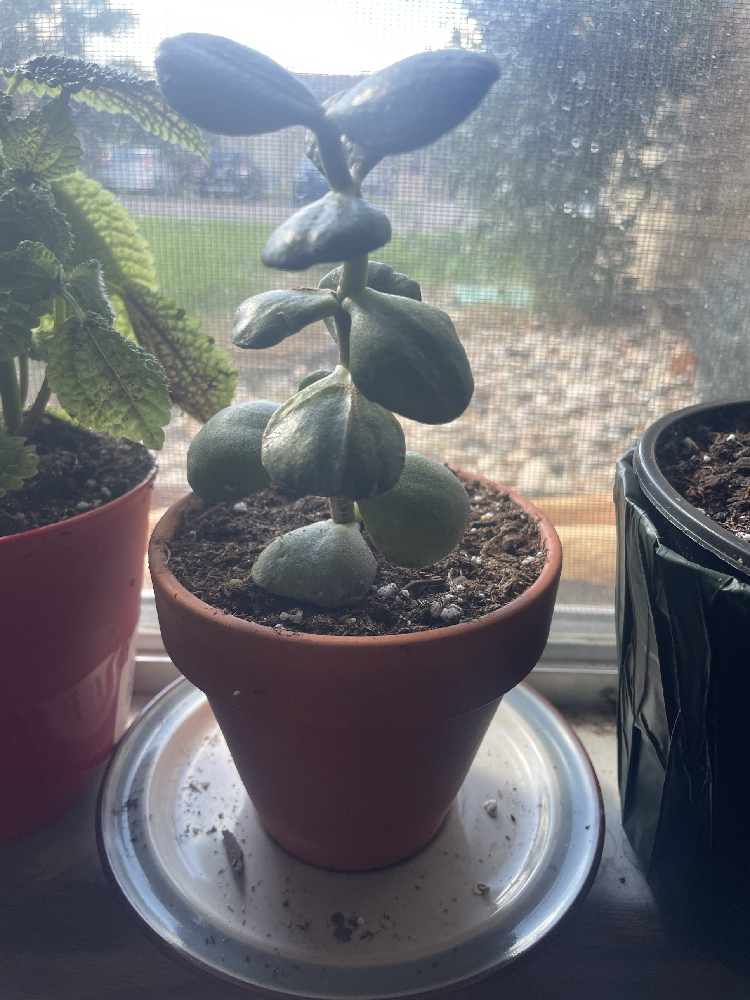

# Jade Plant #1 (*Crassula ovata*, ID tentative)

South African succulent. Thick, paddle-shaped leaves in opposite pairs, each pair rotated 90° from the one below it, on a stem that turns woody with age. Stores water in its leaves, so it wants lots of sun and infrequent watering. **ID is tentative:** the leaves look matte/dusty rather than the usual glossy jade, so it could be another *Crassula* or a similar succulent. Update this if the plant tag or new growth says otherwise.

This page has the full care guide for [Jade #2](jade-plant-2.md) too.

## Current setup

- **Pot:** small terracotta pot on a metal saucer. Terracotta is good for succulents
- **Soil:** looks like regular potting mix with some perlite, and possibly freshly potted. Holds more water than a succulent wants
- **Location:** windowsill with a screen, between the [friendship plant](friendship-plant.md) (red pot) and the black nursery pot

## Condition log

### 2026-09-27
- Single upright stem with about 6 pairs of leaves. New pair at the top
- **Leaves look wrinkled/puckered, especially the lower ones.** In succulents that usually means they're using up stored water: underwatered, or the roots aren't taking up water (not yet established after a repot, or rotting)
- The lowest leaves rest directly on the soil, which can rot them if the soil stays damp
- Upper stem looks a little stretched between leaf pairs. It may want more direct sun

## To do

- [ ] **Diagnose the wrinkling:** stick a finger 1–2" into the soil
  - Bone dry → soak it thoroughly until water runs out the bottom, then empty the saucer. Leaves should plump up within a few days
  - Still damp → don't water. Gently check that the stem is firm at the soil line. Soft/black = rot. Unpot and check the roots (white/firm = OK, brown/mushy = rot)
- [ ] Gently wiggle the stem. If it's loose in the pot, the roots are still establishing and it needs patience, not more water
- [ ] Next repot (spring): switch to cactus/succulent mix, or mix ½ potting soil with ½ perlite/pumice/grit
- [ ] If the bottom leaves stay wrinkled and soft or turn yellow, pull them off. It's normal for the oldest leaves to go first
- [ ] Give it the brightest, sunniest spot. Rotate it weekly so it grows straight
- [ ] Once it's taller, pinch off the top pair of leaves to make it branch. The pinched piece roots easily

## Care guide

| | |
|---|---|
| **Light** | Full sun to very bright light. 4–6+ hours of direct sun. Leaf edges may turn red in strong sun (that's fine) |
| **Water** | Soak, then let the soil dry out **completely** before the next watering. About every 2–3 weeks in spring–summer, monthly or less in winter. Never let it sit in water |
| **Humidity** | Dry household air is ideal |
| **Temp** | 60–80°F (15–27°C). Keep above 50°F. Keep leaves off cold glass in winter |
| **Feeding** | Spring–summer: succulent fertilizer at half strength once a month. None in winter |
| **Soil** | Gritty, fast-draining cactus/succulent mix |
| **Pot** | Terracotta with a drainage hole. Just slightly bigger than the root ball |

## Troubleshooting

| Symptom | Likely cause |
|---|---|
| Wrinkled, deflated leaves + dry soil | Thirsty. Soak it |
| Wrinkled leaves + damp soil | Roots not working: rot, or not established yet after a repot. Check the roots |
| Soft, mushy, translucent leaves | Overwatering |
| Black stem at the soil line | Stem rot. Cut above the rot and re-root the top |
| Leaves dropping suddenly | Over- or underwatering, or a sudden temperature change |
| Stretched stem, gaps between leaves | Not enough sun |
| White cottony spots in leaf joints | Mealybugs. Dab them with rubbing alcohol on a cotton swab |
