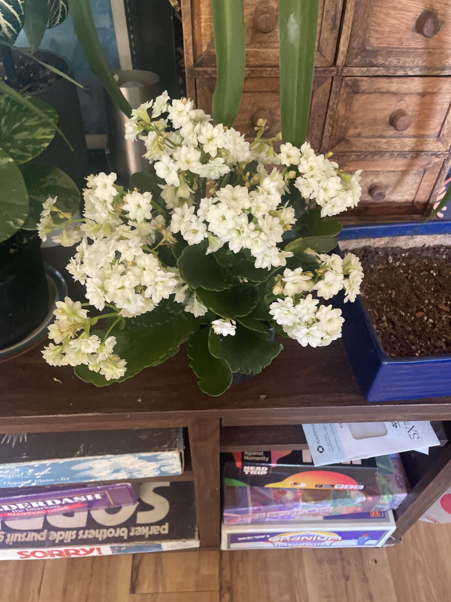

# Kalanchoe #2 (*Kalanchoe blossfeldiana*)

Second double-white kalanchoe, same type as [Kalanchoe #1](kalanchoe.md). **See that page for the full care guide, reblooming steps, and troubleshooting.** **Toxic to cats and dogs.**

## Current setup

- **Pot:** dark pot, no store sleeve
- **Location:** dark wood shelf above the board games, in front of the wooden drawer cabinet. Next to the variegated baby rubber plant

## Condition log

### 2026-09-27
- In full bloom. Dense clusters of fresh double white flowers, more open and fresher than Kalanchoe #1
- Only a few spent/tan flowers, mostly on the outer lower clusters
- Leaves healthy: thick, glossy, dark green with scalloped edges

## To do

- [ ] Deadhead the few spent flowers as they brown. Cut each finished cluster's stalk back to the leaves
- [ ] Water only when the soil is almost completely dry. Empty any saucer water
- [ ] Keep it in bright light for longer blooming
- [ ] Keep it out of reach of pets
- [ ] Reblooming: same long-night routine as Kalanchoe #1 (see [kalanchoe.md](kalanchoe.md)). Both can go in the dark closet together
