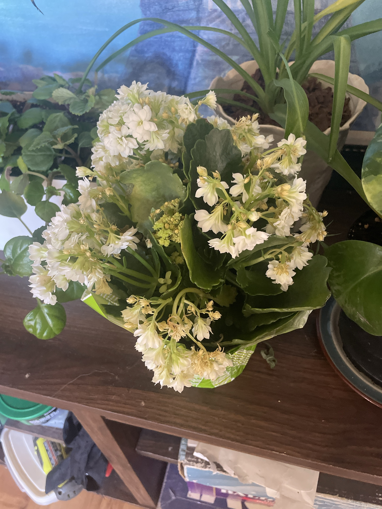

# Kalanchoe #1 (*Kalanchoe blossfeldiana*)

Madagascar succulent sold as a flowering gift plant. This one has double white flowers (the rose-like "Calandiva" type). Thick, glossy, scalloped leaves store water. Blooms last weeks. It can rebloom, but it needs long nights to set buds. **Toxic to cats and dogs** (cardiac glycosides). Keep away from pets.

There is a second one: [Kalanchoe #2](kalanchoe-2.md).

## Current setup

- **Pot:** still in the store's green-and-white decorative plastic sleeve
- **Location:** dark wood shelf/stand next to the Swedish ivy and a spider plant

## Condition log

### 2026-09-27
- In bloom. Several clusters of double white flowers, and a new cluster of green buds in the center
- Many older flowers are spent: browning/tan and papery, especially on the lower and outer clusters
- Leaves look healthy: thick, glossy, dark green, no rot

## To do

- [ ] **Remove the plastic sleeve** (or at least poke drainage holes and pull it down). Sleeves trap water around the pot, and a succulent sitting in water rots fast
- [ ] Check the nursery pot underneath has drainage, and set it on a saucer
- [ ] Deadhead: pinch off the brown, spent flowers. Once a whole cluster is finished, cut its stalk back to the leaves. Keeps it tidy and pushes energy into the new buds
- [ ] Move it to the brightest spot possible. Bright light keeps the flowers coming and prevents leggy stems
- [ ] Keep it out of reach of pets
- [ ] After blooming ends: cut all flower stalks back, keep it as a foliage succulent, and repot into cactus mix in spring if needed
- [ ] To rebloom (optional, start around Oct–Nov): give it 14 hours of total darkness every night for ~6 weeks (closet or box from ~6pm to 8am), with bright light during the day. Water sparingly during this time. Stop once buds appear

## Care guide

| | |
|---|---|
| **Light** | Bright light, including some direct morning or winter sun. Low light = leggy stems and no flowers |
| **Water** | Succulent watering: let the soil dry out almost completely, then water thoroughly and drain. About every 2–3 weeks. Never let it sit in water. Keep water off the flowers and leaves |
| **Humidity** | Dry household air is ideal |
| **Temp** | 60–80°F (15–27°C). Keep above 50°F |
| **Feeding** | After blooming, spring–summer: half-strength balanced fertilizer monthly. None in winter |
| **Soil** | Fast-draining cactus/succulent mix |
| **Blooming** | Short-day plant: sets buds when nights are long (14+ hours of darkness) |

## Troubleshooting

| Symptom | Likely cause |
|---|---|
| Mushy stems/leaves, collapsing at the base | Overwatering or water trapped in the sleeve. Rot |
| Brown, papery flowers | Normal aging. Deadhead them |
| Leggy stems, leaves spaced out | Not enough light |
| No reblooming | Not enough darkness at night (lamps and streetlights count) |
| Wrinkled, soft leaves | Thirsty. Water thoroughly |
| White powdery coating | Powdery mildew. Improve airflow, keep leaves dry |
| White cottony spots | Mealybugs. Dab with rubbing alcohol |
