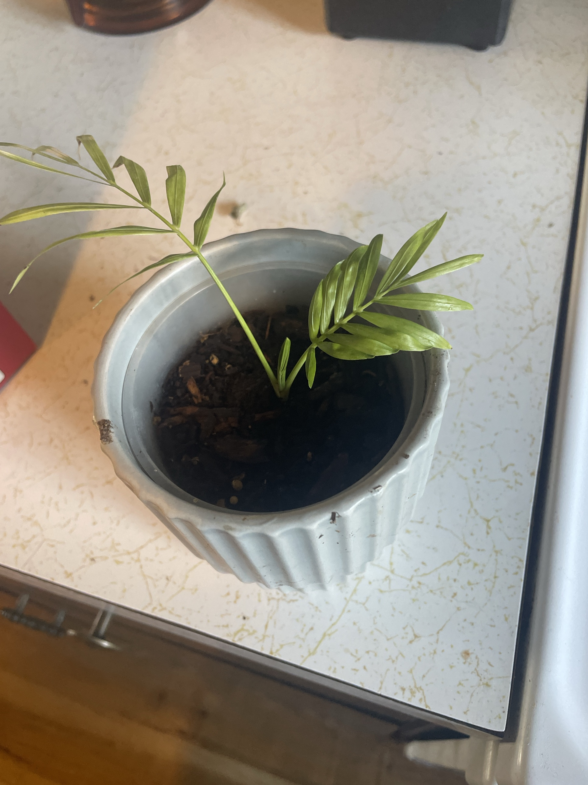

# Parlor Palm (*Chamaedorea elegans*)

Mexican/Central American understory palm. Grows naturally in shade under the forest canopy, so it handles lower light well. Slow-growing, with feathery fronds on thin green stems. Usually sold as a clump of several seedlings in one pot. **Non-toxic to pets.**

## Current setup

- **Pot:** plastic nursery pot inside a pale gray ribbed ceramic cachepot
- **Soil:** potting mix with bark. The soil level sits well below the rim
- **Location:** kitchen counter

## Condition log

### 2026-09-27
- Young single seedling with 2 fronds. One is older and spreading, the other is newer and more upright
- Fronds are a light, slightly yellowish green, where a healthy parlor palm is medium-dark green. Most likely a young plant, too much direct light, or low nutrients. Keep an eye on it
- No brown tips or damage visible
- Stem base looks firm

## To do

- [ ] Check that the inner nursery pot drains, and empty any water that collects in the ceramic cachepot
- [ ] Keep it in medium to bright indirect light, with no direct sun on the fronds. Pale/yellowing fronds can mean too much light
- [ ] Spring 2027: start feeding lightly (see care guide). If new fronds come in darker green, the paleness was low nutrients
- [ ] Don't cut the fronds unless they're fully brown. Palms grow from a single point at the top, and each frond feeds the plant
- [ ] Be patient. Parlor palms grow slowly, and 1–3 new fronds a year is normal for a seedling
- [ ] Optional later: plant several seedlings together for a fuller look (that's how they're usually sold)

## Care guide

| | |
|---|---|
| **Light** | Medium to bright indirect. Tolerates low light. Direct sun bleaches and scorches the fronds |
| **Water** | Water when the top 1" is dry. Keep it lightly moist, and don't let it dry out completely or sit soggy. Water less in winter. Sensitive to minerals, so filtered or rainwater helps prevent brown tips |
| **Humidity** | Average is fine. 40%+ helps prevent brown tips |
| **Temp** | 65–80°F (18–27°C). Keep above 50°F and away from cold drafts |
| **Feeding** | Spring–summer: half-strength balanced fertilizer monthly. None in winter. Palms burn easily from too much |
| **Soil** | Well-draining peat/coco-based potting mix |
| **Pot** | Likes being snug. Repot only when crowded, and keep the stem base at the same depth |

## Troubleshooting

| Symptom | Likely cause |
|---|---|
| Brown leaf tips | Dry air, underwatering, or minerals/fluoride in tap water |
| Pale or yellowing fronds | Too much direct light, low nutrients, or overwatering |
| Yellowing lower fronds | Normal aging, or overwatering |
| Mushy stem base | Rot from overwatering |
| Fine webbing, speckled fronds | Spider mites. Rinse and treat with insecticidal soap |
| No new growth | Normal. Slow grower, especially in winter or low light |
