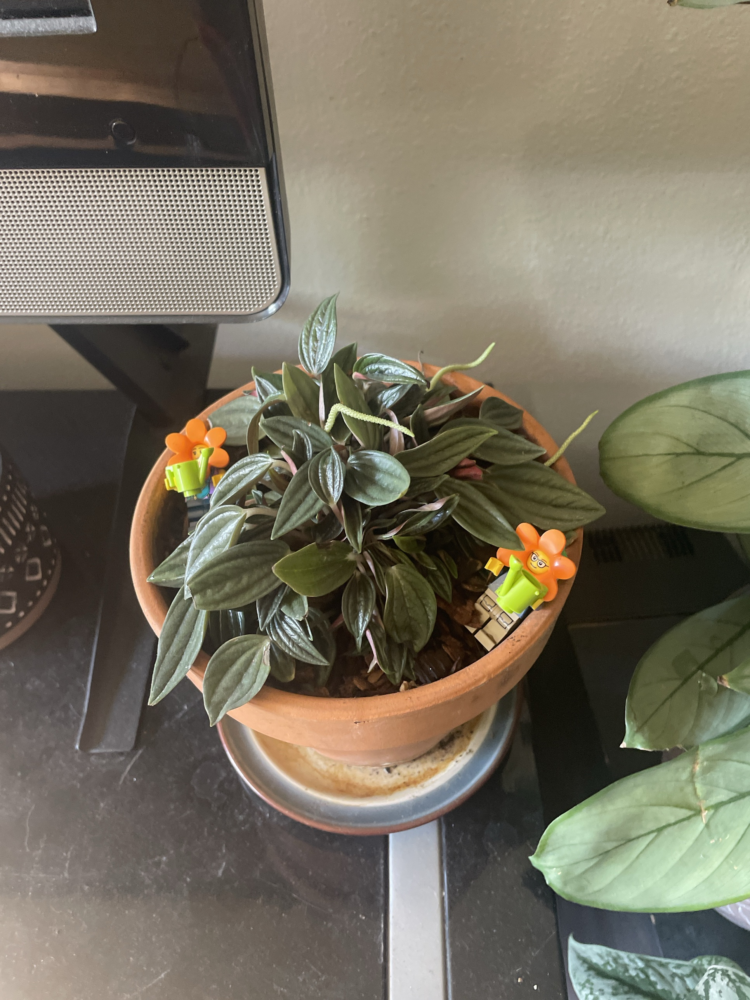

# Peperomia 'Rosso' (*Peperomia caperata* 'Rosso')

A cultivar of the same species as the [ripple peperomia](ripple-peperomia.md). Long, pointed, deeply grooved dark green leaves with **red/pink undersides and stems**. Makes thin cream "rat tail" flower spikes. Semi-succulent, so let it dry out partway between waterings. **Non-toxic to pets.** See the ripple peperomia page for the full care guide (same care).

## Current setup

- **Pot:** terracotta on a saucer, soil topped with bark. Two LEGO flower-head minifigs "watering" it
- **Location:** black shelf, next to the speaker and the Ctenanthe

## Condition log

### 2026-09-27
- Healthy, full, compact rosette of glossy leaves with good red undersides
- **Several flower spikes** (thin cream tails), a sign it's content
- No yellowing, mushiness, or pests visible
- Saucer has a brown water-stain ring. Water has been sitting in it
- **Propagating:** a jar of 'Rosso' stem cuttings is rooting in water on the sunny windowsill next to Jade #2. Roots are visible. Pot them up once the roots are 1–2" long, back into this pot for fullness or into a new one

## To do

- [ ] Empty the saucer after watering. Don't let it sit in water (peperomias rot easily)
- [ ] Water only when the top half of the soil is dry
- [ ] Flower spikes are harmless. Leave them, or snip them at the base once they brown
- [ ] Rotate weekly for even growth
