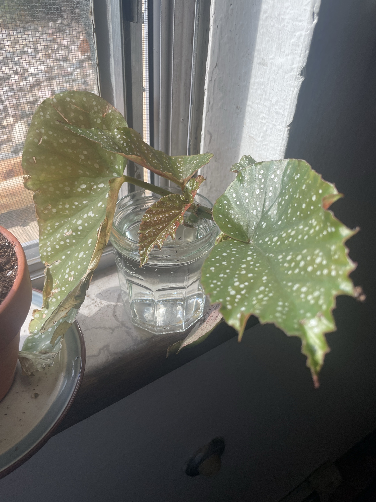
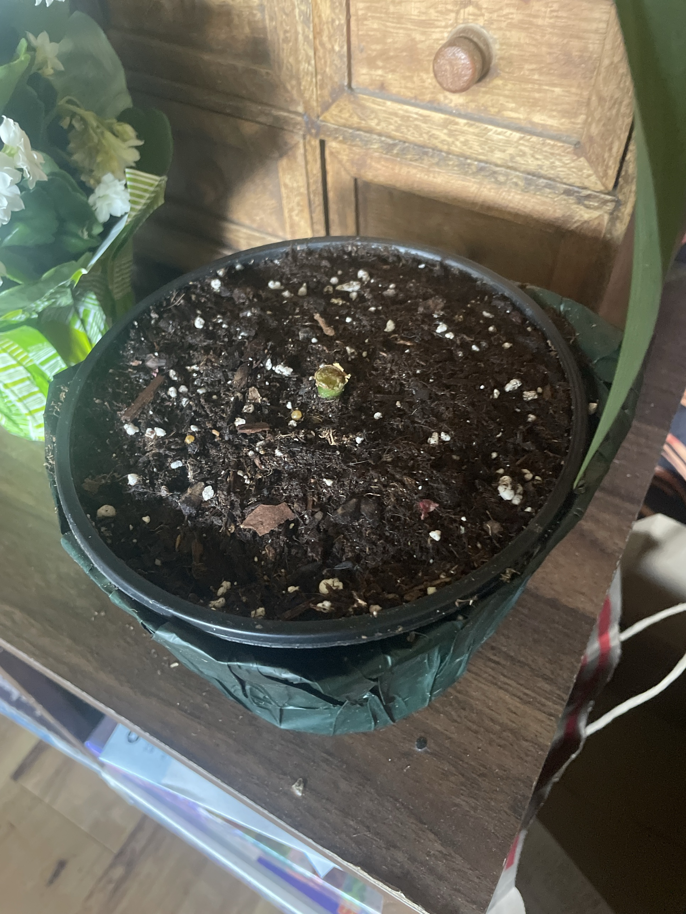

# Polka Dot Begonia (*Begonia maculata*)

Cane begonia from Brazil. Olive-green, wing-shaped leaves with silver spots and red undersides. Grows on bamboo-like jointed stems ("canes"). Roots easily from stem cuttings, and a cut-back cane often resprouts from the base. Hates soggy soil and direct afternoon sun.

## Current setup

The stem broke at soil level on 2026-09-27, so there are now two plants:

- **Top cutting:** in a glass jar of water on the windowsill. Has several leaves, including a new red-edged one
- **Base stub:** about 1" of green stem left in the original black nursery pot (peat/bark/perlite mix), sitting inside a green decorative wrap

## Condition log

### 2026-09-27
- Stem broke at the base. Top half moved to water to root
- Cutting: large left leaf has brown, crispy, torn edges and curled dead sections, probably from sun or dry air. Right leaf is mostly healthy with some crisp edges. New growth at the top looks good
- Cutting is on a sunny windowsill with direct sun on the leaves
- Base: green stub with a ragged top. Stub is still firm and green (good)

## Saving the top cutting (in water)

- [ ] Recut the stem with a clean, sharp blade (wipe with rubbing alcohol) about ¼" below a node, the bump or ring where a leaf joined. A clean cut roots better than a crushed break
- [ ] At least 1 node must be underwater. Roots come from the nodes. No leaves in the water because they rot
- [ ] Cut off the badly damaged big leaf on the left. The cutting has no roots, so it can't keep up with water loss from that much leaf. Keep 2–3 healthy leaves plus the new growth
- [ ] Move it out of direct sun to bright indirect light. Direct sun through glass heats the water and scorches the leaves
- [ ] Change the water every 3–5 days, or sooner if it goes cloudy. Room-temp water
- [ ] Expect roots in about 2–4 weeks. Pot it once the roots are 1–2" long (don't wait longer, or water roots struggle in soil). Use a small pot with drainage and keep the soil lightly moist for the first 2 weeks after potting
- Option: put the cutting back in the original pot next to the stub later. Then it becomes one fuller plant

## Saving the base (stub in pot)

- [ ] Trim the ragged top flat with a clean blade so it seals cleanly. Leave it to dry and callus. Don't cover it
- [ ] **Water much less for now.** With no leaves, the roots barely use water, and soggy soil is what kills the stub. Water lightly only when the top 1" of soil is dry
- [ ] Take the pot out of the decorative wrap when you water so water can't pool at the bottom
- [ ] Keep it in bright indirect light and somewhere warm (65–80°F). Light and warmth trigger new shoots even without leaves
- [ ] No fertilizer until new growth appears
- [ ] Watch for new shoots from the stub or the soil line. They take about 3–8 weeks, and can be slower heading into winter
- [ ] If the stub turns brown/black and mushy, it's rotting. Cut down to firm green tissue. If the rot is below the soil, check the roots: white/firm = fine, brown/mushy = rot

## Care guide

| | |
|---|---|
| **Light** | Bright indirect. Gentle morning sun is OK. No hot direct afternoon sun |
| **Water** | Let the top 1" dry out, then water thoroughly and drain. Never let it sit in water. Mildly underwatered beats overwatered |
| **Humidity** | 50%+. Pebble tray or grouping with other plants. Don't mist the leaves (it encourages powdery mildew) |
| **Temp** | 65–80°F (18–27°C). No drafts or cold windows |
| **Feeding** | Spring–summer: half-strength balanced liquid fertilizer every 2–4 weeks. None in winter |
| **Soil** | Airy, well-draining mix. Peat/coco with perlite and some bark (the current mix is good) |
| **Support** | Canes get tall and top-heavy. Stake them as the plant grows so they don't snap again |
| **Pruning** | Pinch or cut canes above a node in spring to make it bushier. Root the tips |

## Troubleshooting

| Symptom | Likely cause |
|---|---|
| Brown crispy edges | Low humidity, direct sun, or drying out too much |
| Stem mushy/black at soil line | Overwatering or rot. Let it dry out and cut away rot |
| White powdery coating on leaves | Powdery mildew. Improve airflow, keep leaves dry |
| Cutting leaves wilting in water | Too much leaf for no roots. Remove the largest leaf and get it out of direct sun |
| Leggy, leaves only at top | Normal for canes. Prune in spring |
