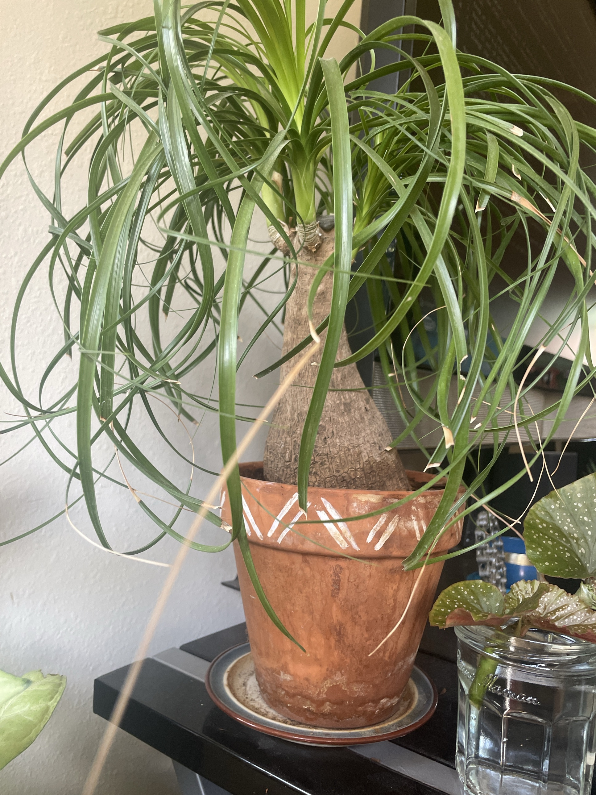

# Ponytail Palm (*Beaucarnea recurvata*)

Mexican desert native, not a true palm (it's related to agave/yucca). The swollen bulb at the base (caudex) stores water, so it's drought-tolerant and easy to care for. Long, thin, curly leaves grow from the top. Slow grower. The #1 killer is overwatering.

## Current setup

- **Pot:** terracotta with white carved band, on a saucer. Terracotta is ideal because it breathes and dries out fast
- **Soil:** not visible under the caudex. Should be a gritty cactus/succulent mix
- **Location:** on a black shelf/stand in front of a light wall, next to the begonia cutting

## Condition log

### 2026-09-27
- Overall healthy. Caudex looks firm with normal textured bark. At least 3 growing heads with bright green new leaves in the centers
- Brown dry tips on many leaves, and some fully dead/brown leaves hanging among the green ones
- White crust on the outside of the pot and in the saucer: mineral/salt buildup from tap water or fertilizer passing through the terracotta. Harmless to the pot, but a sign that salts are building up in the soil
- Pot is fairly snug around the caudex, which this plant likes

## To do

- [ ] Pull out or cut off fully brown dead leaves. Gently tug. If one doesn't come loose, cut it near the base
- [ ] Optional: trim brown tips with clean scissors, cutting at an angle to keep the pointed shape. Leave a thin sliver of brown so the cut doesn't brown again
- [ ] Squeeze the caudex. It should be firm. Soft or wrinkly = problem (see troubleshooting)
- [ ] Flush the soil: water slowly until it pours out the bottom for a minute to wash out built-up salts. Let it drain fully. Do this every few months
- [ ] Empty the saucer after watering. It must never sit in water
- [ ] Scrub the white crust off the pot and saucer with a vinegar-water mix (optional, cosmetic)
- [ ] Spring 2027 or later: repot only when roots fill the pot, every 2–3 years. Go up only 1–2" in size. Use cactus mix and keep the caudex above the soil line

## Care guide

| | |
|---|---|
| **Light** | As bright as possible. A few hours of direct sun is great. Tolerates medium light but grows slowly and gets leggy |
| **Water** | Soak thoroughly, then let the soil dry out **completely** before watering again. About every 2–3 weeks in spring–summer, every 4–6 weeks in fall–winter. When in doubt, wait |
| **Humidity** | Normal household air is fine. Dry air only causes brown tips |
| **Temp** | 60–80°F (15–27°C). Keep above 50°F (10°C) |
| **Feeding** | Spring–summer: half-strength balanced or cactus fertilizer 2–3 times per season. None in fall–winter |
| **Soil** | Fast-draining cactus/succulent mix, or potting mix with lots of perlite/grit |
| **Pot** | Terracotta with a drainage hole. Snug is good. Wide and shallow suits its roots |

## Troubleshooting

| Symptom | Likely cause |
|---|---|
| Brown leaf tips | Normal aging, dry air, or mineral/salt buildup from tap water. Flush the soil. Try rainwater/filtered water |
| Lower leaves browning and dropping | Normal. Old leaves die off as new ones grow from the center |
| Soft or mushy caudex or base | Root rot from overwatering. Stop watering, unpot, cut away rotten roots, and repot into dry cactus mix |
| Wrinkled or shrinking caudex | Underwatered. Give it a deep soak |
| Yellowing leaves and soggy soil | Overwatered |
| Pale, stretched new growth | Not enough light |
| White crust on pot or soil | Salt/mineral buildup. Flush the soil |
