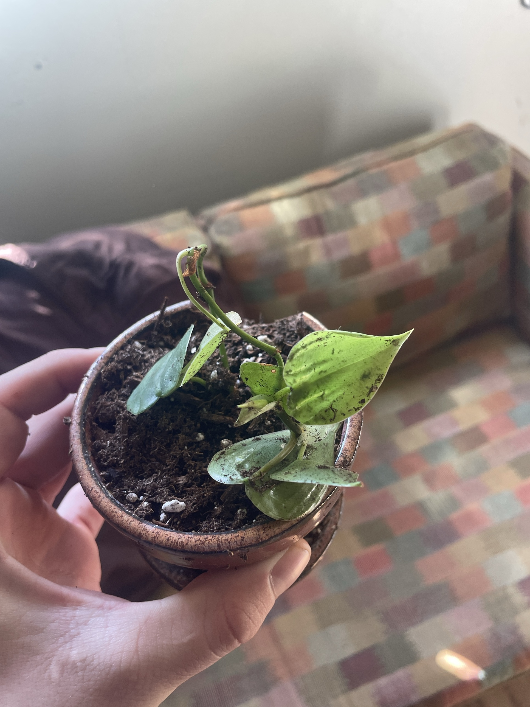

# Pothos Cutting (*Epipremnum* sp., variety unclear)

A freshly planted pothos cutting with a few small leaves. One leaf is bluish-silver-green and one is bright lime-green, so it may be a mix of two cuttings or a variety like 'Cebu Blue' (bluish) or 'Neon' (lime). Update the ID as it grows. **Full pothos care: [golden-pothos.md](golden-pothos.md).** **Toxic to pets.**

## Current setup

- **Pot:** small brown/copper glazed ceramic pot on a saucer
- **Soil:** potting mix with perlite
- **Location:** unknown. Photo was taken by the couch

## Condition log

### 2026-09-27
- Small cutting, 1–2 stems, with a few leaves. Recently planted
- **Soil splashed on the leaves**
- The growing tip at the top is bent over with a dried brown bit on it
- The rest of the leaves look green and firm

## To do

- [ ] Gently rinse or wipe the soil off the leaves so they can photosynthesize
- [ ] Remove the dried brown bit at the tip
- [ ] Keep the soil lightly moist (not soggy) for the first few weeks while the roots establish, then switch to "water when the top inch is dry"
- [ ] Bright indirect light, out of direct sun
- [ ] Gently tug the stem after 3–4 weeks. Resistance means it has rooted
- [ ] Decide on a spot and log its location
- [ ] Confirm the variety once new leaves come in
