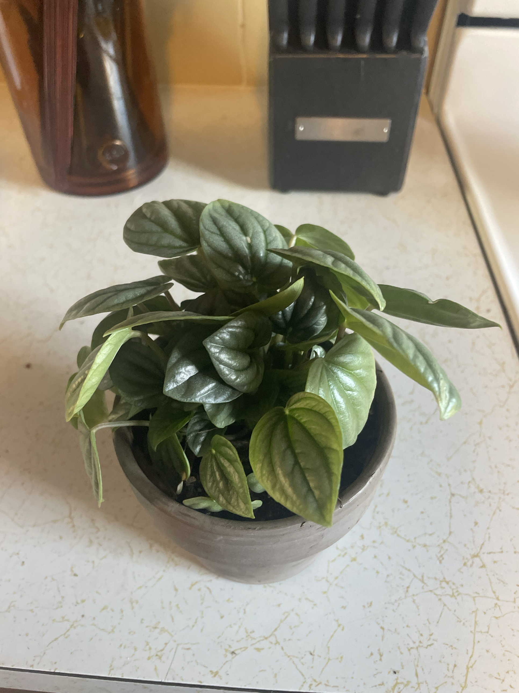

# Ripple Peperomia (*Peperomia caperata*)

Brazilian rainforest native, small and compact. Heart-shaped, deeply rippled/quilted leaves with a silvery sheen (likely a silver cultivar like 'Silver Ripple' or 'Frost'). Semi-succulent: the thick leaves and stems store water, so it prefers drying out a bit between waterings. Stays small. **Non-toxic to pets.**

**Origin:** grown from a single leaf cutting.

## Current setup

- **Pot:** small gray clay/terracotta pot
- **Soil:** dark potting mix
- **Location:** kitchen counter, next to the knife block

## Condition log

### 2026-09-27
- Grown from a single leaf cutting and now a full plant. Propagation success
- Healthy and compact. Full, dense rosette of glossy, rippled leaves with good color
- A few outer leaves are lighter green and splay outward, which is normal for older leaves at the edge
- No spots, mushiness, or pests visible

## To do

- [ ] Keep watering on the light side. Wait until the top half of the soil is dry. Overwatering is the main way these die (stem rot)
- [ ] Water around the base, not into the center of the rosette. Water sitting in the crown can rot it
- [ ] Remove any leaves that turn yellow or mushy at the base
- [ ] Rotate weekly for even growth
- [ ] Repot only when root-bound (every 2–3 years). It likes a small, snug pot

## Care guide

| | |
|---|---|
| **Light** | Medium to bright indirect. No direct sun (scorches the leaves). Too little light = leggy stems and faded color |
| **Water** | Let the top 1–2" (about half the pot) dry out, then water thoroughly and drain. About every 1–2 weeks, and less in winter. Leaves feeling soft and a little limp = thirsty |
| **Humidity** | Average is fine. Likes 40–50%+ |
| **Temp** | 65–80°F (18–27°C). Keep above 55°F and away from cold drafts |
| **Feeding** | Spring–summer: half-strength balanced fertilizer monthly. None in winter |
| **Soil** | Chunky, fast-draining mix: potting soil plus perlite/orchid bark |
| **Propagation** | Easy from single leaf-plus-stalk cuttings in moist soil or water |

## Troubleshooting

| Symptom | Likely cause |
|---|---|
| Mushy stems at the base, leaves dropping | Overwatering/rot. Let it dry out and cut away rot. Re-root healthy leaves as backup |
| Yellow lower leaves | Overwatering, or normal aging |
| Droopy, soft, thin leaves | Underwatered. Water thoroughly |
| Brown patches | Direct sun, or cold damage |
| Leggy with spread-out leaves | Not enough light |
| White cottony spots | Mealybugs. Dab with rubbing alcohol |
