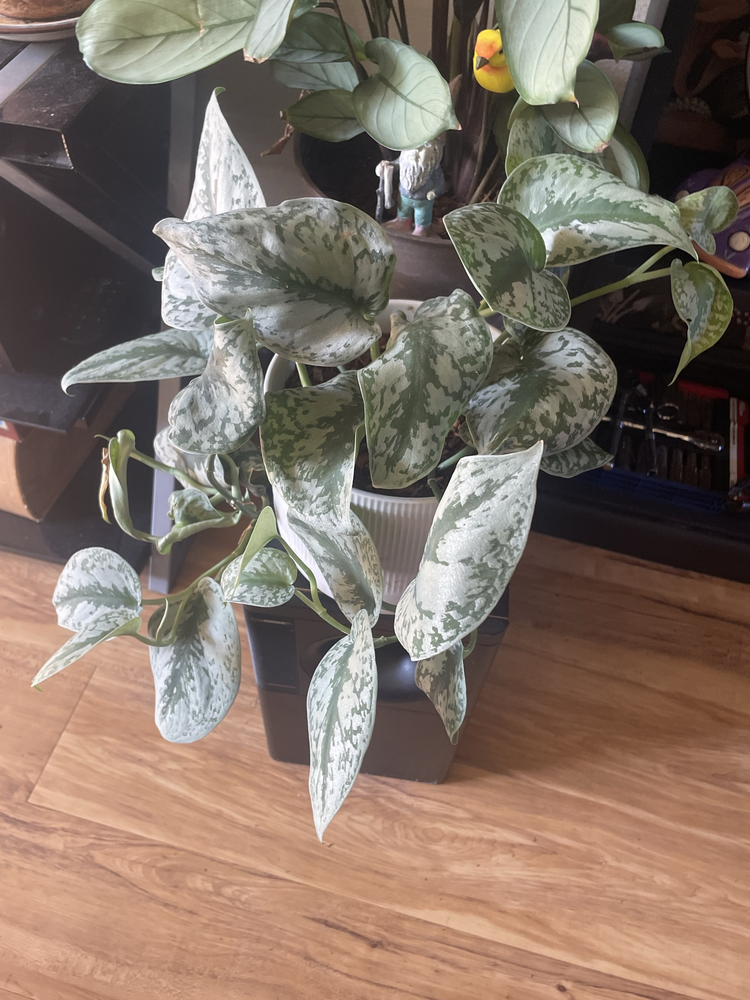

# Satin Pothos (*Scindapsus pictus* 'Exotica')

Southeast Asian vine. Not a true pothos, but the care is similar. Thick, matte, heart-shaped leaves heavily splashed with silver ('Exotica' has the large silver patches). The leaves **curl when thirsty**, which makes watering easy to read. Slower than golden pothos. **Toxic to pets and people if chewed.**

## Current setup

- **Pot:** white ribbed ceramic pot, soil topped with bark
- **Location:** on top of the black speaker, in front of the Ctenanthe on the black shelf

## Condition log

### 2026-09-27
- Healthy and full, with strong silver variegation and lots of leaves
- Several leaves are **slightly curled/cupped**, the plant's thirst signal. It may be due for water
- One dried brown leaf on the left trailing vine
- Vines trailing over the edge on the left and right

## To do

- [ ] Check the soil. If the top 1–2" is dry and the leaves are curled, water thoroughly. The leaves should flatten within a day
- [ ] Remove the dried brown leaf
- [ ] Trim/propagate the long vines if you want it fuller (root the cuttings in water, each with a node)
- [ ] Keep it away from pets

## Care guide

| | |
|---|---|
| **Light** | Medium to bright indirect. More light = more silver. No direct sun |
| **Water** | Let the top 1–2" dry, then water thoroughly. Curled leaves = water now. Less in winter. Overwatering causes yellowing and rot |
| **Humidity** | Average is fine. Likes 40%+ |
| **Temp** | 65–85°F (18–29°C). Keep above 55°F |
| **Feeding** | Spring–summer: half-strength balanced fertilizer monthly |
| **Soil** | Chunky aroid mix: potting soil plus bark and perlite |
| **Pruning** | Cut above a node. Roots easily in water |

## Troubleshooting

| Symptom | Likely cause |
|---|---|
| Leaves curling inward | Thirsty. Water it |
| Yellow leaves | Overwatering |
| Brown crispy leaves | Underwatered too long, or very dry air |
| Losing silver, small leaves | Not enough light |
| Leggy, bare vines | Low light. Prune and move it brighter |
