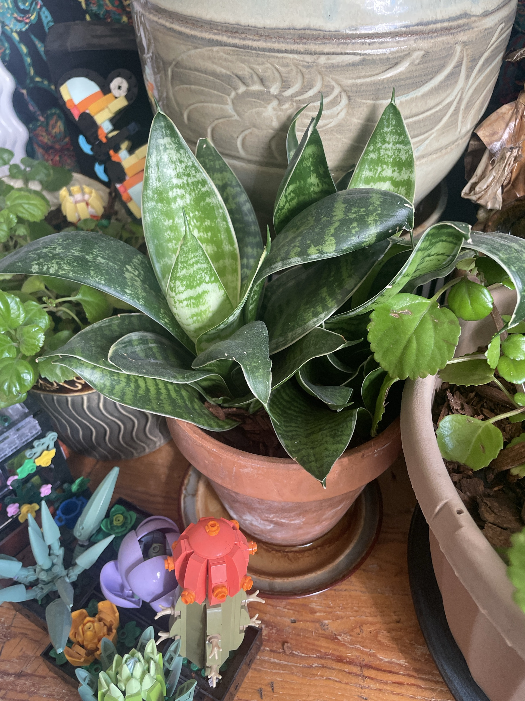

# Snake Plant (*Dracaena trifasciata*)

West African succulent, formerly *Sansevieria*. This one is a compact rosette form with broad, pointed leaves banded in dark and light green, with thin cream edges. Stores water in its leaves and roots (rhizomes). One of the hardest houseplants to kill, except by overwatering. **Mildly toxic to pets** (stomach upset if chewed).

## Current setup

- **Pot:** terracotta on a glazed saucer, soil topped with bark
- **Location:** low wooden surface in front of the Calathea's big pot, between Swedish Ivy #2 and Swedish Ivy #3. LEGO succulent builds in front

## Condition log

### 2026-09-27
- Healthy and full. Tight rosette with strong banding and firm upright leaves, and new leaves in the center
- A few small white nicks/scratches on some leaves (cosmetic, from being bumped)
- **Water appears to be sitting in the saucer**

## To do

- [ ] **Empty the saucer.** Snake plants rot fast if their roots sit in water
- [ ] Water only when the soil is completely dry. About every 2–4 weeks in summer and every 4–8 weeks in winter
- [ ] Repot only when the rhizomes crowd the pot or crack it. They like being snug

## Care guide

| | |
|---|---|
| **Light** | Anything from low to bright indirect, and some direct sun is OK. Grows faster and keeps stronger color in brighter light |
| **Water** | Let the soil dry out completely, then soak. When in doubt, wait. Water the soil, not into the rosette |
| **Humidity** | Dry household air is fine |
| **Temp** | 60–85°F (15–29°C). Keep above 50°F |
| **Feeding** | Spring–summer: cactus/half-strength fertilizer 2–3 times per season |
| **Soil** | Fast-draining cactus/succulent mix |

## Troubleshooting

| Symptom | Likely cause |
|---|---|
| Mushy leaves or base, bad smell | Overwatering/root rot. Unpot, cut away rot, and repot in dry mix |
| Wrinkled, curling leaves | Very thirsty. Soak it |
| Leaves flopping over | Overwatering, or not enough light |
| Brown crispy tips | Uneven watering, or damage. Cosmetic |
| Pale, washed-out color | Too little light (or sudden strong sun) |
