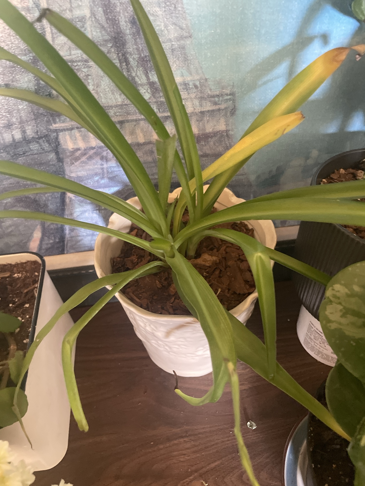

# Spider Plant #2 (*Chlorophytum comosum*)

Smaller solid-green spider plant. **Full care guide and troubleshooting: [spider-plant.md](spider-plant.md).** **Non-toxic to pets.**

## Current setup

- **Pot:** white embossed ceramic pot with a scalloped rim, soil topped with bark
- **Location:** dark wood shelf, between the Swedish ivy tray and the gray ribbed pot, in front of the blue wall art

## Condition log

### 2026-09-27
- Single crown with long, broad, arching green leaves
- **Two leaves turning yellow from the tip down** (upper right), and a few leaves have bent/creased partway along
- Crown looks firm, no rot visible

## To do

- [ ] Remove the yellowing leaves at the base once they're mostly yellow
- [ ] Check soil moisture. Yellowing on a young plant is most often overwatering. Let the top 1–2" dry out before watering
- [ ] Check that the white pot drains (or has a nursery pot inside), and empty any standing water
- [ ] Give it a little more light if possible. Leaves flopping and creasing can mean it's stretching
