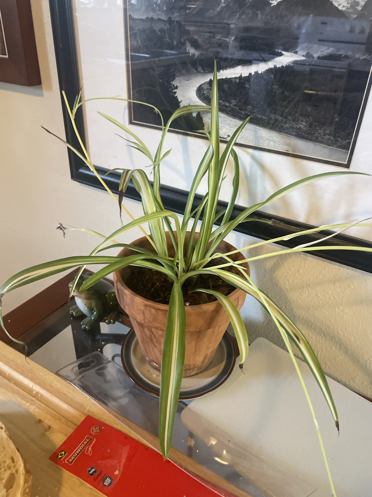

# Variegated Spider Plant (*Chlorophytum comosum* 'Vittatum')

Classic striped spider plant: green edges with a creamy white center stripe. **Full care guide and troubleshooting: [spider-plant.md](spider-plant.md).** Needs a bit more light than the solid green ones to keep its stripes. **Non-toxic to pets.**

## Current setup

- **Pot:** terracotta on a saucer, soil topped with bark
- **Location:** glass-top side table in front of the framed black-and-white river photo, next to a ceramic frog

## Condition log

### 2026-09-27
- Healthy crown with good variegation on newer leaves
- **Brown/black tips on many leaves**, and a couple of leaves browning further down
- Several long runners. Plantlets on them are small and some are dried/brown
- Some outer leaves are long and floppy, spreading outward

## To do

- [ ] Trim the brown tips with clean scissors, cutting at an angle to keep the pointed shape
- [ ] Remove fully brown leaves and dried-up plantlets. Cut old runners with dead babies back to the base
- [ ] Switch to filtered, distilled, or rainwater if you can. Spider plants are sensitive to fluoride/chlorine in tap water, the most common cause of brown tips
- [ ] Flush the soil (water slowly until it runs out the bottom for a minute) to clear built-up salts. Empty the saucer
- [ ] Keep watering even. Don't let it go bone dry and then flood it
- [ ] If any healthy plantlets form root nubs, pot them up
