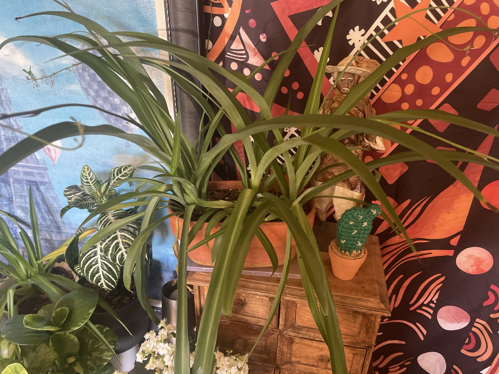

# Spider Plant #1 (*Chlorophytum comosum*)

South African clumping plant with long, arching, strap-shaped leaves from a central crown. Thick white roots store water. Mature plants send out long runners with small white flowers that turn into baby plantlets ("spiderettes"), which root easily. Very tolerant. **Non-toxic to pets** (cats love to chew it).

This page has the full care guide for all three spider plants: [#2 (white pot)](spider-plant-2.md) and [variegated](spider-plant-variegated.md).

## Current setup

- **Pot:** large oval terracotta planter on a clear tray
- **Location:** on top of the wooden drawer cabinet, in front of the orange/black wall tapestry. The zebra plant, kalanchoes and baby rubber plant are on the shelf below/beside it

## Condition log

### 2026-09-27
- Large, full, healthy clump of solid green leaves. Several crowns filling the planter
- Runners with flowers/small plantlets forming at the upper left, which means it's mature and happy
- A few lower leaves yellowing/browning at the base, which is normal aging
- Leaves arching long and wide. It has plenty of room in this planter

## To do

- [ ] Pull or cut off yellow and brown leaves at the base
- [ ] When plantlets grow little root nubs, pot them up (pin them onto soil while still attached, or cut and root in water). Or leave them hanging for the look
- [ ] Rotate occasionally. It's against a wall, so one side gets less light

## Care guide

| | |
|---|---|
| **Light** | Bright indirect. Tolerates medium light. Variegated types lose their stripes in low light. Direct hot sun scorches the leaves |
| **Water** | Water when the top 1–2" is dry. The fleshy roots store water, so it forgives a missed watering. Water less in winter. Sensitive to fluoride/salts in tap water, which causes brown tips. Filtered or rainwater helps |
| **Humidity** | Average is fine. Very dry air adds to brown tips |
| **Temp** | 60–80°F (15–27°C). Keep above 50°F |
| **Feeding** | Spring–summer: half-strength balanced fertilizer monthly. Too much fertilizer also causes brown tips |
| **Soil** | Regular well-draining potting mix |
| **Pot** | Blooms and makes babies best when slightly root-bound. Repot when the roots push the soil up or crack the pot |

## Troubleshooting

| Symptom | Likely cause |
|---|---|
| Brown leaf tips | Fluoride/salts in tap water, dry air, uneven watering, or too much fertilizer. Trim tips at an angle. Flush the soil |
| Yellow leaves | Overwatering, or old leaves aging out |
| Pale/washed-out leaves | Too much direct sun, or low nutrients |
| No runners/babies | Too young, pot too big, or not enough light |
| Mushy crown | Rot from overwatering |
| Dried-up babies on runners | Normal once they get old. Snip them off or pot up the healthy ones |
