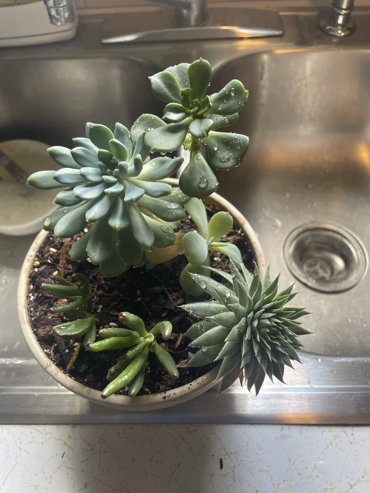

# Succulent Bowl (mixed arrangement)

Mixed succulent planting in one bowl. All IDs are tentative (from the photo):

| Plant | Looks like | Notes |
|---|---|---|
| Blue-gray rosette (largest) | *Echeveria* / *Graptoveria* | Thick, pale blue-green pointed leaves |
| Rosette on a stem (top) | *Aeonium* type | Spoon-shaped green leaves in a flat rosette. Aeoniums grow mostly in the cool months and can go semi-dormant in summer heat |
| Pale paddle-leaf stems (middle) | *Crassula* / *Kalanchoe* cutting | Light green, flat, rounded leaves |
| Finger-like leaves with red tips (lower left) | Jelly bean *Sedum* type (*S. rubrotinctum*) | Tips redden in strong sun |
| Spiky, fuzzy-edged rosette (lower right) | *Sempervivum* (hens and chicks) | Hairy leaf margins, tight spiky rosette |

General succulent care: see [jade-plant.md](jade-plant.md). Most of these are **non-toxic to pets** (jelly bean sedum and kalanchoe can cause mild stomach upset).

## Current setup

- **Pot:** cream ceramic bowl
- **Soil:** potting mix with perlite and bark
- **Location:** photographed in the kitchen sink right after watering. Permanent spot TBD

## Condition log

### 2026-09-27
- All five plants look firm, plump, and healthy. No wrinkling or mushy leaves
- Just watered: droplets are sitting on the leaves and in the rosettes
- A dry brown leaf tucked under the *Sempervivum*
- Plenty of open soil between the plants, so there's room to grow

## To do

- [ ] **After watering, tip or blow the water out of the rosettes** (especially the Echeveria and Sempervivum). Water sitting in the center of a rosette can rot it
- [ ] Next time, water the soil directly instead of pouring over the leaves
- [ ] Let it drain fully in the sink before putting it back
- [ ] Check that the bowl has a drainage hole. If it doesn't, water very sparingly
- [ ] Remove the dry leaf under the Sempervivum
- [ ] Put it in the sunniest spot you have. This bowl needs more direct light than any of the leafy plants. Stretching or leaning = more sun
- [ ] Log where it lives
- [ ] Spring: consider repotting into a grittier cactus mix. Note that the Sempervivum is a cold-hardy outdoor plant that likes full sun and a cold winter rest. It may do better outside long-term
