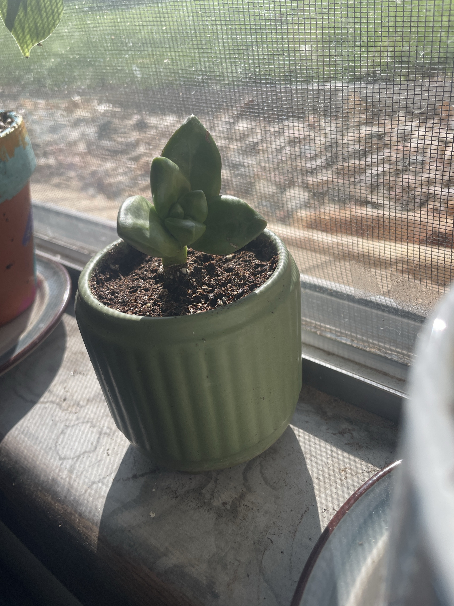

# Succulent Cutting (ID tentative: *Graptoveria* / *Echeveria* type)

A single rosette cutting on a short stem. Thick, pointed, pale green leaves stacked in a small rosette. Looks like a *Graptoveria*, *Graptopetalum*, or *Echeveria* type. Update the ID as it grows. Most of these are **non-toxic to pets.** General succulent care: see [jade-plant.md](jade-plant.md) or [haworthia.md](haworthia.md).

## Current setup

- **Pot:** small sage-green ribbed ceramic pot
- **Soil:** potting mix with perlite
- **Location:** windowsill with a screen, next to the Dieffenbachia

## Condition log

### 2026-09-27
- Single rosette, firm and green. Likely a recently planted cutting
- Leaves look healthy and plump. Maybe slightly pale, which is normal for a new cutting
- A short bare stem between the soil and the rosette

## To do

- [ ] Let the soil dry out **completely** between waterings. New cuttings rot easily if kept wet
- [ ] Gently tug after 2–4 weeks. Resistance = roots
- [ ] Bright light is good. Ease it into direct sun gradually so it doesn't scorch
- [ ] Check that the pot drains. At the next repot, use cactus/succulent mix
- [ ] If it stretches (gaps between leaves, leaning), it needs more light
