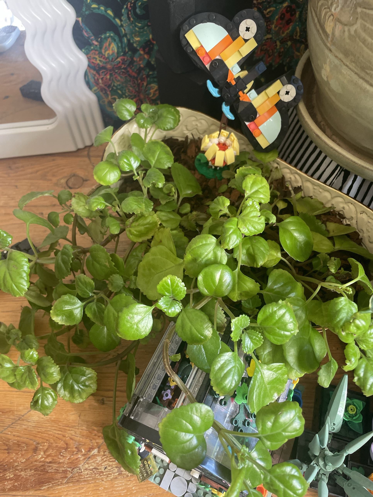

# Swedish Ivy #2 (*Plectranthus verticillatus*)

**Full care guide and troubleshooting: [swedish-ivy.md](swedish-ivy.md).** **Non-toxic to pets.**

## Current setup

- **Pot:** cream oval planter with an embossed scalloped rim, soil topped with bark. LEGO butterfly and flower decorations
- **Location:** low wooden surface in front of the green paisley tapestry, next to the LEGO botanical builds and the Calathea's big celadon pot

## Condition log

### 2026-09-27
- Lush and healthy. Bright green, glossy leaves, dense and spilling over the front of the planter
- No yellowing or pests visible. Nicer color than Swedish Ivy #1
- Trailing stems reach onto the table and the LEGO builds

## To do

- [ ] Check whether this planter has a drainage hole. If not, water sparingly and tip out any excess
- [ ] Pinch the long runners to keep it bushy, and root the trimmings
- [ ] Water when the top 1" is dry
