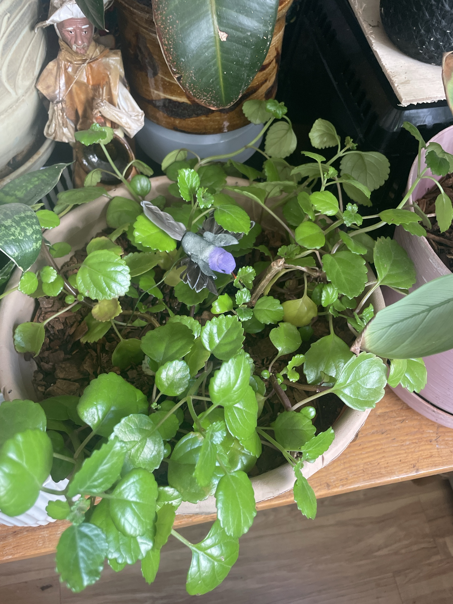

# Swedish Ivy #3 (*Plectranthus verticillatus*)

**Full care guide and troubleshooting: [swedish-ivy.md](swedish-ivy.md).** **Non-toxic to pets.**

## Current setup

- **Pot:** large tan planter on a black saucer, soil topped with bark. Purple hummingbird decoration
- **Location:** wooden table/bench, between the snake plant and the pink-potted Ctenanthe #2

## Condition log

### 2026-09-27
- Healthy and growing, with lots of fresh new growth at the tips
- More open/sparse than #2: bare woody stems visible in the center with the bark showing through
- A few pale/yellowish leaves near the center
- No pests visible

## To do

- [ ] Remove the yellow leaves
- [ ] Pinch the stem tips all around to make it branch and fill in
- [ ] Root cuttings in water (about 1 week) and plant them into the bare center
- [ ] Water when the top 1" is dry. Empty the saucer
