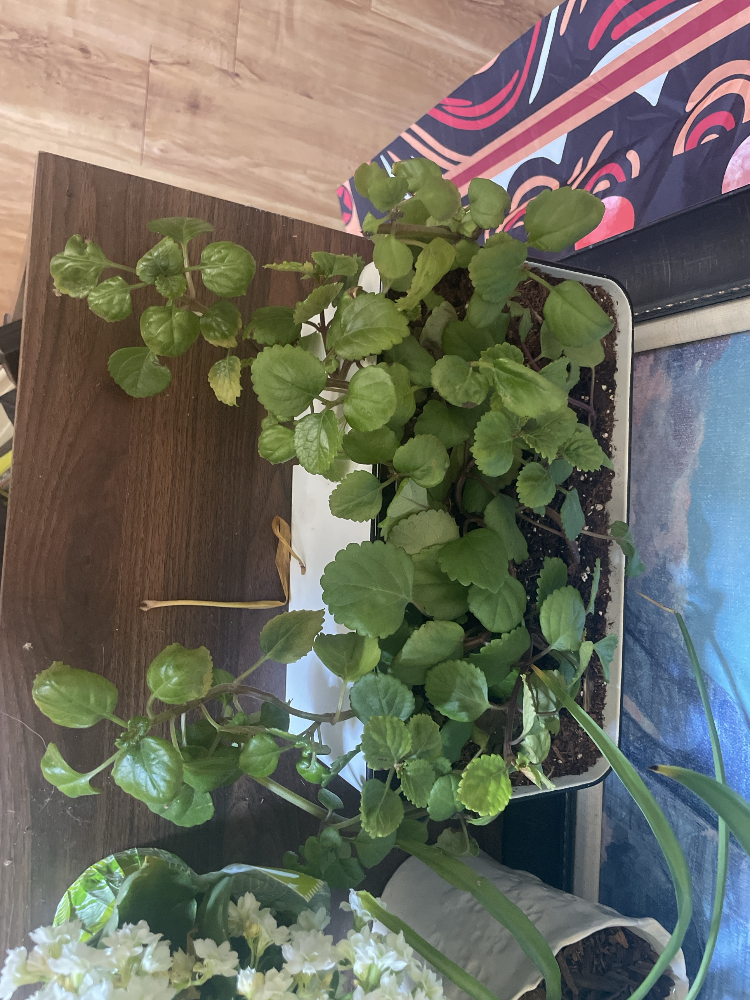

# Swedish Ivy #1 (*Plectranthus verticillatus*)

Not Swedish and not an ivy. It's a southern African trailing plant in the mint family (a cousin of coleus). Round, glossy, scalloped leaves on square purplish stems. Fast-growing and a classic hanging-basket plant. Roots very easily from cuttings. **Non-toxic to pets.**

This page has the full care guide for all three: [#2 (cream oval planter)](swedish-ivy-2.md) and [#3 (tan planter)](swedish-ivy-3.md).

## Current setup

- **Pot:** white rectangular enamel tray/planter with a black rim. **Probably no drainage hole**
- **Soil:** potting mix with perlite
- **Location:** dark wood shelf/stand, near the kalanchoe (white flowers) and a spider plant

## Condition log

### 2026-09-27
- Full and growing well. Dense center with lots of stems trailing over the edges
- Several leaves yellowing, mostly at the edges or tips of older leaves, and one fully yellow dead leaf on the shelf. Some leaves are a lighter lime-green overall
- Trailing stems are getting long, with gaps between leaves on some runners
- No pests visible

## To do

- [ ] **Check for a drainage hole.** Enamel trays usually don't have one. Without one, water pools at the bottom and rots the roots, which is a common cause of yellowing leaves. Either drill a hole, move the plant to a pot with drainage, or water very sparingly and tip out any excess
- [ ] Remove yellow leaves and the dead leaf on the shelf
- [ ] Pinch or trim the long runners just above a leaf pair to keep it bushy
- [ ] Root the trimmings in water (roots in about 1 week) and replant them in the center if it thins out
- [ ] Rotate it so all sides get light evenly

## Care guide

| | |
|---|---|
| **Light** | Bright indirect. Morning sun is OK. Too little light = leggy stems and pale leaves |
| **Water** | Water when the top 1" is dry. Evenly moist, never soggy. Water less in winter |
| **Humidity** | Average is fine |
| **Temp** | 60–75°F (15–24°C). Keep above 50°F |
| **Feeding** | Spring–summer: half-strength balanced fertilizer every 2–4 weeks. None in winter |
| **Soil** | Regular well-draining potting mix |
| **Pruning** | Pinch often. Cut back hard in spring if it gets straggly. It regrows fast |

## Troubleshooting

| Symptom | Likely cause |
|---|---|
| Yellow leaves | Overwatering / poor drainage (most common), or old leaves aging |
| Wilting | Thirsty, or root rot if the soil is wet |
| Leggy, spread-out stems | Not enough light or needs pinching |
| Brown leaf edges | Underwatering or direct hot sun |
| White cottony spots | Mealybugs. Dab with rubbing alcohol |
