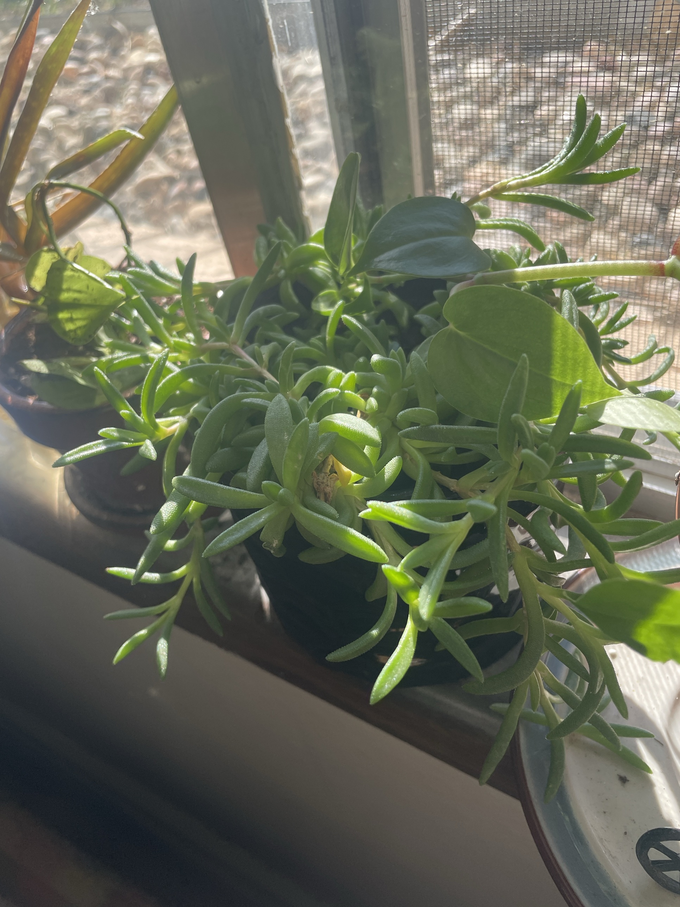

# Trailing Succulent (ID tentative: *Delosperma* / *Sedum* type)

Small trailing succulent with narrow, finger-like, bright green leaves covered in fine fuzz/bumps. Grows in little rosettes along trailing stems and makes aerial roots. Possibly an ice plant (*Delosperma*) or a trailing *Sedum*. Update the ID if it flowers (ice plants have daisy-like flowers). General succulent care: [jade-plant.md](jade-plant.md). Most of these are **non-toxic to pets.**

## Current setup

- **Pot:** small dark pot
- **Location:** screened windowsill, next to the cupid peperomia. This is likely the same trailing succulent seen next to Jade #2

## Condition log

### 2026-09-27
- Full and spilling over the pot on all sides. Lots of healthy bright green rosettes
- **The center of the main rosette has some yellowing and dry, brown dead leaves**
- Some stems are long and stretching outward

## To do

- [ ] Pull the dead brown leaves out of the center so they don't trap moisture and rot
- [ ] Check the center for mushiness. If it's soft, let the soil dry out completely and cut off any rotting bits
- [ ] Let the soil dry out completely between waterings
- [ ] Trim the long stretched stems. Cuttings root easily in dry-ish soil and can refill the pot
- [ ] Try to confirm the ID
