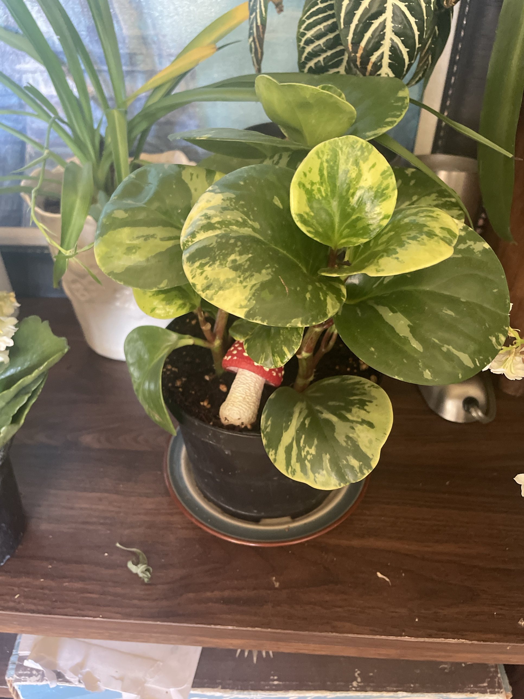

# Variegated Baby Rubber Plant (*Peperomia obtusifolia* 'Variegata')

Florida/Caribbean/South American peperomia. Thick, round, glossy leaves marbled with green, lime, and cream on sturdy upright stems. Semi-succulent, related to the [ripple peperomia](ripple-peperomia.md), with the same "let it dry out" care. Slow and compact. **Non-toxic to pets.**

## Current setup

- **Pot:** black pot on a blue-rimmed ceramic saucer, with a red mushroom decoration in the soil
- **Location:** dark wood shelf with the kalanchoes, in front of the zebra plant and a spider plant

## Condition log

### 2026-09-27
- Healthy and full. Several upright stems with large, firm, glossy leaves and strong marbled variegation
- New leaves at the top have bright lime/cream variegation, a sign of good light
- One darker, pointed, heart-shaped leaf at the lower left looks like a pothos leaf, not peperomia. Possibly a pothos cutting planted in the same pot, or a vine from a neighbor. Check
- No yellowing, spots, or mushy stems visible

## To do

- [ ] Check the pothos-looking leaf at the lower left: is a cutting planted in this pot? If so, note it. Pothos wants a bit more water than peperomia, so it's fine short-term but it's better to give it its own pot eventually
- [ ] Water only when the top half of the soil is dry. Empty the saucer after watering
- [ ] Rotate weekly. It leans toward the light
- [ ] If any shoots come in solid green, cut them off at the base so the plant doesn't revert
- [ ] Repot only when root-bound (every 2–3 years)

## Care guide

| | |
|---|---|
| **Light** | Bright indirect. Variegated types need more light than solid green to keep their color. No hot direct sun |
| **Water** | Let the top 1–2" (about half the pot) dry out, then water thoroughly and drain. About every 1–2 weeks, and less in winter. Slightly soft/droopy leaves = thirsty |
| **Humidity** | Average is fine |
| **Temp** | 65–80°F (18–27°C). Keep above 55°F |
| **Feeding** | Spring–summer: half-strength balanced fertilizer monthly. None in winter |
| **Soil** | Chunky, fast-draining mix: potting soil plus perlite/orchid bark |
| **Propagation** | Stem cuttings with a couple of leaves root easily in water or soil |

## Troubleshooting

| Symptom | Likely cause |
|---|---|
| Mushy stems, leaves dropping | Overwatering/rot. Let it dry and cut away rot |
| Yellow lower leaves | Overwatering, or normal aging |
| Losing variegation, new leaves all green | Not enough light |
| Leggy, stretched stems | Not enough light. Pinch the tips to keep it bushy |
| Brown patches | Direct sun or cold damage |
| White cottony spots | Mealybugs. Dab with rubbing alcohol |
