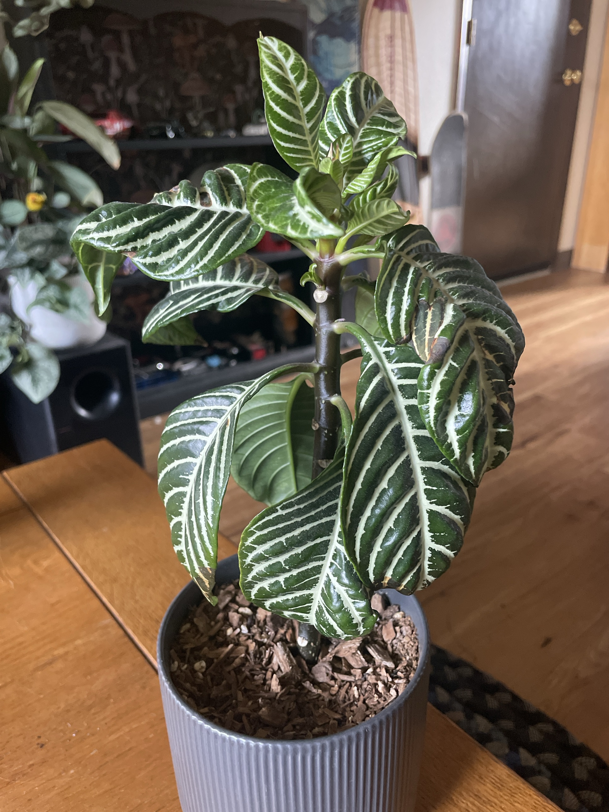

# Zebra Plant (*Aphelandra squarrosa*)

Brazilian rainforest native. Dark glossy leaves with bold white veins, thick central stem. Fussy: wants steady moisture, high humidity, and bright light that isn't direct sun. Droops dramatically and drops lower leaves when unhappy.

## Current setup

- **Pot:** grey ribbed ceramic (confirm it has a drainage hole)
- **Soil:** chunky bark visible on top. May dry out too fast for this plant
- **Location:** brightest room, moved out of direct sun

## Condition log

### 2026-09-25
- Sunburn: brown/crispy patches on several leaves, especially the upper-left and right-side leaves. Leaf tips are browning too
- Lower leaves hang low/droop
- Leaf scars on the stem where older leaves already dropped. Starting to get leggy
- **Good sign:** several new clusters of leaves coming out the top since the move out of direct light
- Action: moved out of direct sun into bright indirect light

## To do

- [ ] Remove only leaves more than ~50% brown or yellowed (cut flush to the stem). Keep the healthy lower leaves because they feed the new growth
- [ ] Trim crispy brown tips/edges, following the leaf's shape
- [ ] Check soil moisture 1" down. Drooping usually means it's too dry (or soggy roots)
- [ ] Check the pot drains and no water pools in the bottom
- [ ] Spring 2027: if it's still leggy, cut the stem back to a few inches above a node so it bushes out. Root the cut top as a new plant
- [ ] Spring 2027: consider repotting into a moisture-holding peat/coco mix with perlite if the bark mix keeps drying out too fast

## Care guide

| | |
|---|---|
| **Light** | Bright indirect. A few feet from a sunny window or behind a sheer curtain. Gentle morning sun is OK |
| **Water** | Keep evenly moist, like a wrung-out sponge. Water when the top ½–1" is dry. Never bone dry, never sitting in water. Room-temp water |
| **Humidity** | 60%+. Pebble tray, humidifier, or group it with other plants. Crispy edges = air too dry |
| **Temp** | 65–80°F (18–27°C). Keep away from drafts, AC vents, and cold windows |
| **Feeding** | Spring–summer: half-strength balanced liquid fertilizer every 2 weeks. Little or none in winter |
| **Soil** | Moisture-holding peat or coco-based mix with perlite. Must drain well |
| **Flowers** | Yellow flower spike (bracts) in late summer/fall when mature. Cut it off once it fades. Some lower leaf drop after blooming is normal |

## Troubleshooting

| Symptom | Likely cause |
|---|---|
| Whole plant wilting/drooping | Soil too dry (most common), soggy roots, or cold draft |
| Brown crispy patches mid-leaf | Sunburn from direct sun |
| Brown tips/edges | Low humidity or uneven watering |
| Lower leaves yellowing and dropping | Normal aging, after blooming, or drying out |
| Leggy bare stem | Normal with age. Cut back in spring |
