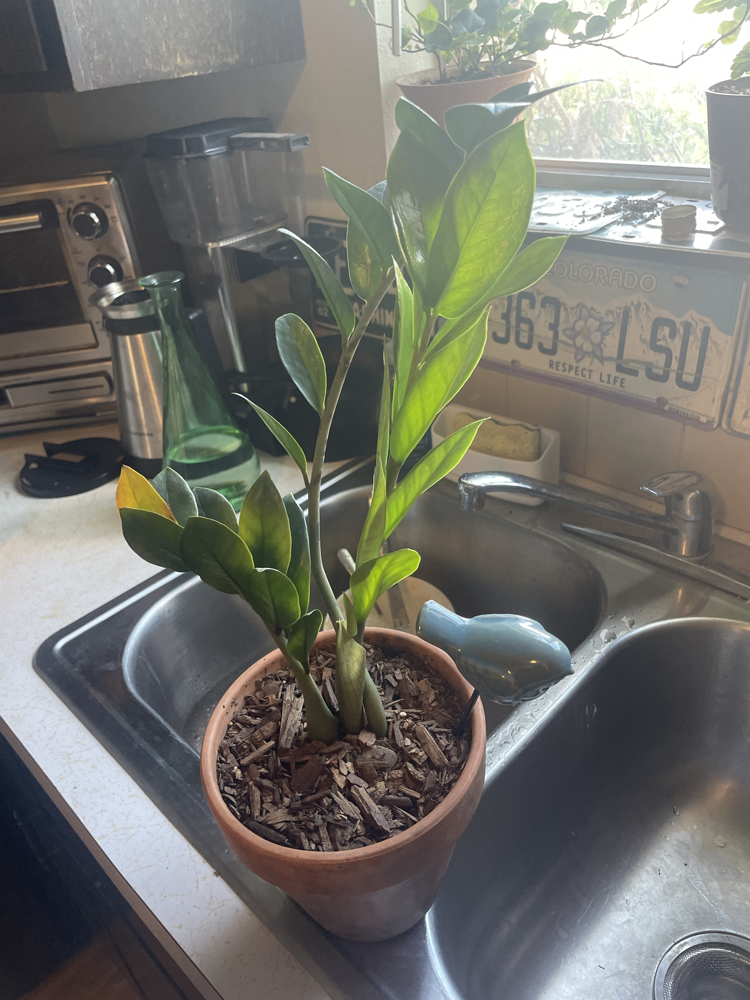

# ZZ Plant (*Zamioculcas zamiifolia*)

East African plant that grows from potato-like underground rhizomes, which store water. Glossy, waxy leaflets on thick upright stems. One of the most drought- and low-light-tolerant houseplants. The main way to kill it is overwatering. **Toxic to pets and people if chewed.** Wash your hands after handling cut stems.

## Current setup

- **Pot:** terracotta, with a blue ceramic bird stake in the soil (check whether it's a self-watering spike or just decoration)
- **Soil:** covered with a bark chip layer on top
- **Location:** photographed at the kitchen sink (probably being watered). Kitchen window nearby

## Condition log

### 2026-09-27
- Healthy overall. About 4 stems with deep green, glossy leaflets, and bright new leaves on the tallest stem
- **One leaflet turning yellow** at the tip of the lower-left stem
- Tallest stem leans a bit and is taller than the others (reaching for light)
- Base of the stems looks firm and green, not mushy

## To do

- [ ] Check what the blue bird is. If it's a watering spike/globe, remove it. ZZs need to dry out completely between waterings, and constant moisture will rot the rhizomes
- [ ] Watch the yellow leaflet. One yellow leaflet on an older stem is normal. If more start yellowing, especially whole stems, water less and check the rhizomes for rot
- [ ] Remove the yellow leaflet once it's fully yellow, or cut the whole stem at the soil line if the whole stem yellows
- [ ] Rotate weekly so the stems grow straight instead of leaning
- [ ] Repot only when the rhizomes crowd or deform the pot (every 2–3 years), and go only one size up

## Care guide

| | |
|---|---|
| **Light** | Bright indirect is best (faster growth). Tolerates low light. Avoid hot direct afternoon sun, which scorches the leaves |
| **Water** | Let the soil dry out **completely**, then soak. About every 2–4 weeks in summer and every 4–6 weeks in winter. When in doubt, wait. Firm, slightly curled leaflets = thirsty |
| **Humidity** | Normal household air is fine |
| **Temp** | 60–85°F (15–29°C). Keep above 50°F |
| **Feeding** | Spring–summer: half-strength balanced fertilizer 2–3 times per season. None in winter |
| **Soil** | Fast-draining mix: potting soil with perlite/bark, or cactus mix |
| **Pot** | Terracotta with drainage is ideal. It likes being snug |

## Troubleshooting

| Symptom | Likely cause |
|---|---|
| Yellow leaflets or whole yellow stems | Overwatering (most common). Also normal aging of old stems |
| Mushy stem base or soft rhizome | Rot. Unpot, cut off the rotten parts, let them dry, and repot in dry mix |
| Wrinkled/shriveled stems or rhizomes | Very underwatered. Soak it |
| Stems leaning/stretching | Needs more light. Rotate it |
| Brown scorched patches | Direct sun |
| No new growth | Normal in winter or low light. ZZs grow slowly and in flushes |
